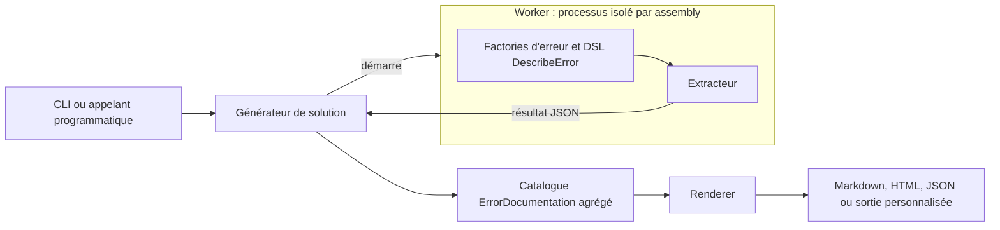

# Architecture du pipeline de documentation

🌍 **Langues :**  
🇬🇧 [English](./ArchitectureOfTheDocumentationPipeline.en.md) | 🇫🇷 Français (ce fichier)

FirstClassErrors dérive la documentation des erreurs du code qui les définit et les crée. Le pipeline sépare cinq responsabilités : définir la connaissance, l’extraire, isoler son exécution, agréger un catalogue et produire les fichiers.

## Le pipeline en un coup d’œil



Le worker est le processus isolé **à l’intérieur duquel** l’extraction s’exécute : le générateur démarre un worker par assembly, le worker exécute les factories et renvoie un résultat sérialisé, et ce n’est qu’ensuite que le générateur agrège et rend. Le contrôle va du générateur vers chaque worker ; les données reviennent sous forme de JSON.

La frontière essentielle est la suivante :

> le code applicatif définit une connaissance structurée sur les erreurs ; les renderers décident uniquement de sa présentation.

## 1. La connaissance est définie à côté de l’erreur

Une classe statique regroupe les erreurs associées à une source applicative — par exemple un type métier ou un composant :

```csharp
[ProvidesErrorsFor(nameof(Temperature))]
public static class InvalidTemperatureError {
    // factories, méthodes de documentation et codes
}
```

Chaque factory représente une situation d’erreur reconnue. `[DocumentedBy]` lie cette factory à une méthode de documentation :

```csharp
[DocumentedBy(nameof(BelowAbsoluteZeroDocumentation))]
internal static DomainError BelowAbsoluteZero(decimal value) {
    // création de l'Error
}
```

```csharp
private static ErrorDocumentation BelowAbsoluteZeroDocumentation() {
    return DescribeError
        .WithTitle("Température sous le zéro absolu")
        .WithDescription("Cette erreur survient lorsqu'une température est inférieure à la limite physique.")
        .WithRule("Une température ne peut pas être inférieure au zéro absolu.")
        .WithDiagnostic(
            "Une température convertie ou calculée est passée sous la limite physique.",
            ErrorOrigin.Internal,
            "Vérifiez le calcul ou la conversion qui a produit la valeur.")
        .WithExamples(() => BelowAbsoluteZero(-1m));
}
```

À ce stade, il n’existe encore ni Markdown, ni HTML, ni JSON. Il existe une connaissance structurée exprimée dans le code.

## 2. L’extraction transforme la documentation exécutable en données

L’extracteur trouve les classes `[ProvidesErrorsFor]`, résout les liens `[DocumentedBy]`, puis invoque les méthodes de documentation et leurs factories d’exemples.

C’est important parce que les exemples invoquent les véritables factories d’erreur : leur structure et leurs données proviennent de ce code, et non de chaînes recopiées dans la documentation qui pourraient en dériver silencieusement.

Le résultat est un catalogue en mémoire d’objets `ErrorDocumentation`, accompagné des éventuels échecs d’extraction.

## 3. Les workers isolent l’exécution des cibles

L’extraction exécute du code applicatif. Pour cette raison, la génération au niveau solution ne charge pas tous les assemblies cibles dans un unique processus longue durée. Elle démarre un worker éphémère pour chaque assembly.

Cette isolation apporte :

- un état statique neuf pour chaque assembly ;
- l’isolation des dépendances et de la version de FirstClassErrors ;
- le confinement des crashs et blocages ;
- une frontière de timeout explicite ;
- le signalement des échecs sans nécessairement perdre toute l’exécution.

Le worker sérialise le résultat d’extraction en JSON, puis le générateur passe à l’assembly suivant.

Pour les règles exactes de découverte, d’opt-in, de timeout et de politique d’échec, voir la [Référence de l’extraction et de la découverte des projets](DocumentationExtractionReference.fr.md).

## 4. Le générateur construit un catalogue unique

Au niveau de la solution, le générateur :

1. compile la solution, sauf avec `--no-build` ;
2. découvre les projets qui participent à la génération documentaire ;
3. démarre un worker par assembly de sortie sélectionné ;
4. collecte la documentation et les échecs d’extraction ;
5. déduplique et ordonne les erreurs par code.

La sortie de cette étape est un catalogue global pour l’application ou l’ensemble d’assemblies sélectionné. Ce catalogue — un ensemble d’objets `ErrorDocumentation` — est la représentation intermédiaire indépendante du format : chaque renderer consomme le même catalogue, si bien qu’aucun format de sortie n’est privilégié par rapport à un autre.

La CLI expose le parcours courant :

```bash
fce generate \
  --solution ./MyApp.sln \
  --format markdown \
  --layout split \
  --service-name my-api \
  --output ./docs/errors
```

## 5. Les renderers transforment le catalogue en fichiers

Un renderer reçoit le catalogue structuré et un `RenderRequest`. Il renvoie un ou plusieurs `RenderedDocument`.

```csharp
public interface IErrorDocumentationRenderer {
    string Format { get; }
    IReadOnlyCollection<string> SupportedLayouts { get; }
    IReadOnlyList<RenderedDocument> Render(
        IEnumerable<ErrorDocumentation> catalog,
        RenderRequest request);
}
```

Les renderers intégrés fournissent actuellement :

| Format | Usage | Layouts |
| --- | --- | --- |
| `json` | catalogue stable lisible par machine | `single` |
| `markdown` | documentation de dépôt ou de portail | `single`, `split` |
| `html` | documentation statique autonome et consultable | `single`, `split` |

`single` produit un document unique ; `split` produit une page par erreur.

Les renderers personnalisés utilisent le même contrat. Voir [Écrire son propre renderer](WritingACustomRenderer.fr.md).

## 6. La culture traverse deux frontières distinctes

L’internationalisation est volontairement séparée :

- la **culture d’extraction** localise le contenu des erreurs produit par les factories et méthodes de documentation ;
- la **culture de rendu** localise les titres, libellés et autres textes fixes appartenant au renderer.

Les identifiants stables restent indépendants de la culture : codes, identités de source, noms de clés de contexte, chemins générés, ancres et messages de diagnostic internes.

Voir [Internationalisation](Internationalisation.fr.md) pour le workflow complet.

## Pourquoi cette séparation est importante

| Composant | Responsabilité |
| --- | --- |
| code applicatif | sens des erreurs, règles, diagnostics, exemples, messages publics |
| extracteur | découverte et exécution des factories documentées |
| worker | isolation du processus et des dépendances |
| générateur | compilation, sélection, agrégation, ordre, collecte des échecs |
| renderer | format de fichier, layout, texte du gabarit |
| CLI | orchestration et configuration |

Cette séparation évite plusieurs couplages :

- les factories ignorent si la sortie sera du Markdown ou du HTML ;
- les renderers n’exécutent pas les factories applicatives ;
- un assembly défaillant ne doit pas corrompre toutes les autres extractions ;
- le contenu localisé et la présentation localisée restent indépendants ;
- les appels programmatiques peuvent utiliser les étapes du pipeline sans passer par la CLI.

## L’idée clé

> La documentation des erreurs n’est pas réécrite manuellement à partir du système. Elle est dérivée des mêmes factories et descriptions structurées qui définissent les échecs reconnus par le système.

Le code reste la source de vérité ; le pipeline rend cette connaissance transportable.

---

<div align="center">
<a href="CatalogVersioning.fr.md">← Versionnage du catalogue</a> · <a href="README.fr.md#-étapes-suivantes">↑ Table des matières</a> · <a href="DocumentationExtractionReference.fr.md">Référence de l’extraction et de la découverte des projets →</a>
</div>

---