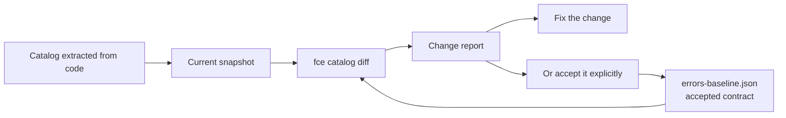

# Catalog Versioning

🌍 **Languages:**  
🇬🇧 English (this file) | 🇫🇷 [Français](./CatalogVersioning.fr.md)

An error code does not stay inside the system that emits it. Client applications branch on it, dashboards alert on it, and support procedures reference it.

Removing or renaming a code is therefore a **breaking change**, just like removing a public API member. FirstClassErrors makes that change visible in the pull request before it reaches production.

## 🧭 How it works in one minute



Three concepts are enough:

- a **snapshot** is the canonical representation of the catalog contract at a given point in time;
- the **baseline** is the accepted snapshot committed to the repository as `errors-baseline.json`;
- `fce catalog diff` compares the current snapshot with that baseline.

In other words, the baseline answers this question:

> “Which error codes and context data have we explicitly promised to preserve?”

## 🧾 What belongs to the contract

The snapshot contains only the information required to detect a contract break.

| Tracked element | Why it is tracked |
| --- | --- |
| `code` | The stable identity of the error. Removing it is breaking. |
| `context`: key name and value type | Log pipelines, dashboards, and support tooling may read these values by name and type. |
| `title`, `source` | They help explain changes and detect probable renames. Changing them is informational only. |

Messages, explanations, business rules, and diagnostics are deliberately **not** versioned as contract data. They are documentation and may evolve without breaking a consumer.

## 📌 Initial setup

### 1. Create the baseline

```bash
fce catalog update --solution MyApp.sln
```

The command extracts the catalog and creates `errors-baseline.json`.

> `catalog update` means **accept the current contract**. It does not fix an incompatibility: it replaces the reference with the current catalog state.

### 2. Inspect the generated file

A baseline looks like this:

```json
{
  "schema": 1,
  "errors": [
    {
      "code": "PAYMENT_DECLINED",
      "source": "Payment",
      "title": "Payment declined",
      "context": [
        {
          "key": "PaymentId",
          "valueType": "System.Guid"
        }
      ]
    }
  ]
}
```

The file is deterministic: errors are ordered by code and context keys by name. The same catalog therefore produces the same file on every machine.

### 3. Commit the baseline

```bash
git add errors-baseline.json
git commit -m "chore: add error catalog baseline"
```

The baseline is now the contract accepted by the team. Every later modification appears in the pull-request Git diff.

### 4. Verify the contract

```bash
fce catalog diff --solution MyApp.sln
```

This command extracts the current catalog, compares it with the baseline, and reports the detected changes.

For complete GitHub Actions or GitLab CI integration, see [Integrating catalog versioning into CI/CD](CatalogVersioningCI.en.md).

## 🔁 The daily workflow

### No change

The command exits with `0` and reports that the catalog has not changed.

### Compatible change

Adding an error code or context key is reported, but does not fail with the default policy.

The developer can then update the baseline so the new contract is committed:

```bash
fce catalog update --solution MyApp.sln
git add errors-baseline.json
git commit -m "chore: update error catalog baseline"
```

### Breaking change

Removing a code, removing a context key, or changing its type makes the command exit with `2`. CI can use that code to block the pull request.

The developer must then choose explicitly between two actions:

1. **The change is accidental:** fix the code and restore the contract.
2. **The change is intentional:** run `fce catalog update`, inspect the `errors-baseline.json` diff, then commit it.

A breaking change is therefore not forbidden; it simply cannot be introduced silently.

## 🧪 Example: renaming a code

A developer renames `PAYMENT.DECLINED` to `PAYMENT.REFUSED` during a refactoring.

For a consumer, this is not a harmless rename: the old code disappears and a new one appears. The report therefore looks like this:

```text
Breaking changes (1):
  - [removed] PAYMENT.DECLINED — error removed (possibly renamed to 'PAYMENT.REFUSED', which has the same title)
Compatible changes (1):
  - [added] PAYMENT.REFUSED — new error 'Payment declined' (source: Payment)
```

If the rename was accidental, the developer fixes it. If it was intentional, updating the baseline makes the removal visible in the pull request so reviewers can approve it knowingly.

## 🧮 Change classification

| Change | Default impact |
| --- | --- |
| Error code removed | 💥 Breaking |
| Context key removed | 💥 Breaking |
| Context key type changed | 💥 Breaking |
| Error code added | ✅ Compatible |
| Context key added | ✅ Compatible |
| Title or source changed | ℹ️ Informational |

A rename remains breaking because consumers know the old code. When the title suggests a probable rename, the report adds a hint for the developer; it does not make the operation compatible.

## 📚 Further reading

- [Command, baseline format, and exit-code reference](CatalogVersioningReference.en.md)
- [CI/CD integration: GitHub Actions, GitLab CI, and advanced workflows](CatalogVersioningCI.en.md)

---

<div align="center">
<a href="OperationalIntegration.en.md">← CI/CD and Operational Integration</a> · <a href="../README.md#-next-steps">↑ Table of contents</a> · <a href="ArchitectureOfTheDocumentationPipeline.en.md">Architecture of the Documentation Pipeline →</a>
</div>

---