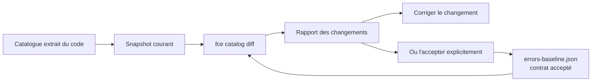

# Versionnage du catalogue

🌍 **Langues :**  
🇬🇧 [English](./CatalogVersioning.en.md) | 🇫🇷 Français (ce fichier)

Un code d'erreur ne reste pas à l'intérieur du système qui l'émet. Des applications clientes branchent leur logique dessus, des tableaux de bord déclenchent des alertes dessus et des procédures de support y font référence.

Supprimer ou renommer un code est donc un **changement cassant**, de même nature que la suppression d'un membre d'API publique. FirstClassErrors permet de rendre ce changement visible dans la pull request avant qu'il n'atteigne la production.

## 🧭 Le fonctionnement en une minute



Trois notions suffisent :

- le **snapshot** est la représentation canonique du contrat du catalogue à un instant donné ;
- la **baseline** est le snapshot accepté, commité dans le dépôt sous la forme de `errors-baseline.json` ;
- `fce catalog diff` compare le snapshot courant à cette baseline.

Autrement dit, la baseline répond à la question :

> « Quels codes d'erreur et quelles données de contexte avons-nous explicitement promis de conserver ? »

## 🧾 Ce qui fait partie du contrat

Le snapshot ne contient que les informations nécessaires pour détecter une rupture de contrat.

| Élément suivi | Pourquoi il est suivi |
| --- | --- |
| `code` | C'est l'identité stable de l'erreur. Sa suppression est cassante. |
| `context` : nom de clé et type de valeur | Les pipelines de logs, tableaux de bord et outils de support peuvent lire ces données par leur nom et leur type. |
| `title`, `source` | Ils aident à expliquer les changements et à détecter un renommage probable. Leur modification est seulement informative. |

Les messages, explications, règles métier et diagnostics ne sont volontairement **pas** versionnés comme un contrat. Ils constituent de la documentation et peuvent évoluer sans casser un consommateur.

## 📌 Mise en place initiale

### 1. Créer la baseline

```bash
fce catalog update --solution MyApp.sln
```

La commande extrait le catalogue et crée `errors-baseline.json`.

> `catalog update` signifie **accepter le contrat courant**. La commande ne corrige pas une incompatibilité : elle remplace la référence par l'état actuel du catalogue.

### 2. Examiner le fichier généré

Une baseline ressemble à ceci :

```json
{
  "schema": 1,
  "errors": [
    {
      "code": "PAYMENT_DECLINED",
      "source": "Payment",
      "title": "Payment declined",
      "context": [
        {
          "key": "PaymentId",
          "valueType": "System.Guid"
        }
      ]
    }
  ]
}
```

Ce fichier est déterministe : les erreurs sont triées par code et les clés de contexte par nom. Un même catalogue produit donc le même fichier sur toutes les machines.

### 3. Commiter la baseline

```bash
git add errors-baseline.json
git commit -m "chore: add error catalog baseline"
```

La baseline devient alors le contrat accepté par l'équipe. Toute modification ultérieure apparaît dans le diff Git de la pull request.

### 4. Vérifier le contrat

```bash
fce catalog diff --solution MyApp.sln
```

Cette commande extrait le catalogue courant, le compare à la baseline et affiche les changements détectés.

Pour une intégration complète dans GitHub Actions ou GitLab CI, consultez le guide [Intégrer le versionnage du catalogue en CI/CD](CatalogVersioningCI.fr.md).

## 🔁 Le workflow quotidien

### Aucun changement

La commande retourne `0` et indique que le catalogue n'a pas changé.

### Changement compatible

L'ajout d'un code d'erreur ou d'une clé de contexte est signalé, mais ne fait pas échouer la commande avec la politique par défaut.

Le développeur peut ensuite mettre à jour la baseline afin que le nouveau contrat soit commité :

```bash
fce catalog update --solution MyApp.sln
git add errors-baseline.json
git commit -m "chore: update error catalog baseline"
```

### Changement cassant

La suppression d'un code, la suppression d'une clé de contexte ou la modification de son type fait retourner le code `2`. La CI peut utiliser ce code pour bloquer la pull request.

Le développeur doit alors choisir explicitement entre deux actions :

1. **Le changement est accidentel** : il corrige le code afin de restaurer le contrat.
2. **Le changement est volontaire** : il exécute `fce catalog update`, vérifie le diff de `errors-baseline.json`, puis le committe.

Ainsi, un changement cassant n'est pas interdit ; il ne peut simplement plus être introduit silencieusement.

## 🧪 Exemple : renommage d'un code

Un développeur renomme `PAYMENT_DECLINED` en `PAYMENT_REFUSED` pendant un refactoring.

Pour un consommateur, ce n'est pas un simple renommage : l'ancien code disparaît et un nouveau code apparaît. Le rapport ressemble donc à ceci :

```text
Breaking changes (1):
  - [removed] PAYMENT_DECLINED — error removed (possibly renamed to 'PAYMENT_REFUSED', which has the same title)
Compatible changes (1):
  - [added] PAYMENT_REFUSED — new error 'Payment declined' (source: Payment)
```

Si le renommage était accidentel, le développeur le corrige. S'il était volontaire, la mise à jour de la baseline rend la suppression visible dans la pull request et permet au relecteur de l'approuver en connaissance de cause.

## 🧮 Classification des changements

| Changement | Impact par défaut |
| --- | --- |
| Code d'erreur supprimé | 💥 Cassant |
| Clé de contexte supprimée | 💥 Cassant |
| Type d'une clé de contexte modifié | 💥 Cassant |
| Code d'erreur ajouté | ✅ Compatible |
| Clé de contexte ajoutée | ✅ Compatible |
| Titre ou source modifié | ℹ️ Informatif |

Un renommage reste cassant, car les consommateurs connaissent l'ancien code. Lorsque le titre permet d'identifier un renommage probable, le rapport ajoute seulement un indice pour aider le développeur ; il ne transforme pas le changement en opération compatible.

## 📚 Aller plus loin

- [Référence des commandes, du fichier de baseline et des codes de sortie](CatalogVersioningReference.fr.md)
- [Intégration CI/CD : GitHub Actions, GitLab CI et workflows avancés](CatalogVersioningCI.fr.md)

---

<div align="center">
<a href="OperationalIntegration.fr.md">← CI/CD et intégration opérationnelle</a> · <a href="README.fr.md#-étapes-suivantes">↑ Table des matières</a> · <a href="ArchitectureOfTheDocumentationPipeline.fr.md">Architecture du pipeline de documentation →</a>
</div>

---
