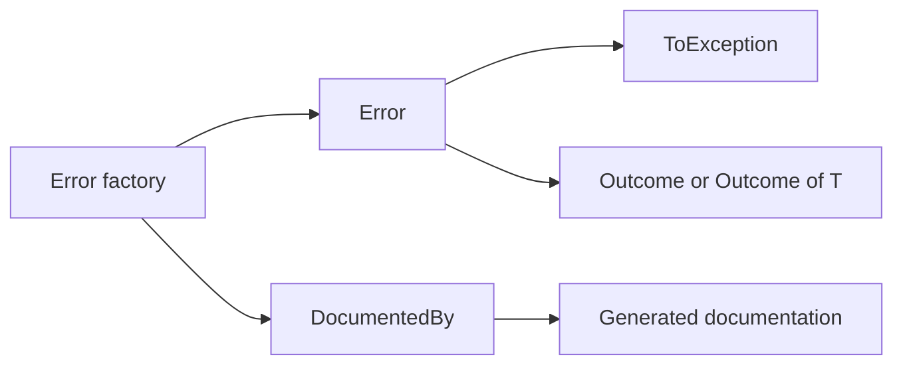

# Core Concepts

🌍 **Languages:**  
🇬🇧 English (this file) | 🇫🇷 [Français](./CoreConcepts.fr.md)

FirstClassErrors separates the **meaning of a failure** from the mechanism used to propagate it.

The central object is `Error`. An exception or an `Outcome<T>` only transports that error.



## An error represents one situation

A useful error answers a precise question:

> What situation did the system recognize?

For example:

```csharp
InvalidAmountOperationError.CurrencyMismatch(left, right)
```

The factory gives the situation a readable name. Its stable code gives the same situation a machine-readable identity:

```text
AMOUNT_CURRENCY_MISMATCH
```

One factory should therefore correspond to one documented error case.

## What an `Error` carries

An error occurrence contains:

- a stable `Code`;
- a unique `InstanceId`;
- an `OccurredAt` timestamp;
- public and internal messages;
- optional typed context;
- optional inner errors.

The factory centralizes how these values are created, so every occurrence of the same situation remains consistent.

## Three messages, two audiences

An error carries three messages, divided between a public audience and an internal audience.

| Message | Mandatory | Audience | Purpose |
| --- | --- | --- | --- |
| `ShortMessage` | yes | users and API clients | safe public summary |
| `DetailedMessage` | no | users and API clients | optional controlled detail |
| `DiagnosticMessage` | yes | logs, support, developers | internal investigation detail |

The separation is deliberate. A diagnostic message may contain identifiers, offending values, or internal state that must never be exposed to an external client by default.

```csharp
return DomainError.Create(
        Code.CurrencyMismatch,
        diagnosticMessage: $"Cannot add {left} and {right} because their currencies differ.")
    .WithPublicMessage(
        shortMessage: "The amounts use different currencies.",
        detailedMessage: "Both amounts must use the same currency.");
```

Calling `error.ToException()` uses the diagnostic message as the exception's `Message`. How public messages are mapped to HTTP, gRPC, a UI, or another transport remains the application's responsibility.

## A factory is the source of truth

Factories keep construction details out of business logic:

```csharp
if (Currency != other.Currency) {
    throw InvalidAmountOperationError.CurrencyMismatch(this, other).ToException();
}
```

The code states the recognized situation without repeating its code, messages, context, or construction rules.

Factories also anchor the documentation:

```csharp
[DocumentedBy(nameof(CurrencyMismatchDocumentation))]
internal static DomainError CurrencyMismatch(...) { ... }
```

The linked method describes the stable meaning of the situation: its title, explanation, rule, diagnostics, and representative examples.

## Documentation and runtime data are different

The documentation describes the error **category**:

- what the situation means;
- which rule it represents;
- what might cause it;
- where investigation can start.

The runtime error describes one **occurrence**:

- when it happened;
- its unique instance id;
- the actual diagnostic message;
- occurrence-specific context values.

For example, `ORDER_NOT_FOUND` is the stable category. `OrderId = 42` belongs to one occurrence and therefore belongs in `ErrorContext`.

## Diagnostics guide investigation

A diagnostic is a structured hypothesis composed of:

- a possible cause;
- its likely `ErrorOrigin` (`Internal`, `External`, or `InternalOrExternal`);
- an analysis lead.

Diagnostics should not claim a root cause that is not yet known. They should describe plausible states and suggest what to verify first.

## One model, two common transports

When the system cannot continue normally, throw the paired exception:

```csharp
throw error.ToException();
```

When failure is expected and should remain explicit in the normal flow, return it as data:

```csharp
return Outcome<Amount>.Failure(error);
```

The error does not change identity when its transport changes. This makes it possible to return an error from domain logic, log it, or escalate it later without recreating or translating the model.

## Error categories

FirstClassErrors provides several categories for distinguishing domain rule violations from technical-boundary failures:

- `DomainError`;
- `InfrastructureError`;
- `PrimaryPortError`;
- `SecondaryPortError`.

Their interaction direction, transience, and composition rules are explained separately in [Error Taxonomy and Composition](ErrorTaxonomy.en.md).

---

<div align="center">
<a href="WhenNotToUseFirstClassErrors.en.md">← When Not to Use FirstClassErrors</a> · <a href="../README.md#-documentation">↑ Table of contents</a> · <a href="ErrorTaxonomy.en.md">Error Taxonomy and Composition →</a>
</div>

---
