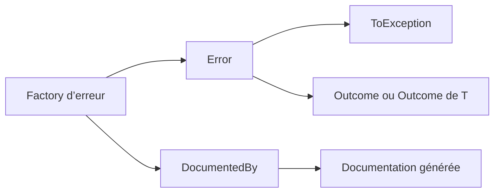

# Concepts fondamentaux

🌍 **Langues :**  
🇬🇧 [English](./CoreConcepts.en.md) | 🇫🇷 Français (ce fichier)

FirstClassErrors sépare le **sens d’un échec** du mécanisme utilisé pour le propager.

L’objet central est `Error`. Une exception ou un `Outcome<T>` ne fait que transporter cette erreur.



## Une erreur représente une situation

Une erreur utile répond à une question précise :

> Quelle situation le système a-t-il reconnue ?

Par exemple :

```csharp
InvalidAmountOperationError.CurrencyMismatch(left, right)
```

La factory donne à la situation un nom lisible. Son code stable lui donne une identité lisible par machine :

```text
AMOUNT_CURRENCY_MISMATCH
```

Une factory doit donc correspondre à un cas d’erreur documenté.

## Ce que porte une `Error`

Une occurrence d’erreur — une instance de la situation à l’exécution — contient :

- un `Code` stable ;
- un `InstanceId` unique ;
- un horodatage `OccurredAt` ;
- des messages publics et internes ;
- un contexte typé optionnel ;
- des erreurs internes optionnelles (erreurs imbriquées qui enregistrent la cause).

La factory centralise la création de ces valeurs, afin que chaque occurrence d’une même situation reste cohérente.

## Trois messages, deux publics

Une erreur porte trois messages répartis entre un public externe et un public interne.

| Message | Obligatoire | Public | Rôle |
| --- | --- | --- | --- |
| `ShortMessage` | oui | utilisateurs et clients d’API | résumé public sûr |
| `DetailedMessage` | non | utilisateurs et clients d’API | détail public optionnel et maîtrisé |
| `DiagnosticMessage` | oui | logs, support et développeurs | détail interne pour l’investigation |

Cette séparation est volontaire. Un message de diagnostic peut contenir des identifiants, des valeurs fautives ou un état interne qui ne doivent jamais être exposés par défaut à un client externe.

```csharp
return DomainError.Create(
        Code.CurrencyMismatch,
        diagnosticMessage: $"Impossible d’additionner {left} et {right} car leurs devises diffèrent.")
    .WithPublicMessage(
        shortMessage: "Les montants utilisent des devises différentes.",
        detailedMessage: "Les deux montants doivent utiliser la même devise.");
```

`error.ToException()` utilise le message de diagnostic comme `Message` de l’exception. Le mapping des messages publics vers HTTP, gRPC, une interface utilisateur ou un autre transport reste la responsabilité de l’application.

## La factory est la source de vérité

Les factories gardent les détails de construction hors de la logique métier :

```csharp
if (Currency != other.Currency) {
    throw InvalidAmountOperationError.CurrencyMismatch(this, other).ToException();
}
```

Le code nomme la situation reconnue sans répéter son code, ses messages, son contexte ni ses règles de construction.

Les factories servent également de point d’ancrage à la documentation :

```csharp
[DocumentedBy(nameof(CurrencyMismatchDocumentation))]
internal static DomainError CurrencyMismatch(...) { ... }
```

La méthode liée décrit le sens stable de la situation : son titre, son explication, sa règle, ses diagnostics et des exemples représentatifs.

## Documentation et données d’exécution sont différentes

La documentation décrit la **catégorie** d’erreur :

- ce que signifie la situation ;
- quelle règle elle représente ;
- ce qui pourrait la provoquer ;
- par où commencer l’investigation.

L’erreur d’exécution décrit une **occurrence** :

- quand elle s’est produite ;
- son identifiant unique ;
- son message de diagnostic réel ;
- les valeurs de contexte propres à cette occurrence.

Par exemple, `ORDER_NOT_FOUND` est la catégorie stable. `OrderId = 42` appartient à une occurrence précise et doit donc être placé dans [`ErrorContext`](ErrorContext.fr.md).

## Les diagnostics orientent l’investigation

Un diagnostic est une hypothèse structurée composée de :

- une cause possible ;
- son `ErrorOrigin` probable (`Internal`, `External` ou `InternalOrExternal`) ;
- une piste d’analyse.

Les diagnostics ne doivent pas affirmer une cause racine qui n’est pas encore connue. Ils décrivent des états plausibles et suggèrent ce qu’il faut vérifier en premier.

## Un modèle, deux transports courants

Lorsque le système ne peut pas continuer normalement, levez l’exception associée :

```csharp
throw error.ToException();
```

Lorsque l’échec est attendu et doit rester explicite dans le flux normal, retournez-le comme une donnée :

```csharp
return Outcome<Amount>.Failure(error);
```

L’erreur ne change pas d’identité lorsque son transport change. Elle peut donc être retournée depuis la logique métier, journalisée ou transformée en exception plus tard sans recréer ni traduire le modèle.

## Catégories d’erreur

FirstClassErrors fournit plusieurs catégories pour distinguer les violations de règles métier des défaillances aux frontières techniques :

- `DomainError` ;
- `InfrastructureError` ;
- `PrimaryPortError` ;
- `SecondaryPortError`.

Leur direction d’interaction, leur transience et leurs règles de composition sont expliquées séparément dans [Taxonomie et composition des erreurs](ErrorTaxonomy.fr.md).

---

<div align="center">
<a href="WhenNotToUseFirstClassErrors.fr.md">← Quand ne pas utiliser FirstClassErrors</a> · <a href="README.fr.md#-documentation">↑ Table des matières</a> · <a href="ErrorTaxonomy.fr.md">Taxonomie et composition des erreurs →</a>
</div>

---
