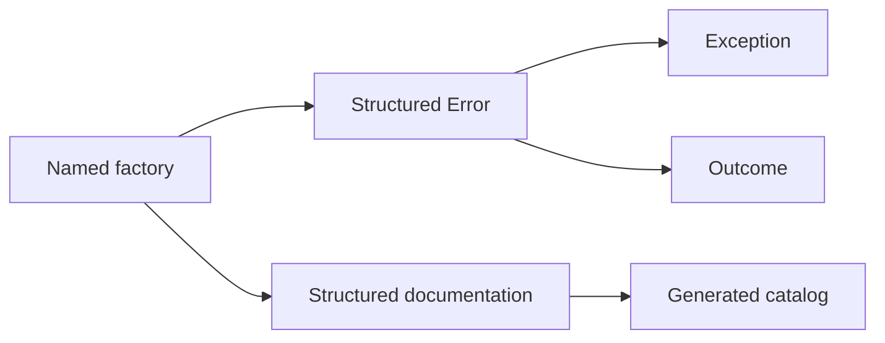

# Design Principles

🌍 **Languages:**  
🇬🇧 English (this file) | 🇫🇷 [Français](./DesignPrinciples.fr.md)

FirstClassErrors is built around five principles. Each one has a direct consequence in the API and in the way errors are written.

## 1. An error is a recognized situation

An error is not merely a message emitted after something failed. It is a situation the system recognizes and gives a stable name.

```csharp
InvalidAmountOperationError.CurrencyMismatch(left, right)
```

The factory name expresses the situation for humans. Its `ErrorCode` gives the same situation a stable identity for clients, logs, dashboards, and documentation.

**Consequence:** one factory represents one precise error situation. Avoid generic factories such as `InvalidOperation(...)` that hide several unrelated failures behind one name.

## 2. The error is the model; the exception is a transport

Throwing is one way to move an error through the system, not the definition of the error itself.

```csharp
Error error = InvalidAmountOperationError.CurrencyMismatch(left, right);

throw error.ToException();
```

The same error can instead be carried as data:

```csharp
return Outcome<Amount>.Failure(error);
```

**Consequence:** model the meaning once, then choose the transport according to the flow. Use an exception when execution cannot continue normally; use `Outcome<T>` when failure is expected and should be handled explicitly.

## 3. Public and internal information must remain separate

A useful diagnostic message often contains identifiers, offending values, or internal state. That information must not accidentally become an API response.

FirstClassErrors separates:

- public messages intended for users or API clients;
- an internal diagnostic message intended for logs, support, and developers.

The staged builder enforces that distinction when the error is created.

**Consequence:** public messages remain safe and controlled, while diagnostics can still contain the detail required for investigation.

## 4. Documentation belongs beside behavior

Documentation written far from the code eventually drifts. FirstClassErrors links each factory to structured documentation in the same class:

```csharp
[DocumentedBy(nameof(CurrencyMismatchDocumentation))]
internal static DomainError CurrencyMismatch(...) { ... }
```

The documentation method describes the situation, rule, diagnostic hypotheses, and executable examples.

**Consequence:** changing an error situation naturally brings its construction and documentation into the same review. The catalog is generated from the code rather than maintained as a second source of truth.

## 5. Diagnostics are hypotheses, not verdicts

At the moment an error is defined, its exact root cause is often unknown. Useful documentation should therefore propose plausible explanations and investigation leads without assigning blame.

Prefer:

> The amounts reached the operation without being converted to one currency.

Over:

> The developer forgot to convert the amounts.

**Consequence:** diagnostics describe observable states and direct investigation. They do not encode support procedures, claim certainty, or accuse a person or system.

## The resulting model

These principles work together:



The factory defines one meaningful situation. The `Error` preserves that meaning whichever transport is chosen, and the linked documentation makes the same knowledge available outside the runtime flow.

---

<div align="center">
<a href="GettingStarted.en.md">← Getting Started</a> · <a href="../README.md#-documentation">↑ Table of contents</a> · <a href="WhenNotToUseFirstClassErrors.en.md">When Not to Use FirstClassErrors →</a>
</div>

---
