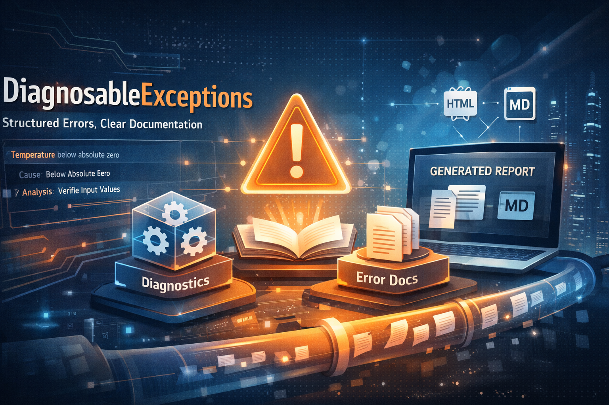

# Principes de conception

FirstClassErrors repose sur l’idée que les erreurs ne sont pas des sous-produits accidentels du code, mais des éléments porteurs de sens dans la connaissance du système. Dans de nombreuses applications, les erreurs sont traitées comme du bruit technique — quelque chose à logger, attraper ou masquer. Cette bibliothèque adopte la position inverse : lorsqu’une erreur est exprimée, elle révèle quelque chose sur les règles, les hypothèses et les frontières du système.

Une **erreur** n’est pas simplement un échec d’exécution. Elle représente une situation que le système reconnaît et à laquelle il donne un nom. En transformant les situations d’erreur en concepts explicites — via des méthodes factory, des codes, des diagnostics et de la documentation — le système devient plus lisible, plus explicable et plus facile à maintenir.

Un autre principe fondamental est que la documentation ne doit pas dériver du comportement. La documentation traditionnelle vit dans des fichiers externes et devient progressivement obsolète. Ici, la documentation est définie à côté du code qui crée l’erreur. Cette proximité garantit que la connaissance évolue avec le système lui-même. Si le comportement change, la documentation change avec lui, car ils partagent la même source.

Les diagnostics ne sont pas une analyse post-mortem ; ce sont des hypothèses structurées. L’objectif n’est pas d’attribuer une faute ni de déterminer à l’avance une cause racine, mais de fournir des points de départ pertinents pour l’investigation. Les erreurs décrivent ce qui est connu, pas ce qui est supposé.

La bibliothèque sépare également la sémantique de la mécanique. Lever, intercepter, logger ou transporter des erreurs sont des préoccupations mécaniques. Le sens d’une erreur — quelle règle a été violée, quelle situation s’est produite, ce qui pourrait l’expliquer — appartient au domaine de la connaissance. FirstClassErrors se concentre sur la préservation de ce sens, indépendamment de la manière dont l’erreur circule dans le système.

Enfin, la conception reconnaît que tous les échecs ne doivent pas être exceptionnels au sens runtime. Certaines erreurs font partie du flux normal, comme les échecs de validation ou les problèmes de parsing. En permettant d’utiliser les exceptions comme information d’erreur structurée via `Outcome<T>`, le modèle supporte à la fois les flux avec et sans levée d’exception, sans perdre la richesse sémantique.

En essence, la bibliothèque encourage les équipes à considérer les erreurs comme des artefacts de connaissance de premier plan. Lorsque les erreurs sont explicites, documentées et structurées, elles améliorent la communication entre les développeurs, les équipes de support et le système lui-même.

---

Section précédente: [Premiers pas](GettingStarted.fr.md) | Section suivante: [Quand ne pas utiliser FirstClassErrors](WhenNotToUseFirstClassErrors.fr.md)

---

