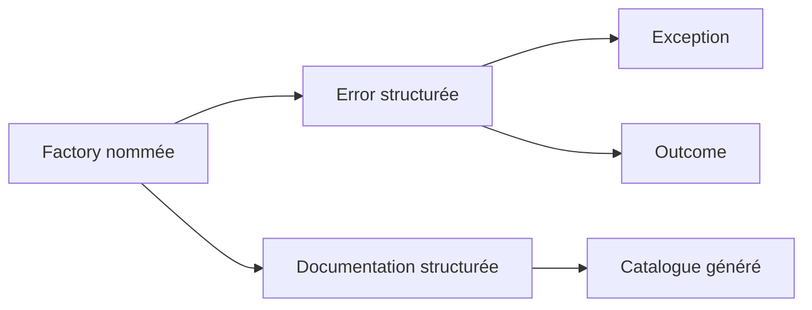

# Principes de conception

🌍 **Langues :**  
🇬🇧 [English](./DesignPrinciples.en.md) | 🇫🇷 Français (ce fichier)

FirstClassErrors repose sur cinq principes. Chacun possède une conséquence directe dans l’API et dans la manière d’écrire les erreurs.

## 1. Une erreur est une situation reconnue

Une erreur n’est pas seulement un message émis après un échec. C’est une situation que le système reconnaît et à laquelle il donne un nom stable.

```csharp
InvalidAmountOperationError.CurrencyMismatch(left, right)
```

Le nom de la factory exprime la situation pour les humains. Son `ErrorCode` donne à cette même situation une identité stable pour les clients, les logs, les dashboards et la documentation.

**Conséquence :** une factory représente une situation d’erreur précise. Évitez les factories génériques comme `InvalidOperation(...)`, qui masquent plusieurs échecs sans rapport derrière un même nom.

## 2. L’erreur est le modèle ; l’exception est un transport

Lever une exception est une manière de faire circuler une erreur dans le système, pas la définition de l’erreur elle-même.

```csharp
Error error = InvalidAmountOperationError.CurrencyMismatch(left, right);

throw error.ToException();
```

La même erreur peut être transportée comme une donnée :

```csharp
return Outcome<Amount>.Failure(error);
```

**Conséquence :** modélisez le sens une seule fois, puis choisissez le transport selon le flux. Utilisez une exception lorsque l’exécution ne peut pas continuer normalement ; utilisez `Outcome<T>` lorsque l’échec est attendu et doit être traité explicitement.

## 3. Les informations publiques et internes doivent rester séparées

Un message de diagnostic utile contient souvent des identifiants, des valeurs fautives ou un état interne. Ces informations ne doivent pas devenir accidentellement une réponse d’API.

FirstClassErrors sépare :

- les messages publics destinés aux utilisateurs ou clients d’API ;
- le message de diagnostic interne destiné aux logs, au support et aux développeurs.

Le builder étagé — chaque étape de construction n’expose que les appels valides suivants — impose cette distinction lors de la création de l’erreur.

**Conséquence :** les messages publics restent sûrs et maîtrisés, tandis que les diagnostics peuvent conserver les détails nécessaires à l’investigation.

## 4. La documentation doit vivre à côté du comportement

Une documentation écrite loin du code finit par dériver. FirstClassErrors relie chaque factory à une documentation structurée située dans la même classe :

```csharp
[DocumentedBy(nameof(CurrencyMismatchDocumentation))]
internal static DomainError CurrencyMismatch(...) { ... }
```

La méthode de documentation décrit la situation, la règle, les hypothèses de diagnostic et des exemples exécutables.

**Conséquence :** modifier une situation d’erreur amène naturellement sa construction et sa documentation dans la même revue. Le catalogue est généré depuis le code au lieu d’être maintenu comme une seconde source de vérité.

## 5. Les diagnostics sont des hypothèses, pas des verdicts

Au moment où une erreur est définie, sa cause racine exacte est souvent inconnue. Une documentation utile doit donc proposer des explications plausibles et des pistes d’investigation sans attribuer de faute.

Préférez :

> Les montants ont atteint l’opération sans avoir été convertis dans une devise commune.

À :

> Le développeur a oublié de convertir les montants.

**Conséquence :** les diagnostics décrivent des états observables et orientent l’investigation. Ils n’encodent pas de procédures de support, n’affirment pas une certitude et n’accusent ni une personne ni un système.

## Le modèle qui en découle

Ces principes fonctionnent ensemble :



La factory définit une situation significative. L’`Error` en préserve le sens quel que soit le transport choisi, et la documentation liée rend cette même connaissance disponible en dehors du flux d’exécution.

---

<div align="center">
<a href="GettingStarted.fr.md">← Premiers pas</a> · <a href="README.fr.md#-documentation">↑ Table des matières</a> · <a href="WhenNotToUseFirstClassErrors.fr.md">Quand ne pas utiliser FirstClassErrors →</a>
</div>

---
