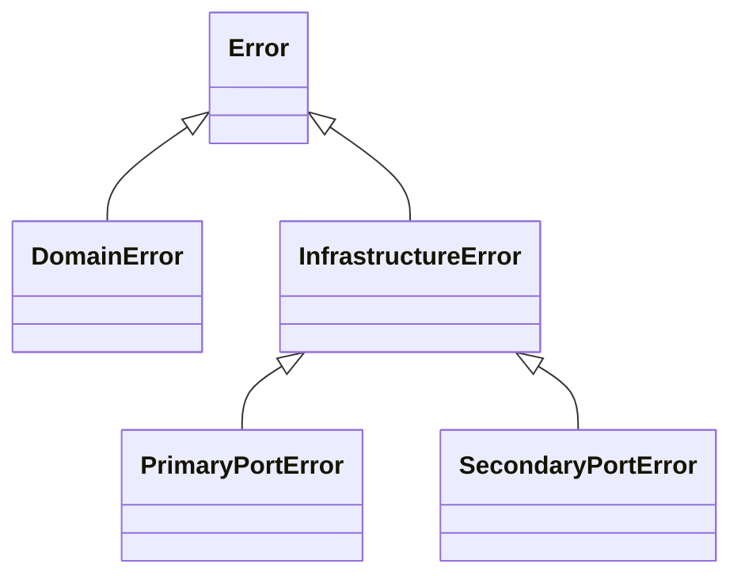

# Error Taxonomy and Composition

🌍 **Languages:**  
🇬🇧 English (this file) | 🇫🇷 [Français](./ErrorTaxonomy.fr.md)

FirstClassErrors distinguishes the **nature of a failure** from the place where it happens to be detected.

That distinction helps domain code remain independent from infrastructure while giving operational tooling useful signals such as interaction direction and transience.

## The hierarchy at a glance



| Type | Meaning | Typical example |
| --- | --- | --- |
| `DomainError` | a domain rule or invariant was violated | an amount uses an unsupported currency |
| `InfrastructureError` | a technical interaction failed, without a more precise port category | a generic infrastructure component failed |
| `PrimaryPortError` | an incoming interaction could not be accepted or processed | an API request cannot be mapped into valid domain values |
| `SecondaryPortError` | an outgoing interaction failed | a database or remote service is unavailable |

## `DomainError`: the business rule was violated

Use a `DomainError` when the failure is expressed entirely in domain language.

```csharp
return DomainError.Create(
        Code.CurrencyMismatch,
        diagnosticMessage: $"Cannot combine {left.Currency} and {right.Currency} amounts.")
    .WithPublicMessage(
        shortMessage: "The amounts use different currencies.");
```

The same error remains a domain error whether it is detected in a value object, an entity, a domain service, or while an adapter is constructing a domain value.

The type follows **which rule was violated**, not which layer happened to observe it.

## `PrimaryPortError`: an incoming interaction failed

A primary port represents an interaction entering the application: HTTP, messaging, a CLI command, a file import, or another inbound adapter.

Consider an API request containing an invalid amount. Two facts may need to be preserved:

1. the domain rejected the value because an invariant was violated;
2. the incoming request therefore cannot be accepted.

The adapter can wrap the domain cause in a primary-port error:

```csharp
DomainError invalidAmount = InvalidAmountError.NegativeValue(request.Amount);
var innerErrors = new PrimaryPortInnerErrors().Add(invalidAmount);

return PrimaryPortError.Create(
        Code.RequestRejected,
        diagnosticMessage: $"Request {request.Id} contains an invalid amount.",
        innerErrors: innerErrors)
    .WithPublicMessage(
        shortMessage: "The request contains invalid data.");
```

The domain error still describes the violated business rule. The primary-port error describes the boundary condition: this incoming interaction is rejected. When inner errors are supplied, the port error computes its overall transience from them.

## `SecondaryPortError`: an outgoing interaction failed

A secondary port represents an interaction initiated by the application toward a database, broker, filesystem, or remote service.

```csharp
return SecondaryPortError.Create(
        Code.PaymentProviderUnavailable,
        diagnosticMessage: "The payment provider timed out after 5 seconds.",
        transience: Transience.Transient)
    .WithPublicMessage(
        shortMessage: "The payment service is temporarily unavailable.");
```

The outgoing direction and transient classification provide operational meaning that a generic exception type or message would not preserve.

## `Transience`: is retrying meaningful?

Infrastructure errors carry a `Transience` value:

| Value | Meaning |
| --- | --- |
| `Transient` | the same operation may succeed later without changing the request |
| `NonTransient` | retrying the same operation is not expected to help |
| `Unknown` | the system cannot classify the failure reliably |

Examples:

- database timeout → usually `Transient`;
- unsupported request format → `NonTransient`;
- unclassified third-party failure → `Unknown`.

Transience is an operational hint, not a retry policy. The application still decides whether, when, and how often to retry.

## Interaction direction

Port errors fix their direction by construction:

- `PrimaryPortError` → `Incoming`;
- `SecondaryPortError` → `Outgoing`.

This allows logs and monitoring to distinguish a rejected inbound request from a failing outbound dependency, even when both are non-transient.

For example, an invalid email entered by a user should not trigger the same alert as a database outage. Direction and transience preserve that distinction.

## Composition rules

Inner errors represent causes or aggregated failures. The model constrains what may be nested:

| Outer error | Allowed inner errors |
| --- | --- |
| `DomainError` | `DomainError` only |
| `PrimaryPortError` | `DomainError` and `PrimaryPortError` |
| `SecondaryPortError` | `DomainError` and `SecondaryPortError` |
| base `InfrastructureError` | any `Error` |

These rules prevent technical concerns from leaking into domain vocabulary and prevent an incoming port error from accidentally containing an unrelated outgoing-port classification.

### Why a domain error cannot contain an infrastructure error

A `DomainError` states that a business rule was violated. If it contained a database timeout as its cause, the model would describe a technical outage as though it were part of the business rule.

Keep the domain failure and the technical failure distinct. If the actual failure is infrastructural, represent it with an infrastructure or port error at the boundary that owns that interaction.

### Why a port error may contain a domain error

A boundary may legitimately reject an interaction because domain construction failed. The domain error explains the underlying rule; the port error explains the boundary-level outcome.

This preserves both facts without making the domain depend on HTTP, messaging, files, or any other adapter technology.

## Choosing the type

Ask these questions in order:

1. **Was a business rule or invariant violated?** Use `DomainError`.
2. **Did an incoming interaction fail at the application boundary?** Use `PrimaryPortError`.
3. **Did an outgoing dependency interaction fail?** Use `SecondaryPortError`.
4. **Is it infrastructural but not meaningfully classified by direction?** Use `InfrastructureError`.

Do not choose a type from the current class or folder. Choose it from the meaning of the failure.

---

<div align="center">
<a href="CoreConcepts.en.md">← Core Concepts</a> · <a href="../README.md#-documentation">↑ Table of contents</a> · <a href="ErrorContext.en.md">Error Context Guide →</a>
</div>

---
