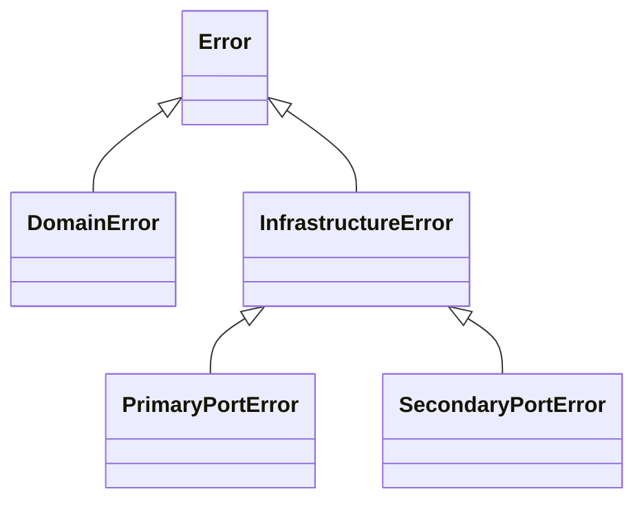

# Taxonomie et composition des erreurs

🌍 **Langues :**  
🇬🇧 [English](./ErrorTaxonomy.en.md) | 🇫🇷 Français (ce fichier)

FirstClassErrors distingue la **nature d’un échec** de l’endroit où il est détecté.

Cette distinction permet au domaine de rester indépendant de l’infrastructure, tout en fournissant à l’exploitation des signaux utiles comme la direction de l’interaction et la transience.

## La hiérarchie en un coup d’œil



| Type | Signification | Exemple courant |
| --- | --- | --- |
| `DomainError` | une règle ou un invariant métier a été violé | un montant utilise une devise incompatible |
| `InfrastructureError` | une interaction technique a échoué sans catégorie de port plus précise | un composant d’infrastructure générique échoue |
| `PrimaryPortError` | une interaction entrante ne peut pas être acceptée ou traitée | une requête API ne peut pas être convertie en valeurs métier valides |
| `SecondaryPortError` | une interaction sortante a échoué | une base de données ou un service distant est indisponible |

## `DomainError` : une règle métier a été violée

Utilisez une `DomainError` lorsque l’échec s’exprime entièrement dans le langage du domaine.

```csharp
return DomainError.Create(
        Code.CurrencyMismatch,
        diagnosticMessage: $"Impossible de combiner des montants en {left.Currency} et {right.Currency}.")
    .WithPublicMessage(
        shortMessage: "Les montants utilisent des devises différentes.");
```

La même erreur reste une erreur de domaine, qu’elle soit détectée dans un value object, une entité, un service de domaine ou pendant qu’un adapter construit une valeur métier.

Le type dépend de **la règle violée**, pas de la couche qui constate l’échec.

## `PrimaryPortError` : une interaction entrante a échoué

Un port primaire représente une interaction qui entre dans l’application : HTTP, message, commande CLI, import de fichier ou autre adapter entrant.

Prenons une requête API contenant un montant invalide. Deux faits peuvent devoir être conservés :

1. le domaine a refusé la valeur parce qu’un invariant a été violé ;
2. la requête entrante ne peut donc pas être acceptée.

L’adapter peut encapsuler la cause métier dans une erreur de port primaire :

```csharp
DomainError invalidAmount = InvalidAmountError.NegativeValue(request.Amount);
var innerErrors = new PrimaryPortInnerErrors().Add(invalidAmount);

return PrimaryPortError.Create(
        Code.RequestRejected,
        diagnosticMessage: $"La requête {request.Id} contient un montant invalide.",
        innerErrors: innerErrors)
    .WithPublicMessage(
        shortMessage: "La requête contient des données invalides.");
```

L’erreur de domaine décrit toujours la règle violée. L’erreur de port primaire décrit la condition à la frontière : cette interaction entrante est rejetée. Lorsque des erreurs internes sont fournies, l’erreur de port calcule sa transience globale à partir d’elles.

## `SecondaryPortError` : une interaction sortante a échoué

Un port secondaire représente une interaction initiée par l’application vers une base de données, un broker, un système de fichiers ou un service distant.

```csharp
return SecondaryPortError.Create(
        Code.PaymentProviderUnavailable,
        diagnosticMessage: "Le fournisseur de paiement a dépassé le délai de 5 secondes.",
        transience: Transience.Transient)
    .WithPublicMessage(
        shortMessage: "Le service de paiement est temporairement indisponible.");
```

La direction sortante et la classification transiente apportent un sens opérationnel qu’un type d’exception ou un message générique ne conserverait pas.

## `Transience` : retenter peut-il être utile ?

Les erreurs d’infrastructure portent une valeur `Transience` :

| Valeur | Signification |
| --- | --- |
| `Transient` | la même opération peut réussir plus tard sans modifier la requête |
| `NonTransient` | retenter la même opération ne devrait pas aider |
| `Unknown` | le système ne peut pas classer l’échec de façon fiable |

Exemples :

- timeout de base de données → généralement `Transient` ;
- format de requête non supporté → `NonTransient` ;
- échec tiers non classé → `Unknown`.

La transience est un indice opérationnel, pas une politique de retry. L’application décide toujours si, quand et combien de fois elle retente.

## Direction de l’interaction

Les erreurs de port fixent leur direction par construction :

- `PrimaryPortError` → `Incoming` ;
- `SecondaryPortError` → `Outgoing`.

Les logs et la supervision peuvent ainsi distinguer une requête entrante rejetée d’une dépendance sortante en panne, même si les deux erreurs sont non transientes.

Par exemple, une adresse e-mail invalide saisie par un utilisateur ne doit pas déclencher la même alerte qu’une indisponibilité de base de données. La direction et la transience préservent cette différence.

## Règles de composition

Les erreurs internes représentent des causes ou des échecs agrégés. Le modèle contraint ce qui peut être imbriqué :

| Erreur externe | Erreurs internes autorisées |
| --- | --- |
| `DomainError` | uniquement des `DomainError` |
| `PrimaryPortError` | des `DomainError` et `PrimaryPortError` |
| `SecondaryPortError` | des `DomainError` et `SecondaryPortError` |
| `InfrastructureError` de base | n’importe quelle `Error` |

Ces règles empêchent les préoccupations techniques de fuiter dans le vocabulaire métier et évitent qu’une erreur de port entrant contienne accidentellement une classification de port sortant sans rapport.

### Pourquoi une erreur de domaine ne contient-elle pas une erreur d’infrastructure ?

Une `DomainError` affirme qu’une règle métier a été violée. Si elle contenait un timeout de base de données comme cause, le modèle décrirait une panne technique comme si elle faisait partie de la règle métier.

Gardez l’échec métier et l’échec technique distincts. Lorsque l’échec réel est infrastructurel, représentez-le par une erreur d’infrastructure ou de port à la frontière qui possède cette interaction.

### Pourquoi une erreur de port peut-elle contenir une erreur de domaine ?

Une frontière peut légitimement rejeter une interaction parce que la construction d’un objet métier a échoué. L’erreur de domaine explique la règle sous-jacente ; l’erreur de port explique le résultat au niveau de la frontière.

Les deux faits sont préservés sans rendre le domaine dépendant de HTTP, de la messagerie, des fichiers ou d’une autre technologie d’adapter.

## Choisir le type

Posez ces questions dans l’ordre :

1. **Une règle ou un invariant métier a-t-il été violé ?** Utilisez `DomainError`.
2. **Une interaction entrante a-t-elle échoué à la frontière de l’application ?** Utilisez `PrimaryPortError`.
3. **Une interaction avec une dépendance sortante a-t-elle échoué ?** Utilisez `SecondaryPortError`.
4. **L’échec est-il infrastructurel sans direction pertinente ?** Utilisez `InfrastructureError`.

Ne choisissez pas un type selon la classe ou le dossier actuel. Choisissez-le selon le sens de l’échec.

---

<div align="center">
<a href="CoreConcepts.fr.md">← Concepts fondamentaux</a> · <a href="README.fr.md#-documentation">↑ Table des matières</a> · <a href="ErrorContext.fr.md">Guide du contexte d’erreur →</a>
</div>

---
