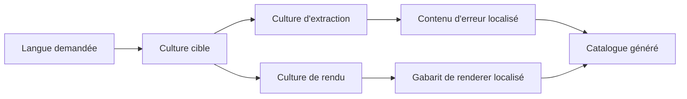

# Internationalisation

🌍 **Langues :**  
🇬🇧 [English](./Internationalization.en.md) | 🇫🇷 Français (ce fichier)

FirstClassErrors peut générer le même catalogue d’erreurs dans plusieurs langues. L’internationalisation est optionnelle et granulaire : un projet peut tout localiser, ne localiser que certaines sources, ou ne rien localiser.

Cette page décrit l’internationalisation du pipeline et, plus précisément, la manière dont son contenu et ses gabarits sont **localisés** pour une culture donnée. La règle essentielle est que la localisation intervient à **deux étapes distinctes du pipeline**.

## Le modèle en un coup d’œil

Une seule culture cible pilote normalement les deux étapes : l’extraction localise le contenu d’erreur, le rendu localise le gabarit autour.



| Étape | Localise |
| --- | --- |
| extraction | titres, descriptions, règles, hypothèses de diagnostic, exemples, messages publics, descriptions de source et de clés de contexte |
| rendu | titres, libellés, en-têtes, navigation et autres textes fixes du renderer |

Les identités stables restent indépendantes de la culture.

## Ce qui reste invariant

Ne localisez pas les valeurs utilisées comme contrats ou identifiants opérationnels :

- codes d’erreur ;
- noms de source créés avec `nameof(...)` ;
- valeurs d’`ErrorOrigin` ;
- noms de clés de contexte ;
- noms de fichiers et ancres générés ;
- noms de champs JSON et autres schémas machine.

Ces valeurs stables garantissent que les liens, branches clientes, dashboards et requêtes de logs fonctionnent dans toutes les langues du catalogue.

`DiagnosticMessage` relève de la même habitude « garder stable », mais pour une raison différente. C’est une simple chaîne — rien dans la bibliothèque n’empêche de la localiser — donc la garder dans une seule langue interne est une convention, pas une contrainte technique. La section suivante explique pourquoi cette convention mérite d’être suivie.

## Les trois messages runtime

| Message | Localisé ? | Pourquoi |
| --- | --- | --- |
| `ShortMessage` | oui | message public pour utilisateurs ou clients d’API |
| `DetailedMessage` | oui | détail public maîtrisé |
| `DiagnosticMessage` | non, par convention | une langue interne cohérente pour les logs, le support et les développeurs |

Un catalogue français peut donc afficher des messages publics français tout en conservant un message de diagnostic anglais. C’est volontaire : le diagnostic explique une occurrence runtime à un public interne commun. La bibliothèque ne l’impose pas — c’est un choix de gouvernance — mais localiser le diagnostic par appelant rend les logs d’un même type d’erreur dépendants de la langue et plus difficiles à rechercher.

Pour les règles d’écriture, voir [Écrire les messages d’erreur](WritingErrorMessages.fr.md).

## Choisir la langue

Passez `--language` ou `-l` :

```bash
fce generate \
  --solution ./MyApp.sln \
  --format markdown \
  --language fr \
  --service-name my-api \
  --output ./docs/errors-fr
```

Ou configurez une valeur par défaut dans `fce.json` :

```json
{
  "solution": "./MyApp.sln",
  "language": "fr"
}
```

Une valeur en ligne de commande écrase la configuration. Sans option de langue, la langue par défaut du catalogue est l’anglais.

`--language` accepte un nom de culture .NET : une culture neutre comme `fr`, ou une culture spécifique comme `fr-FR` ou `en-GB`. Utilisez une culture spécifique lorsque les variantes régionales doivent différer. Un nom non reconnu est rejeté avec une erreur, sans repli silencieux. L’API programmatique nomme la même valeur `Culture` (un `CultureInfo`) ; l’option CLI s’appelle `--language` par familiarité, mais c’est bien une culture, pas un simple code de langue.

## Localiser le contenu documentaire

Pendant l’extraction, le worker s’exécute sous la culture demandée : il définit à la fois `CultureInfo.CurrentUICulture`, qui pilote la résolution des ressources `.resx`, et `CultureInfo.CurrentCulture`, qui pilote le formatage des nombres et dates sensible à la culture. Les méthodes de documentation et factories résolvent donc les ressources localisées — et formatent les valeurs — pour cette culture.

```csharp
// Messages.Get(...) représente ici le mécanisme de ressources de votre
// application (une classe adossée à des .resx), pas une API FirstClassErrors.
private static ErrorDocumentation BelowAbsoluteZeroDocumentation() {
    return DescribeError
        .WithTitle(Messages.Get("Temperature_BelowAbsoluteZero_Title"))
        .WithDescription(Messages.Get("Temperature_BelowAbsoluteZero_Description"))
        .WithRule(Messages.Get("Temperature_BelowAbsoluteZero_Rule"))
        .WithDiagnostic(
            Messages.Get("Temperature_BelowAbsoluteZero_Cause"),
            ErrorOrigin.Internal,
            Messages.Get("Temperature_BelowAbsoluteZero_Hint"))
        .WithExamples(() => BelowAbsoluteZero(-1m));
}
```

La factory runtime peut localiser ses messages publics depuis la même source :

```csharp
return DomainError.Create(
        Code.BelowAbsoluteZero,
        diagnosticMessage: $"Temperature {value} is below absolute zero.")
    .WithPublicMessage(
        shortMessage: Messages.Get("Temperature_BelowAbsoluteZero_ShortMessage"),
        detailedMessage: Messages.Get("Temperature_BelowAbsoluteZero_DetailedMessage"));
```

Le message de diagnostic reste rédigé directement dans la langue interne choisie par le projet.

## Localiser les descriptions de source

`[ProvidesErrorsFor]` peut traiter `Description` comme une clé de ressource lorsque `DescriptionResourceType` est renseigné :

```csharp
[ProvidesErrorsFor(
    nameof(Amount),
    Description = "Amount_Source_Description",
    DescriptionResourceType = typeof(Messages))]
public static class InvalidAmountError {
}
```

Sans `DescriptionResourceType`, la description est littérale et reste dans sa langue d’écriture.

## Localiser les descriptions de clés de contexte

Le nom de clé reste stable, mais sa description documentaire peut être résolue paresseusement :

```csharp
public static readonly ErrorContextKey<DateOnly> TransactionDate =
    ErrorContextKey.Create<DateOnly>(
        "TRANSACTION_DATE",
        () => Messages.Get("TransactionDate_Context_Description"));
```

On obtient ainsi une prose localisée dans le catalogue sans modifier la clé opérationnelle utilisée dans les logs.

## Localiser les gabarits des renderers

Un renderer reçoit la culture cible via `RenderRequest.Culture`. Il doit l’utiliser uniquement pour le texte qui lui appartient :

```csharp
// RendererResources est votre propre classe de ressources .resx, pas un type de la bibliothèque.
string heading = RendererResources.GetString(
    "ErrorCatalogHeading",
    request.Culture) ?? "Error catalog";
```

Le catalogue reçu contient déjà le contenu d’erreur localisé. Le traduire une seconde fois mélangerait les responsabilités et pourrait produire une sortie incohérente.

Le renderer JSON garde ses noms de champs invariants : il s’agit d’un contrat machine, pas de prose utilisateur.

Voir [Écrire son propre renderer](WritingACustomRenderer.fr.md).

## La localisation partielle est valide

L’internationalisation n’est pas tout ou rien.

Un projet peut contenir :

- des sources entièrement localisées ;
- de la documentation rédigée comme littéraux anglais ;
- des descriptions de source issues de ressources avec des diagnostics fixes ;
- des renderers traduits dans moins de langues que le contenu applicatif.

Lorsqu’une ressource manque, le fallback appartient à la stratégie de ressources de l’application. Avec `Messages.resx` et `Messages.fr.resx`, une clé absente du fichier français retombe sur la ressource neutre — le comportement standard des assemblies satellites `.resx`. Une clé absente de *toutes* les ressources doit faire échouer un test plutôt que produire un catalogue incomplet : vérifiez qu’une ressource absente ne produit pas silencieusement des titres, règles ou messages publics vides.

## Générer plusieurs langues en CI

Exécutez une génération par langue et publiez des dossiers distincts :

```bash
fce generate --solution MyApp.sln --no-build \
  --format markdown --language en --service-name my-api \
  --output artifacts/errors/en

fce generate --solution MyApp.sln --no-build \
  --format markdown --language fr --service-name my-api \
  --output artifacts/errors/fr
```

Publiez ensemble les langues d’une même version afin que le support puisse changer de langue sans ouvrir la documentation d’un autre déploiement.

Les noms de fichiers et ancres restent invariants, ce qui rend les liens inter-langues prévisibles.

## Utiliser le pipeline programmatiquement

Utilisez la même culture pour l’extraction et le rendu :

```csharp
CultureInfo culture = CultureInfo.GetCultureInfo("fr");

IEnumerable<ErrorDocumentation> catalog =
    SolutionErrorDocumentationGenerator.GetErrorDocumentationFrom(
        "MyApp.sln",
        new SolutionGenerationOptions { Culture = culture });

RenderRequest request = new(RenderLayouts.Single, culture, "my-api");

IReadOnlyList<RenderedDocument> documents =
    new MarkdownErrorDocumentationRenderer().Render(catalog, request);
```

Le nom de service est exigé par les renderers markdown et html, qui intègrent des exemples RFC 9457 (« Problem Details » pour les API HTTP) typés `urn:problem:{service}:{code}` ; le format json accepte `null`.

Employer volontairement deux cultures différentes produit une sortie multilingue mélangée et devrait rester exceptionnel.

## Erreurs fréquentes

### Localiser les codes ou noms de clés

Cela casse clients, dashboards et liens. Localisez les descriptions, jamais les identités.

### Localiser `DiagnosticMessage` selon l’appelant

Les logs d’un même type d’erreur deviennent dépendants de la langue et plus difficiles à rechercher. Gardez une langue interne unique.

### Traduire le contenu applicatif dans un renderer

Le renderer reçoit déjà le contenu localisé. Il possède uniquement son gabarit.

### Croire qu’un littéral est traduit automatiquement

Un littéral reste littéral. Utilisez des ressources lorsque la localisation est nécessaire.

### Publier des langues provenant de builds différents

Les catalogues peuvent décrire des codes différents. Générez toutes les langues depuis les mêmes binaires et la même version.

## Checklist de revue

Avant de publier des catalogues localisés, vérifiez que :

- la prose publique utilise les ressources prévues ;
- codes, clés, chemins, ancres et schémas restent invariants ;
- `DiagnosticMessage` reste dans la langue interne choisie ;
- les descriptions de source et de contexte suivent la culture demandée ;
- les libellés de renderer utilisent `RenderRequest.Culture` ;
- le fallback de ressources est explicite et testé ;
- toutes les langues proviennent des mêmes binaires ;
- les dossiers de langue sont versionnés et publiés ensemble ;
- les parcours CLI et programmatiques utilisent la même culture aux deux étapes.

---

<div align="center">
<a href="WritingACustomRenderer.fr.md">← Écrire son propre renderer</a> · <a href="README.fr.md#-étapes-suivantes">↑ Table des matières</a> · <a href="FAQ.fr.md">FAQ →</a>
</div>

---