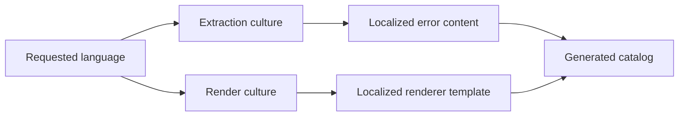

# Internationalization

🌍 **Languages:**  
🇬🇧 English (this file) | 🇫🇷 [Français](./Internationalisation.fr.md)

FirstClassErrors can generate the same error catalog in several languages. Internationalization is optional and granular: a project may localize every documented error, only selected sources, or nothing at all.

The most important rule is that localization happens at **two different pipeline stages**.

## The model at a glance



| Stage | Owns |
| --- | --- |
| extraction | titles, descriptions, rules, diagnostic hypotheses, examples, public messages, source descriptions, context-key descriptions |
| rendering | headings, labels, table headers, navigation, and other renderer-owned boilerplate |

Stable identities remain culture-invariant.

## What remains invariant

Do not localize values used as contracts or operational identifiers:

- error codes;
- source names created with `nameof(...)`;
- `ErrorOrigin` values;
- context-key names;
- generated file names and anchors;
- JSON field names and other machine schemas;
- `DiagnosticMessage`, the internal runtime message.

Keeping these values stable ensures that links, client branches, dashboards, and log queries work across every catalog language.

## The three runtime messages

| Message | Localized? | Reason |
| --- | --- | --- |
| `ShortMessage` | yes | public message for users or API clients |
| `DetailedMessage` | yes | controlled public detail |
| `DiagnosticMessage` | no | one consistent internal language for logs, support, and development |

A French catalog may therefore show French public messages while preserving an English diagnostic message. This is intentional: the diagnostic message identifies and explains one runtime occurrence for the internal audience.

For message-writing rules, see [Writing Error Messages](WritingErrorMessages.en.md).

## Choose the language

Pass `--language` or `-l`:

```bash
fce generate \
  --solution ./MyApp.sln \
  --format markdown \
  --language fr \
  --service-name my-api \
  --output ./docs/errors-fr
```

Or configure a default in `fce.json`:

```json
{
  "solution": "./MyApp.sln",
  "language": "fr"
}
```

A command-line value overrides the configuration. Without a language option, the default catalog language is English.

## Localize documentation content

During extraction, the worker runs with `CultureInfo.CurrentUICulture` set from the requested language. Documentation methods and error factories can therefore read `.resx` resources normally.

```csharp
private static ErrorDocumentation BelowAbsoluteZeroDocumentation() {
    return DescribeError
        .WithTitle(Messages.Get("Temperature_BelowAbsoluteZero_Title"))
        .WithDescription(Messages.Get("Temperature_BelowAbsoluteZero_Description"))
        .WithRule(Messages.Get("Temperature_BelowAbsoluteZero_Rule"))
        .WithDiagnostic(
            Messages.Get("Temperature_BelowAbsoluteZero_Cause"),
            ErrorOrigin.Internal,
            Messages.Get("Temperature_BelowAbsoluteZero_Hint"))
        .WithExamples(() => BelowAbsoluteZero(-1m));
}
```

The runtime factory can localize its public messages through the same resource source:

```csharp
return DomainError.Create(
        Code.BelowAbsoluteZero,
        diagnosticMessage: $"Temperature {value} is below absolute zero.")
    .WithPublicMessage(
        shortMessage: Messages.Get("Temperature_BelowAbsoluteZero_ShortMessage"),
        detailedMessage: Messages.Get("Temperature_BelowAbsoluteZero_DetailedMessage"));
```

The diagnostic message remains authored directly in the project’s chosen internal language.

## Localize source descriptions

`[ProvidesErrorsFor]` can treat `Description` as a resource key when `DescriptionResourceType` is set:

```csharp
[ProvidesErrorsFor(
    nameof(Amount),
    Description = "Amount_Source_Description",
    DescriptionResourceType = typeof(Messages))]
public static class InvalidAmountError {
}
```

Without `DescriptionResourceType`, the description is literal and remains in its authored language.

## Localize context-key descriptions

The key name remains stable, but its documentation description can be resolved lazily:

```csharp
public static readonly ErrorContextKey<DateOnly> TransactionDate =
    ErrorContextKey.Create<DateOnly>(
        "TRANSACTION_DATE",
        () => Messages.Get("TransactionDate_Context_Description"));
```

This produces localized catalog prose without changing the operational key used in logs.

## Localize renderer templates

A renderer receives the target culture through `RenderRequest.Culture`. It should use that culture only for text that belongs to the renderer:

```csharp
string heading = RendererResources.GetString(
    "ErrorCatalogHeading",
    request.Culture) ?? "Error catalog";
```

The catalog passed to the renderer already contains localized error content. Translating it again would mix responsibilities and can produce inconsistent output.

The JSON renderer keeps its schema field names invariant because they are a machine contract, not user-facing prose.

See [Writing a custom renderer](WritingACustomRenderer.en.md).

## Partial localization is valid

Internationalization is not all-or-nothing.

A project may contain:

- fully localized sources;
- documentation written as English literals;
- source descriptions backed by resources but fixed diagnostic messages;
- custom renderers localized in fewer languages than the application content.

When a resource is unavailable, the fallback behavior belongs to the application’s resource strategy. Ensure that missing resources do not silently produce empty titles, rules, or public messages.

## Generate several languages in CI

Run one generation per language and publish separate directories:

```bash
fce generate --solution MyApp.sln --no-build \
  --format markdown --language en --service-name my-api \
  --output artifacts/errors/en

fce generate --solution MyApp.sln --no-build \
  --format markdown --language fr --service-name my-api \
  --output artifacts/errors/fr
```

Keep identical catalog versions together so support can switch language without opening documentation from another deployment.

File names and anchors remain invariant, which makes language switching and cross-language links predictable.

## Use the pipeline programmatically

Set the same culture for extraction and rendering:

```csharp
CultureInfo culture = CultureInfo.GetCultureInfo("fr");

IEnumerable<ErrorDocumentation> catalog =
    SolutionErrorDocumentationGenerator.GetErrorDocumentationFrom(
        "MyApp.sln",
        new SolutionGenerationOptions { Culture = culture });

RenderRequest request = new(RenderLayouts.Single, culture, "my-api");

IReadOnlyList<RenderedDocument> documents =
    new MarkdownErrorDocumentationRenderer().Render(catalog, request);
```

The service name is required by the markdown and html renderers, which embed RFC 9457 examples typed `urn:problem:{service}:{code}`; the json format accepts `null`.

Using different cultures intentionally produces mixed-language output and should be rare.

## Common mistakes

### Localizing codes or key names

This breaks clients, dashboards, and links. Localize descriptions, never identities.

### Localizing `DiagnosticMessage` per caller

Logs for the same error type become language-dependent and harder to search. Keep one internal author language.

### Translating application content inside a renderer

The renderer receives already localized content. It owns only its template.

### Treating literal text as automatically translated

A literal remains literal. Use resource-backed values where localization is required.

### Publishing languages from different builds

The catalogs may describe different code. Generate every language from the same build and version.

## Review checklist

Before publishing localized catalogs, verify that:

- public prose is backed by the intended resources;
- codes, keys, paths, anchors, and schemas stay invariant;
- `DiagnosticMessage` stays in the chosen internal language;
- source and context descriptions resolve in the requested culture;
- renderer labels use `RenderRequest.Culture`;
- missing-resource fallback is explicit and tested;
- every language is generated from the same binaries;
- language directories are versioned and published together;
- the CLI and programmatic paths use the same culture for extraction and rendering.

---

<div align="center">
<a href="WritingACustomRenderer.en.md">← Writing a custom renderer</a> · <a href="../README.md#-next-steps">↑ Table of contents</a> · <a href="FAQ.en.md">FAQ →</a>
</div>

---