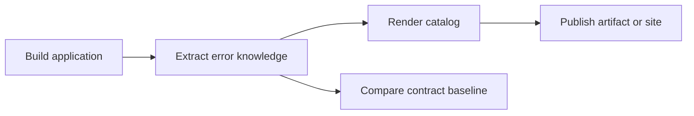

# Generating and Publishing the Error Catalog

🌍 **Languages:**  
🇬🇧 English (this file) | 🇫🇷 [Français](./OperationalIntegration.fr.md)

FirstClassErrors becomes operationally useful when the catalog is generated from the exact code being built and published where developers, support teams, and operators can reach it.

This guide covers the delivery workflow. For structured logging and production diagnostics, see [Logging and Operational Integration](LoggingIntegration.en.md).

## The delivery flow



A reliable pipeline should:

1. build the application;
2. generate the catalog from the built code;
3. publish the generated files;
4. optionally compare the current contract with a committed baseline.

## Opt projects into generation

Solution-level generation is opt-in. Add the marker directly to every `.csproj` that defines documented application errors:

```xml
<PropertyGroup>
  <GenerateErrorDocumentation>true</GenerateErrorDocumentation>
</PropertyGroup>
```

The marker is read from the project file itself. A value inherited from `Directory.Build.props` is not detected.

When no project opts in, the generator warns instead of silently presenting an empty catalog as a valid result.

For ambiguous declarations, project discovery, and worker behavior, see [Architecture of the Documentation Pipeline](ArchitectureOfTheDocumentationPipeline.en.md).

## Generate the catalog locally

Install the CLI, build, then generate from the existing binaries:

```bash
dotnet tool install --global FirstClassErrors.Cli
dotnet build MyApp.sln -c Release
fce generate \
  --solution MyApp.sln \
  --configuration Release \
  --no-build \
  --format markdown \
  --output artifacts/errors.md \
  --service-name my-api
```

`--service-name` is required for Markdown and HTML because their RFC 9457 examples use problem types such as:

```text
urn:problem:my-api:payment-declined
```

JSON output does not require a service name.

## Recommended GitHub Actions workflow

```yaml
name: error-documentation

on:
  pull_request:
  push:
    branches: [main]

jobs:
  generate-error-catalog:
    runs-on: ubuntu-latest

    steps:
      - uses: actions/checkout@v4

      - uses: actions/setup-dotnet@v4
        with:
          dotnet-version: '10.0.x'

      - name: Install FirstClassErrors CLI
        run: dotnet tool install --global FirstClassErrors.Cli

      - name: Build
        run: dotnet build MyApp.sln -c Release

      - name: Generate catalog
        run: |
          fce generate \
            --solution MyApp.sln \
            --configuration Release \
            --no-build \
            --format html \
            --layout split \
            --output artifacts/error-catalog \
            --service-name my-api

      - name: Publish catalog artifact
        uses: actions/upload-artifact@v4
        with:
          name: error-catalog
          path: artifacts/error-catalog
```

The build and generation steps use the same configuration. `--no-build` prevents the generator from rebuilding a different set of binaries.

## Generate several languages

Run one generation per locale:

```yaml
strategy:
  matrix:
    language: [en, fr]

steps:
  # checkout, setup, install, and build omitted

  - name: Generate ${{ matrix.language }} catalog
    run: |
      fce generate \
        --solution MyApp.sln \
        --configuration Release \
        --no-build \
        --format html \
        --layout split \
        --language "${{ matrix.language }}" \
        --output "artifacts/error-catalog-${{ matrix.language }}" \
        --service-name my-api
```

File names and anchors remain stable across languages. See [Internationalization](Internationalization.en.md) for how content and renderer templates are localized.

## Choose a publication target

The generated catalog may be:

- retained as a pipeline artifact;
- attached to a release;
- deployed as a static site;
- copied into an internal documentation portal;
- published beside service operational documentation.

The important requirement is not the platform. It is that the catalog for a deployed version is reachable by the people investigating that version.

## Keep versioned catalogs

A single “latest” site is useful for daily work, but it does not explain an older production release after the contract has evolved.

For long-lived or support-critical systems, publish at least one immutable form per release:

```text
/errors/latest/
/errors/releases/2.4.0/
/errors/releases/2.3.1/
```

This lets an `InstanceId`, deployment version, or release tag lead support to the matching documentation.

## Guard the error contract

Generation answers “what does this version document?” Catalog versioning answers “did this version break a previously accepted contract?”

```bash
fce catalog diff --solution MyApp.sln --configuration Release --no-build
```

Keep the accepted baseline in source control and run the comparison in pull requests.

See:

- [Catalog Versioning](CatalogVersioning.en.md) for the mental model and daily workflow;
- [Catalog Versioning CI/CD](CatalogVersioningCI.en.md) for complete GitHub Actions and GitLab examples.

## Failure policy

Treat these situations differently:

| Situation | Pipeline meaning |
| --- | --- |
| application build fails | the product cannot be produced |
| extraction or rendering fails | the catalog cannot be trusted |
| no project opted in | configuration is incomplete or the solution intentionally has no documented project |
| catalog contract breaks | human review is required before acceptance |
| publishing fails | the documentation is unavailable even if generation succeeded |

Do not hide extraction or publication failures behind `continue-on-error` in a pipeline that promises operational documentation.

## Review checklist

Before approving a catalog-delivery pipeline, verify that:

- opted-in projects declare the marker in their own `.csproj`;
- generation uses the same binaries and configuration as the application build;
- `--service-name` is supplied for Markdown or HTML;
- generated files are published somewhere reachable;
- locale-specific outputs do not overwrite one another;
- released versions can retain immutable documentation;
- contract comparison is separate from catalog rendering;
- generation and publication failures are visible.

---

<div align="center">
<a href="DeterministicTesting.en.md">← Deterministic Error Tests</a> · <a href="../README.md#-next-steps">↑ Table of contents</a> · <a href="LoggingIntegration.en.md">Logging and Operational Integration →</a>
</div>

---