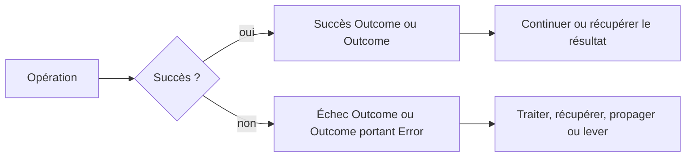

# Composer avec Outcome

🌍 **Langues :**  
🇬🇧 [English](./OutcomeGuide.en.md) | 🇫🇷 Français (ce fichier)

`Outcome` et `Outcome<T>` transportent une `Error` structurée sans la lever. Utilisez-les lorsque l’échec est attendu et que l’appelant doit décider comment le traiter.

Cette page est le guide dédié à la création, l’inspection, la composition, la récupération et l’escalade des outcomes. Pour choisir quand les utiliser, commencez par [Patterns d’utilisation](UsagePatterns.fr.md).

## 🧭 Le modèle en une minute



Un outcome ne transporte jamais une exception. Un échec porte une `Error` et conserve son code, ses messages, son contexte, son identité d’occurrence et ses erreurs internes.

## `Outcome` ou `Outcome<T>` ?

| Type | À utiliser lorsque |
| --- | --- |
| `Outcome` | le succès ne produit aucune valeur, par exemple réserver un stock ou valider une commande |
| `Outcome<T>` | le succès produit une valeur, par exemple parser un montant ou charger une commande |

```csharp
Outcome reservation = Inventory.Reserve(sku);
Outcome<Order> lookup = Orders.Find(orderId);
```

## Créer des outcomes

### Succès sans valeur

```csharp
return Outcome.Success;
```

### Succès avec une valeur

```csharp
return Outcome<Amount>.Success(amount);
```

### Échec

```csharp
return Outcome<Amount>.Failure(
    InvalidAmountOperationError.UnknownCurrency(currencyCode));
```

`Failure(...)` exige une `Error`. Gardez la création des erreurs dans une factory nommée afin qu’une même situation reste cohérente, qu’elle soit retournée ou levée.

## Inspecter un outcome

Utilisez `IsSuccess` et `IsFailure` lorsqu’un branchement explicite est le plus lisible.

```csharp
Outcome<Amount> result = TryCreateAmount(value, currencyCode);

if (result.IsFailure) {
    Log(result.Error!);
    return;
}

Amount amount = result.GetResultOrThrow();
Process(amount);
```

En cas d’échec, `Error` contient l’erreur structurée. Après avoir établi le succès, `GetResultOrThrow()` retourne le résultat sans lever.

Préférez un pipeline lorsque cela rend le contrôle de flux plus clair.

## `Then` : continuer seulement après un succès

`Then(...)` exécute l’opération suivante uniquement lorsque l’outcome courant a réussi. Un échec court-circuite la chaîne et est propagé sans modification.

```csharp
Outcome<Receipt> result =
    TryCreateAmount(value, currencyCode)
        .Then(CheckLimits)
        .Then(Charge);
```

L’exemple comporte trois points d’échec possibles, mais l’appelant reçoit un seul `Outcome<Receipt>`. La première erreur reste le résultat.

`Then` convient lorsque l’étape suivante peut elle-même échouer et retourne donc un autre `Outcome` ou `Outcome<T>`.

## `To` : transformer une valeur réussie

`To(...)` transforme la valeur portée par un `Outcome<T>` réussi. Il ne s’exécute pas après un échec.

```csharp
Outcome<Money> total =
    TryCreateAmount(value, currencyCode)
        .To(amount => amount.WithVat());
```

Utilisez `To` pour une transformation qui ne peut pas échouer. Utilisez `Then` lorsque la transformation retourne un outcome parce qu’elle peut échouer.

```csharp
Outcome<Money> mapped = amountOutcome.To(AddVat);
Outcome<Money> validated = amountOutcome.Then(CheckLimits);
```

## `Recover` : remplacer volontairement un échec

`Recover(...)` s’exécute uniquement après un échec et reçoit l’`Error` courante.

```csharp
Outcome<ExchangeRate> rate =
    LoadLiveRate(currency)
        .Recover(error => LoadCachedRate(currency));
```

La récupération peut produire un succès ou un nouvel échec. Si le fallback échoue, son erreur devient l’erreur de l’outcome.

Utilisez la récupération pour une véritable stratégie alternative, compensation ou valeur de repli. Ne l’utilisez pas simplement pour masquer une erreur.

Une valeur de repli peut être retournée sous forme de succès :

```csharp
Outcome<Amount> amount =
    TryCreateAmount(value, currencyCode)
        .Recover(error => Outcome<Amount>.Success(Amount.Zero));
```

## `Finally` : traiter les deux cas terminaux

`Finally(...)` sélectionne une action ou une valeur terminale selon le succès ou l’échec.

```csharp
string message = result.Finally(
    onSuccess: receipt => $"Paiement {receipt.Id} effectué",
    onFailure: error => $"Échec avec {error.Code}");
```

Il est utile aux frontières applicatives où les deux cas doivent être traduits vers une autre représentation : réponse API, résultat CLI ou entrée de log.

```csharp
result.Finally(
    onSuccess: receipt => LogInformation(receipt),
    onFailure: error => LogError(error));
```

`Finally` est terminal : utilisez-le pour consommer ou traduire un outcome, pas comme une étape intermédiaire cachée dans une longue chaîne.

## Sortir du flux Outcome

Deux méthodes reconvertissent un échec en flux par exception.

### `ThrowIfFailure()`

Utilisez-la avec `Outcome`, ou lorsque la valeur réussie n’est pas nécessaire à cet endroit.

```csharp
Outcome reservation = Inventory.Reserve(sku);
reservation.ThrowIfFailure();
```

Elle ne fait rien en cas de succès et lève `error.ToException()` en cas d’échec.

### `GetResultOrThrow()`

Utilisez-la avec `Outcome<T>` lorsqu’une frontière exige une valeur ou une exception.

```csharp
Amount amount = TryCreateAmount(value, currencyCode).GetResultOrThrow();
```

L’exception est créée et levée à cet endroit. La stack trace commence donc au point d’escalade, pas là où l’échec `Outcome` a été créé.

Gardez cette conversion à une frontière intentionnelle. L’appeler immédiatement après chaque opération supprimerait l’intérêt d’utiliser `Outcome<T>`.

## Composition asynchrone

Les mêmes opérations existent pour les étapes asynchrones. Propagez le token d’annulation dans la chaîne.

```csharp
Outcome<Receipt> result =
    await LoadOrderAsync(orderId, cancellationToken)
        .Then(
            (order, ct) => ValidateOrderAsync(order, ct),
            cancellationToken)
        .Then(
            (order, ct) => ChargeAsync(order, ct),
            cancellationToken);
```

`OutcomeTaskExtensions` permet également à un `Task<Outcome>` ou `Task<Outcome<T>>` de continuer directement avec `Then`, `To`, `Recover` et `Finally`.

Préférez un token d’annulation visible pour tout le flux applicatif. Une annulation reste une annulation ; ne la traduisez pas en erreur métier sauf si l’application modélise explicitement cette situation.

## Chaîne fluide ou branchement classique ?

Une chaîne fluide est utile lorsque :

- le flux est une séquence d’étapes dépendantes ;
- chaque étape suit le même modèle succès/échec ;
- le court-circuit est le comportement voulu ;
- la chaîne se lit de gauche à droite sans masquer les décisions métier.

Préférez un branchement explicite lorsque :

- des erreurs différentes exigent des actions très différentes ;
- plusieurs opérations indépendantes doivent toutes s’exécuter ;
- des résultats partiels doivent être collectés ;
- la chaîne devient moins lisible que quelques `if`.

FirstClassErrors n’impose pas du railway-oriented programming (enchaîner chaque étape dans un pipeline succès/échec) partout. `Outcome` sert le modèle ; le modèle ne sert pas la syntaxe fluide.

## Exemple complet

```csharp
public async Task<Outcome<Receipt>> CheckoutAsync(
    decimal value,
    string currencyCode,
    CancellationToken cancellationToken) {

    return await TryCreateAmount(value, currencyCode)
        .Then(CheckLimits)
        .Then(
            (amount, ct) => ChargeAsync(amount, ct),
            cancellationToken)
        .Recover(
            (error, ct) => TryAlternativeProviderAsync(error, ct),
            cancellationToken);
}
```

Le flux conserve un seul modèle d’erreur structuré de la validation jusqu’au paiement. Aucune exception n’est nécessaire tant qu’un appelant ne choisit pas explicitement d’escalader.

## 📌 Checklist de revue

Avant de valider un flux `Outcome`, vérifiez que :

- l’échec est attendu et appartient au contrôle de flux normal ;
- les échecs portent une `Error`, jamais une exception ou une chaîne ;
- les factories restent la source unique de construction des erreurs ;
- `Then` est utilisé pour les étapes susceptibles d’échouer et `To` pour les transformations infaillibles ;
- la récupération est intentionnelle et ne supprime pas silencieusement des erreurs utiles ;
- la conversion en exception n’a lieu qu’à une frontière claire ;
- une chaîne fluide est réellement plus lisible qu’un branchement explicite ;
- les tokens d’annulation sont propagés dans les opérations asynchrones.

---

<div align="center">
<a href="UsagePatterns.fr.md">← Patterns d’utilisation</a> · <a href="README.fr.md#-étapes-suivantes">↑ Table des matières</a> · <a href="BestPractices.fr.md">Bonnes pratiques →</a>
</div>

---