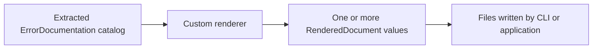

# Writing a custom renderer

🌍 **Languages:**  
🇬🇧 English (this file) | 🇫🇷 [Français](./WritingACustomRenderer.fr.md)

A custom renderer turns the extracted `ErrorDocumentation` catalog into a format owned by your organization: CSV, a documentation portal payload, a company-specific static site, or another machine-readable representation.

A renderer does **not** discover projects or execute error factories. It receives an already extracted catalog and decides only how to present it.

## The workflow



To add a format:

1. reference `FirstClassErrors`;
2. implement `IErrorDocumentationRenderer`;
3. declare a unique `Format` and supported layouts;
4. return one or more `RenderedDocument` values;
5. package the renderer in a loadable assembly;
6. register that assembly in `fce.json` or with the CLI.

## The contract

```csharp
public interface IErrorDocumentationRenderer {
    string Format { get; }
    IReadOnlyCollection<string> SupportedLayouts { get; }
    IReadOnlyList<RenderedDocument> Render(
        IEnumerable<ErrorDocumentation> catalog,
        RenderRequest request);
}
```

The renderer contract types live in the `FirstClassErrors.GenDoc.Rendering` namespace of the `FirstClassErrors` package; the documentation model itself (`ErrorDocumentation` and related types) lives in the `FirstClassErrors` namespace.

### `Format`

`Format` is the value selected by `--format`:

```csharp
public string Format => "csv";
```

Choose a stable, lowercase name. Built-in formats take precedence if a custom renderer reuses `json`, `markdown`, or `html`.

### `SupportedLayouts`

A layout describes the shape of the output, not its format:

```csharp
public IReadOnlyCollection<string> SupportedLayouts { get; } =
    new[] { RenderLayouts.Single };
```

The built-in names are `single` and `split`, but a custom renderer may define another string when its output model requires it.

Reject an unsupported request explicitly:

```csharp
if (!SupportedLayouts.Contains(request.Layout, StringComparer.OrdinalIgnoreCase)) {
    throw new LayoutNotSupportedException(Format, request.Layout, SupportedLayouts);
}
```

### `RenderedDocument`

Each returned document contains:

- `RelativePath`, the path below the selected output location;
- `Content`, the complete file contents.

Return one document for a single-file format. Return several documents for a site or split layout.

Keep paths relative, deterministic, and safe. Do not write files directly inside `Render(...)`; the caller owns the output destination.

### `RenderRequest`

`RenderRequest` carries:

- `Layout`, selected by `--layout`;
- `Culture`, used for renderer-owned headings, labels, and template text;
- `ServiceName`, set from `--service-name` or the configuration, used by renderers that emit RFC 9457 (Problem Details for HTTP APIs) problem types (`urn:problem:{service}:{code}`); `null` when none is configured.

The catalog content has already been localized during extraction. A renderer must not reinterpret or retranslate error titles, rules, messages, or diagnostics.

## Complete minimal CSV renderer

```csharp
using System;
using System.Collections.Generic;
using System.Linq;

using FirstClassErrors;
using FirstClassErrors.GenDoc.Rendering;

public sealed class CsvErrorDocumentationRenderer : IErrorDocumentationRenderer {

    public string Format => "csv";

    public IReadOnlyCollection<string> SupportedLayouts { get; } =
        new[] { RenderLayouts.Single };

    public IReadOnlyList<RenderedDocument> Render(
        IEnumerable<ErrorDocumentation> catalog,
        RenderRequest request) {

        if (!SupportedLayouts.Contains(request.Layout, StringComparer.OrdinalIgnoreCase)) {
            throw new LayoutNotSupportedException(Format, request.Layout, SupportedLayouts);
        }

        IEnumerable<string> rows = catalog.Select(error =>
            $"{Quote(error.Code.ToString())},{Quote(error.Title)}");

        string content = "code,title\n" + string.Join("\n", rows);

        return new[] {
            new RenderedDocument("errors.csv", content)
        };
    }

    private static string Quote(string? value) {
        string escaped = (value ?? string.Empty).Replace("\"", "\"\"");
        return $"\"{escaped}\"";
    }
}
```

This renderer is deterministic, supports one layout, and returns one complete file.

## Register it with the CLI

Build the renderer into a class library, then register the assembly:

```bash
fce config renderer add ./plugins/MyCompany.Renderers.dll
fce config renderer list
```

The configuration contains the registered path:

```json
{
  "renderers": ["./plugins/MyCompany.Renderers.dll"]
}
```

Paths may be absolute or relative to `fce.json`. Relative paths make a repository-local configuration portable.

Generate with the new format:

```bash
fce generate \
  --solution ./MyApp.sln \
  --format csv \
  --layout single \
  --output ./artifacts/errors.csv
```

## Discovery and loading rules

The CLI discovers public renderer types in configured assemblies. A renderer must:

- implement `IErrorDocumentationRenderer`;
- be public;
- have a parameterless constructor;
- use the contract assembly resolved by the CLI process;
- target a framework loadable by that CLI runtime.

Do not deploy a private copy of `FirstClassErrors` beside the plugin: if the CLI and the plugin each load their own copy, `IErrorDocumentationRenderer` becomes two distinct types and the renderer is silently not recognized. A project reference may use `<Private>false</Private>` when appropriate for the packaging layout.

A plugin that cannot be loaded is reported and skipped. Review those warnings: an unknown format later in the command may simply mean its plugin failed to load.

## Localize renderer-owned text

A CSV schema may have no translated template text. A renderer producing headings should resolve only those headings from `request.Culture`:

```csharp
// RendererResources is your own .resx-backed resource class, not a library type.
string heading = RendererResources.GetString("ErrorCatalog", request.Culture)
                 ?? "Error catalog";
```

Keep these responsibilities separate:

| Content | Owner |
| --- | --- |
| error title, description, rule, diagnostics, public messages | extraction and application resources |
| headings, labels, navigation text, table headers | renderer resources |
| codes, paths, anchors, schema field names | culture-invariant contract |

See [Internationalization](Internationalization.en.md).

## Use it without the CLI

A renderer is an ordinary class. Programmatic callers can extract and render directly:

```csharp
CultureInfo culture = CultureInfo.GetCultureInfo("en");

IEnumerable<ErrorDocumentation> catalog =
    SolutionErrorDocumentationGenerator.GetErrorDocumentationFrom(
        "MyApp.sln",
        new SolutionGenerationOptions { Culture = culture });

RenderRequest request = new(RenderLayouts.Single, culture);

foreach (RenderedDocument document in
         new CsvErrorDocumentationRenderer().Render(catalog, request)) {
    File.WriteAllText(document.RelativePath, document.Content);
}
```

The same culture should be used for extraction and rendering unless mixed-language output is deliberate.

## Renderer design checklist

Before publishing a renderer, verify that:

- `Format` is stable and does not collide with a built-in format;
- every declared layout is implemented;
- unsupported layouts throw `LayoutNotSupportedException`;
- output paths are relative and deterministic;
- output order is deterministic;
- machine schemas do not change accidentally;
- escaping is correct for the target format;
- renderer-owned text uses `request.Culture`;
- application-owned content is not translated a second time;
- the renderer performs no external I/O inside `Render(...)`;
- the plugin loads without warnings in the CLI environment.

---

<div align="center">
<a href="DocumentationExtractionReference.en.md">← Extraction and Project Discovery Reference</a> · <a href="../README.md#-next-steps">↑ Table of contents</a> · <a href="Internationalization.en.md">Internationalization →</a>
</div>

---