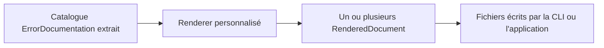

# Écrire son propre renderer

🌍 **Langues :**  
🇬🇧 [English](./WritingACustomRenderer.en.md) | 🇫🇷 Français (ce fichier)

Un renderer personnalisé transforme le catalogue `ErrorDocumentation` déjà extrait dans un format appartenant à votre organisation : CSV, payload pour un portail documentaire, site statique maison ou autre représentation lisible par machine.

Un renderer ne découvre pas les projets et n’exécute pas les factories d’erreur. Il reçoit un catalogue déjà extrait et décide uniquement de sa présentation.

## Le workflow



Pour ajouter un format :

1. référencez `FirstClassErrors` ;
2. implémentez `IErrorDocumentationRenderer` ;
3. déclarez un `Format` unique et les layouts pris en charge ;
4. renvoyez un ou plusieurs `RenderedDocument` ;
5. packagez le renderer dans un assembly chargeable ;
6. enregistrez cet assembly dans `fce.json` ou avec la CLI.

## Le contrat

```csharp
public interface IErrorDocumentationRenderer {
    string Format { get; }
    IReadOnlyCollection<string> SupportedLayouts { get; }
    IReadOnlyList<RenderedDocument> Render(
        IEnumerable<ErrorDocumentation> catalog,
        RenderRequest request);
}
```

Les types du contrat de rendu sont dans le namespace `FirstClassErrors.GenDoc.Rendering` du package `FirstClassErrors` ; le modèle documentaire lui-même (`ErrorDocumentation` et les types associés) est dans le namespace `FirstClassErrors`.

### `Format`

`Format` est la valeur sélectionnée par `--format` :

```csharp
public string Format => "csv";
```

Choisissez un nom stable en minuscules. Les formats intégrés restent prioritaires si un renderer personnalisé réutilise `json`, `markdown` ou `html`.

### `SupportedLayouts`

Un layout décrit la forme de la sortie, pas son format :

```csharp
public IReadOnlyCollection<string> SupportedLayouts { get; } =
    new[] { RenderLayouts.Single };
```

Les noms intégrés sont `single` et `split`, mais un renderer peut définir une autre chaîne si son modèle de sortie l’exige.

Rejetez explicitement un layout non supporté :

```csharp
if (!SupportedLayouts.Contains(request.Layout, StringComparer.OrdinalIgnoreCase)) {
    throw new LayoutNotSupportedException(Format, request.Layout, SupportedLayouts);
}
```

### `RenderedDocument`

Chaque document renvoyé contient :

- `RelativePath`, le chemin sous l’emplacement de sortie choisi ;
- `Content`, le contenu complet du fichier.

Renvoyez un document pour un format mono-fichier et plusieurs documents pour un site ou un layout splitté.

Gardez les chemins relatifs, déterministes et sûrs. N’écrivez pas directement les fichiers dans `Render(...)` : l’appelant possède la destination.

### `RenderRequest`

`RenderRequest` porte :

- `Layout`, sélectionné avec `--layout` ;
- `Culture`, utilisée pour les titres, libellés et textes fixes appartenant au renderer ;
- `ServiceName`, issu de `--service-name` ou de la configuration, utilisé par les renderers qui émettent des types de problème RFC 9457 (« Problem Details » pour les API HTTP) de la forme `urn:problem:{service}:{code}` ; `null` si non configuré.

Le contenu du catalogue a déjà été localisé pendant l’extraction. Un renderer ne doit pas retraduire les titres, règles, messages ou diagnostics des erreurs.

## Renderer CSV minimal complet

```csharp
using System;
using System.Collections.Generic;
using System.Linq;

using FirstClassErrors;
using FirstClassErrors.GenDoc.Rendering;

public sealed class CsvErrorDocumentationRenderer : IErrorDocumentationRenderer {

    public string Format => "csv";

    public IReadOnlyCollection<string> SupportedLayouts { get; } =
        new[] { RenderLayouts.Single };

    public IReadOnlyList<RenderedDocument> Render(
        IEnumerable<ErrorDocumentation> catalog,
        RenderRequest request) {

        if (!SupportedLayouts.Contains(request.Layout, StringComparer.OrdinalIgnoreCase)) {
            throw new LayoutNotSupportedException(Format, request.Layout, SupportedLayouts);
        }

        IEnumerable<string> rows = catalog.Select(error =>
            $"{Quote(error.Code.ToString())},{Quote(error.Title)}");

        string content = "code,title\n" + string.Join("\n", rows);

        return new[] {
            new RenderedDocument("errors.csv", content)
        };
    }

    private static string Quote(string? value) {
        string escaped = (value ?? string.Empty).Replace("\"", "\"\"");
        return $"\"{escaped}\"";
    }
}
```

Ce renderer est déterministe, prend en charge un seul layout et renvoie un fichier complet.

## L’enregistrer dans la CLI

Compilez le renderer dans une bibliothèque, puis enregistrez l’assembly :

```bash
fce config renderer add ./plugins/MyCompany.Renderers.dll
fce config renderer list
```

La configuration contient le chemin enregistré :

```json
{
  "renderers": ["./plugins/MyCompany.Renderers.dll"]
}
```

Les chemins peuvent être absolus ou relatifs à `fce.json`. Les chemins relatifs rendent la configuration du dépôt portable.

Générez avec le nouveau format :

```bash
fce generate \
  --solution ./MyApp.sln \
  --format csv \
  --layout single \
  --output ./artifacts/errors.csv
```

## Règles de découverte et de chargement

La CLI découvre les types de renderer publics dans les assemblies configurés. Un renderer doit :

- implémenter `IErrorDocumentationRenderer` ;
- être public ;
- posséder un constructeur sans paramètre ;
- utiliser l’assembly de contrat résolu par le processus CLI ;
- cibler un framework chargeable par ce runtime.

Ne déployez pas de copie privée de `FirstClassErrors` à côté du plugin : si la CLI et le plugin chargent chacun leur propre copie, `IErrorDocumentationRenderer` devient deux types distincts et le renderer n’est silencieusement pas reconnu. Une référence projet peut utiliser `<Private>false</Private>` lorsque ce choix correspond au packaging.

Un plugin impossible à charger est signalé puis ignoré. Examinez ces avertissements : un format inconnu peut simplement indiquer que son plugin n’a pas été chargé.

## Localiser le texte du renderer

Un schéma CSV peut ne contenir aucun texte à traduire. Un renderer avec des titres doit résoudre uniquement ses propres libellés depuis `request.Culture` :

```csharp
// RendererResources est votre propre classe de ressources .resx, pas un type de la bibliothèque.
string heading = RendererResources.GetString("ErrorCatalog", request.Culture)
                 ?? "Error catalog";
```

Gardez ces responsabilités séparées :

| Contenu | Responsable |
| --- | --- |
| titre, description, règle, diagnostics, messages publics | extraction et ressources applicatives |
| titres, libellés, navigation, en-têtes | ressources du renderer |
| codes, chemins, ancres, champs de schéma | contrat indépendant de la culture |

Voir [Internationalisation](Internationalisation.fr.md).

## L’utiliser sans la CLI

Un renderer est une classe ordinaire. Un appelant programmatique peut extraire puis rendre directement :

```csharp
CultureInfo culture = CultureInfo.GetCultureInfo("fr");

IEnumerable<ErrorDocumentation> catalog =
    SolutionErrorDocumentationGenerator.GetErrorDocumentationFrom(
        "MyApp.sln",
        new SolutionGenerationOptions { Culture = culture });

RenderRequest request = new(RenderLayouts.Single, culture);

foreach (RenderedDocument document in
         new CsvErrorDocumentationRenderer().Render(catalog, request)) {
    File.WriteAllText(document.RelativePath, document.Content);
}
```

Utilisez la même culture pour l’extraction et le rendu, sauf si une sortie multilingue mélangée est volontaire.

## Checklist de conception

Avant de publier un renderer, vérifiez que :

- `Format` est stable et ne collisionne pas avec un format intégré ;
- chaque layout déclaré est implémenté ;
- les layouts non supportés lèvent `LayoutNotSupportedException` ;
- les chemins de sortie sont relatifs et déterministes ;
- l’ordre de sortie est déterministe ;
- les schémas machine ne changent pas accidentellement ;
- l’échappement correspond au format cible ;
- les textes du renderer utilisent `request.Culture` ;
- le contenu applicatif n’est pas traduit une seconde fois ;
- `Render(...)` n’effectue pas d’I/O externe ;
- le plugin se charge sans avertissement dans l’environnement CLI.

---

<div align="center">
<a href="DocumentationExtractionReference.fr.md">← Référence de l’extraction et de la découverte des projets</a> · <a href="README.fr.md#-étapes-suivantes">↑ Table des matières</a> · <a href="Internationalisation.fr.md">Internationalisation →</a>
</div>

---