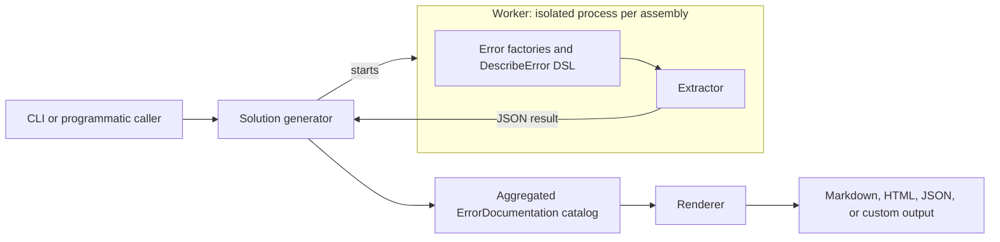

# Architecture of the Documentation Pipeline

🌍 **Languages:**  
🇬🇧 English (this file) | 🇫🇷 [Français](./ArchitectureOfTheDocumentationPipeline.fr.md)

FirstClassErrors derives error documentation from the code that defines and creates errors. The pipeline keeps five responsibilities separate: defining knowledge, extracting it, isolating execution, aggregating a catalog, and rendering files.

## The pipeline at a glance



The worker is the isolated process **inside which** extraction runs: the generator starts a worker per assembly, the worker executes the factories and returns a serialized result, and only then does the generator aggregate and render. Control flows from the generator into each worker; data flows back out as JSON.

The important boundary is this:

> application code defines structured error knowledge; renderers only decide how that knowledge is presented.

## 1. Knowledge is defined next to the error

A static class groups the errors associated with one application source — for example a domain type or a component:

```csharp
[ProvidesErrorsFor(nameof(Temperature))]
public static class InvalidTemperatureError {
    // factories, documentation methods, and codes
}
```

Each factory represents one recognized error situation. `[DocumentedBy]` links that factory to a documentation method:

```csharp
[DocumentedBy(nameof(BelowAbsoluteZeroDocumentation))]
internal static DomainError BelowAbsoluteZero(decimal value) {
    // create the Error
}
```

```csharp
private static ErrorDocumentation BelowAbsoluteZeroDocumentation() {
    return DescribeError
        .WithTitle("Temperature below absolute zero")
        .WithDescription("This error occurs when a temperature is below the physical minimum.")
        .WithRule("A temperature cannot be lower than absolute zero.")
        .WithDiagnostic(
            "A converted or computed temperature fell below the physical minimum.",
            ErrorOrigin.Internal,
            "Check the computation or conversion that produced the value.")
        .WithExamples(() => BelowAbsoluteZero(-1m));
}
```

At this point there is no Markdown, HTML, or JSON. There is structured knowledge expressed in code.

## 2. Extraction turns executable documentation into data

The extractor finds `[ProvidesErrorsFor]` classes, resolves `[DocumentedBy]` links, and invokes the documentation methods and their example factories.

This matters because the examples invoke the real error factories: their structure and data come from that code, not from strings recopied into the documentation that can silently drift from it.

The result is an in-memory catalog of `ErrorDocumentation` objects plus any extraction failures.

## 3. Workers isolate target execution

Extraction executes application code. For that reason, solution-level generation does not load every target assembly into one long-lived process. It starts a short-lived worker for each assembly.

That isolation provides:

- a fresh static state for each assembly;
- dependency and FirstClassErrors version isolation;
- containment of crashes and hangs;
- a clear timeout boundary;
- failure reporting without necessarily losing the whole run.

The worker serializes the extraction result to JSON, then the generator continues with the next assembly.

For exact discovery, opt-in, timeout, and failure-policy rules, see [Extraction and Project Discovery Reference](DocumentationExtractionReference.en.md).

## 4. The generator builds one catalog

At solution level, the generator:

1. builds the solution unless `--no-build` is used;
2. discovers the projects that participate in documentation generation;
3. starts one worker per selected output assembly;
4. collects documentation and extraction failures;
5. deduplicates and orders errors by code.

The output of this stage is one global catalog for the selected application or set of assemblies. This catalog — a set of `ErrorDocumentation` objects — is the format-independent intermediate representation: every renderer consumes the same catalog, so no output format is privileged over another.

The CLI exposes the common path:

```bash
fce generate \
  --solution ./MyApp.sln \
  --format markdown \
  --layout split \
  --service-name my-api \
  --output ./docs/errors
```

## 5. Renderers turn the catalog into files

A renderer receives the structured catalog and a `RenderRequest`. It returns one or more `RenderedDocument` values.

```csharp
public interface IErrorDocumentationRenderer {
    string Format { get; }
    IReadOnlyCollection<string> SupportedLayouts { get; }
    IReadOnlyList<RenderedDocument> Render(
        IEnumerable<ErrorDocumentation> catalog,
        RenderRequest request);
}
```

Built-in renderers currently provide:

| Format | Purpose | Layouts |
| --- | --- | --- |
| `json` | stable machine-readable catalog | `single` |
| `markdown` | repository or portal documentation | `single`, `split` |
| `html` | self-contained searchable static documentation | `single`, `split` |

`single` produces one document; `split` produces one page per error.

Custom renderers use the same contract. See [Writing a custom renderer](WritingACustomRenderer.en.md).

## 6. Culture crosses two distinct boundaries

Internationalization is deliberately split:

- **extraction culture** localizes error content produced by factories and documentation methods;
- **render culture** localizes headings, labels, and other renderer-owned boilerplate.

Stable identifiers remain culture-invariant: codes, source identities, context-key names, generated paths, anchors, and internal diagnostic messages.

See [Internationalization](Internationalization.en.md) for the complete workflow.

## Why the separation matters

| Component | Owns |
| --- | --- |
| application code | error meaning, rules, diagnostics, examples, public messages |
| extractor | discovery and execution of documented factories |
| worker | process and dependency isolation |
| generator | build, selection, aggregation, ordering, failure collection |
| renderer | file format, layout, template text |
| CLI | orchestration and configuration |

This prevents several forms of coupling:

- factories do not know whether the output is Markdown or HTML;
- renderers do not execute application factories;
- one failing assembly does not have to corrupt every other extraction;
- localized content and localized presentation remain independent;
- programmatic callers can use individual pipeline stages without the CLI.

## The key idea

> Error documentation is not manually rewritten from the system. It is derived from the same factories and structured descriptions that define the system's recognized failures.

The code remains the source of truth; the pipeline makes that knowledge portable.

---

<div align="center">
<a href="CatalogVersioning.en.md">← Catalog Versioning</a> · <a href="../../../README.md#-documentation">↑ Table of contents</a> · <a href="DocumentationExtractionReference.en.md">Extraction and Project Discovery Reference →</a>
</div>

---