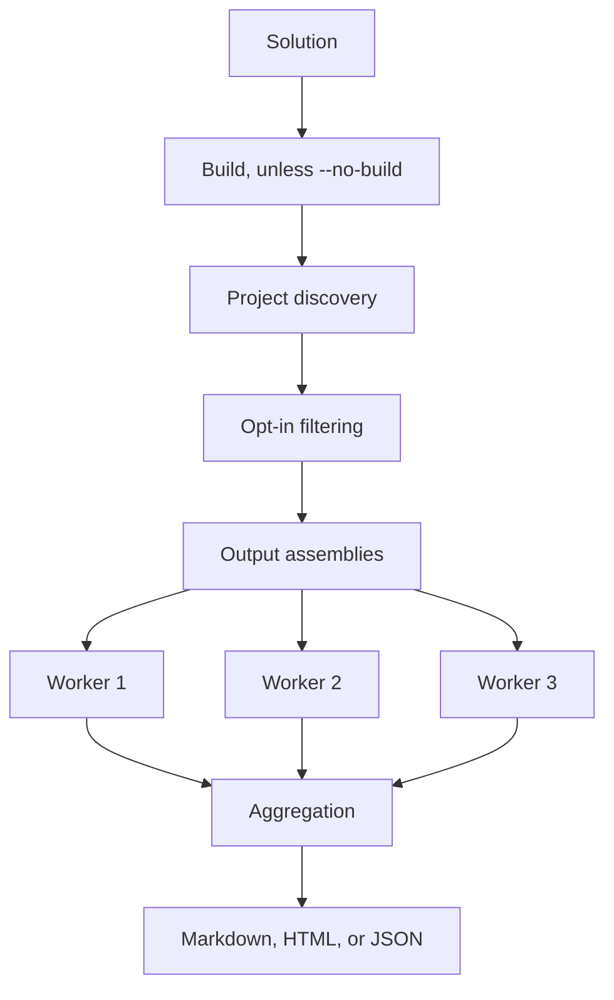

# Extraction and Project Discovery Reference

🌍 **Languages:**  
🇬🇧 English (this file) | 🇫🇷 [Français](./DocumentationExtractionReference.fr.md)

This page is the operational reference for selecting projects and assemblies, configuring isolated extraction, and handling its failures. For the mental model first, read [Architecture of the Documentation Pipeline](ArchitectureOfTheDocumentationPipeline.en.md).

**On this page:**

- [Choosing a mode](#choosing-a-mode) — `--solution` vs `--assemblies`
- [Project opt-in](#project-opt-in)
- [Worker execution](#worker-execution)
- [Failures and continuation](#failures-and-continuation)
- [Timeouts and process failures](#timeouts-and-process-failures)
- [Building and `--no-build`](#building-and---no-build)
- [Troubleshooting checklist](#troubleshooting-checklist)

## Choosing a mode

Two entry points select what gets documented. Pick from the need, not the command:

| Need | Mode |
| --- | --- |
| start directly from a `.sln` | `--solution` |
| apply the `.csproj` opt-in filter | `--solution` |
| reuse the output of a previous build | `--solution --no-build` |
| select exact `.dll` files | `--assemblies` |
| aggregate assemblies from several solutions | `--assemblies` |
| avoid MSBuild project discovery entirely | `--assemblies` |

The two modes are detailed below.

## Solution mode

Solution mode runs this flow end to end. Assembly mode enters lower down — at the workers — and skips build, discovery, and opt-in:



The common CLI path starts from a solution:

```bash
fce generate --solution ./MyApp.sln --format markdown --service-name my-api --output ./docs/errors
```

At a high level, solution mode:

1. builds the whole solution unless `--no-build` is set;
2. lists projects through `dotnet sln list`;
3. selects projects according to the opt-in marker;
4. locates their output assemblies;
5. launches one extraction worker per assembly;
6. aggregates documentation and failures.

The build runs on the solution itself, before project selection: a compile error in a project that never opted in still fails the run.

## Project opt-in

A project participates when its own `.csproj` contains:

```xml
<PropertyGroup>
  <GenerateErrorDocumentation>true</GenerateErrorDocumentation>
</PropertyGroup>
```

The marker is read directly from the project XML. It is not evaluated as a normal MSBuild property.

| Declaration | Result |
| --- | --- |
| `true` once, unconditionally | project is included |
| absent | project is skipped |
| `false` | project is skipped |
| declared more than once | ambiguous and reported |
| declared under `Condition` | ambiguous and reported |

Important consequences:

- declaring the value only in `Directory.Build.props` does not opt the project in;
- importing the property from another file does not opt the project in;
- passing `-p:GenerateErrorDocumentation=true` to `dotnet build` does not opt the project in;
- the marker must be literal and unambiguous in the `.csproj` itself.

Under a continue-on-failure policy (the default), ambiguous projects are reported and skipped. Under a strict policy (`--strict`), they fail generation.

## Programmatic opt-in options

`SolutionGenerationOptions` allows programmatic callers to change the defaults:

- `OptInPropertyName` changes the marker name;
- `IncludeProjectsWithoutOptIn` includes projects without the marker.

The `fce` CLI uses `GenerateErrorDocumentation` and the opt-in behavior described above.

## Assembly mode

Use pre-built assemblies when solution discovery or building should not be part of the run:

```bash
fce generate \
  --assemblies ./artifacts/MyApp.Domain.dll \
  --assemblies ./artifacts/MyApp.Application.dll \
  --format json \
  --output ./artifacts/errors.json
```

`--assemblies` takes one path per occurrence; repeat the option for each assembly.

Assembly mode documents exactly the binaries supplied. It does not apply the `.csproj` opt-in filter.

Use it when:

- another pipeline stage already built the application;
- assemblies come from different solutions;
- the caller needs exact binary selection;
- project discovery would be inappropriate.

The caller remains responsible for providing compatible dependency files and runtime assets beside the target assembly (the build’s `.deps.json` and `runtimeconfig.json` plus the dependent assemblies).

## Single-assembly extraction

`AssemblyErrorDocumentationReader.GetErrorDocumentationFrom(assembly)` performs in-process extraction for one already loaded assembly.

It:

- finds `[ProvidesErrorsFor]` classes;
- resolves methods referenced by `[DocumentedBy]`;
- invokes documentation methods and example factories;
- returns an `ErrorDocumentationExtractionResult` containing documentation and failures;
- deduplicates and orders documentation by error code.

This low-level API is useful for controlled tooling and tests. Solution-level generation normally uses isolated workers instead.

## Worker execution

Each selected assembly is extracted in a short-lived worker process. The generator launches the worker with the target assembly's dependency context so its application dependencies and FirstClassErrors version resolve independently.

The worker:

1. loads the target assembly;
2. runs extraction;
3. serializes the complete extraction result as JSON;
4. exits.

The generator then collects each worker's result into the aggregated catalog.

Each assembly runs in its own worker to isolate its load context, its FirstClassErrors version, and any crash or hang, so a failure stays associated with the assembly that produced it. For the architectural reasons behind that isolation, see [Architecture of the Documentation Pipeline](ArchitectureOfTheDocumentationPipeline.en.md#3-workers-isolate-target-execution).

## Failures and continuation

Two categories of failure behave differently, and the difference is exactly what `--strict` controls.

**Per-error extraction failures** happen while a worker runs the factories and are captured in its result. The run always records them and continues — `--strict` does not change this — so they never fail the command on their own:

- a `[DocumentedBy]` target cannot be found or has an invalid signature;
- a documentation method throws;
- an example factory throws.

**Process-level failures** happen around a worker rather than inside its extraction. By default the generator records them and continues with the other assemblies; under `--strict` (which sets `FailureBehavior.Stop`) it treats the first one as fatal:

- a project's output assembly cannot be found;
- the opt-in marker is ambiguous (declared twice, or under a `Condition`);
- the worker crashes, times out, or produces no readable output.

Process-level failures are themselves first-class errors: each carries a stable `GENDOC_`-prefixed code (for example `GENDOC_WORKER_FAILED`, `GENDOC_PROCESS_TIMED_OUT`), structured context, and generated documentation — the tool documents its own failure surface with the very pipeline it implements. Log lines lead with the code, and under `--strict` the raised `SolutionDocumentationGenerationException` exposes the full error through its `Error` property.

| Failure | Default | `--strict` | Exit code | Surfaced in |
| --- | --- | --- | --- | --- |
| `[DocumentedBy]` missing or bad signature | recorded, run continues | recorded, run continues | `0` | result `Failures` and error log |
| documentation method throws | recorded, run continues | recorded, run continues | `0` | result `Failures` and error log |
| example factory throws | recorded, run continues | recorded, run continues | `0` | result `Failures` and error log |
| ambiguous opt-in | project skipped, run continues | fatal | `0` / `1` | log |
| output assembly not found | skipped, run continues | fatal | `0` / `1` | log |
| worker crash, timeout, or no output | recorded, run continues | fatal | `0` / `1` | log |

The command exits `0` even when the catalog is partial, so a generated file does not prove that every assembly was documented. It exits `1` only on a fatal process-level failure (under `--strict`) or an invalid invocation, and `130` on cancellation. Programmatic callers set the same behavior through `SolutionGenerationOptions.FailureBehavior`.

The CLI writes these to standard error. A per-error extraction failure — here a documentation method that throws — is logged as an error and also appears in the extraction result's `Failures`:

```text
error: Documentation extraction issue in 'artifacts/MyApp.Application.dll': MyApp.Errors.OrderErrors.OutOfStockDocumentation: The documentation factory threw while being executed. (System.InvalidOperationException: Inventory service was called during documentation extraction.)
```

A worker timeout is a process-level failure; the default run records it and continues, and it becomes fatal under `--strict`. The default worker timeout is two minutes:

```text
warning: GENDOC_PROCESS_TIMED_OUT: Process 'documentation worker for artifacts/MyApp.Application.dll' timed out after 00:02:00 and was killed.
```

## Timeouts and process failures

A worker that does not complete within its configured timeout is terminated; the timeout and the resulting process failure are then handled as in the table above.

When investigating a timeout:

1. run the documented factory or example directly in a test;
2. check for blocking I/O, deadlocks, or environment-dependent initialization;
3. confirm the target's runtime and dependency files are available;
4. avoid network or production-service access in documentation factories;
5. make example factories small and deterministic.

Documentation code should construct representative errors, not perform real application workflows.

## Building and `--no-build`

In solution mode, the generator builds the solution by default. Use `--no-build` only when the expected outputs already exist and match the current source.

```bash
fce generate --solution ./MyApp.sln --no-build --format markdown --service-name my-api --output ./docs/errors
```

A safe CI sequence is:

```bash
dotnet build MyApp.sln -c Release
fce generate --solution MyApp.sln --configuration Release --no-build --format markdown --service-name my-api --output artifacts/errors
```

If `--no-build` points to stale or missing outputs, extraction may document old code or fail to locate assemblies.

## Configuration and framework selection

The selected configuration and target framework must identify a real output for each participating project. Multi-targeted projects may require an explicit framework.

Keep the CLI configuration aligned with the build that produced the assemblies:

```bash
fce generate \
  --solution ./MyApp.sln \
  --configuration Release \
  --framework net8.0 \
  --no-build \
  --output ./artifacts/errors
```

## Failure-safe documentation factories

A documentation method should be:

- deterministic;
- fast;
- free of external I/O;
- independent of environment secrets;
- safe to execute repeatedly;
- limited to constructing documentation and representative errors.

Avoid:

- database calls;
- HTTP calls;
- reading mutable production configuration;
- reliance on current time or randomness when it affects output;
- starting background work;
- modifying global application state.

## Troubleshooting checklist

When expected errors are missing, walk the pipeline in order — each step depends on the previous one:

1. was the project selected? (literal `<GenerateErrorDocumentation>true</GenerateErrorDocumentation>` in its own `.csproj`, or the right `--assemblies` paths);
2. was the expected assembly found? (correct configuration and framework built; `--no-build` not reusing stale outputs);
3. was the assembly loaded? (worker failures and warnings reviewed);
4. were the `[ProvidesErrorsFor]` classes found? (the factory class carries the attribute);
5. are the `[DocumentedBy]` references valid? (the referenced method exists with a valid documentation-factory signature);
6. did the methods run? (the documentation method and example factories complete without throwing);
7. is the output partial? (recorded extraction failures in the log or result).

---

<div align="center">
<a href="ArchitectureOfTheDocumentationPipeline.en.md">← Architecture of the Documentation Pipeline</a> · <a href="../../../README.md#-documentation">↑ Table of contents</a> · <a href="WritingACustomRenderer.en.md">Writing a custom renderer →</a>
</div>

---