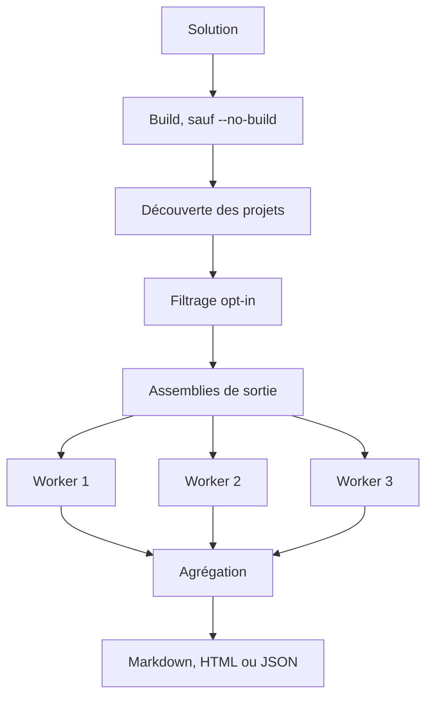

# Référence de l’extraction et de la découverte des projets

🌍 **Langues :**  
🇬🇧 [English](./DocumentationExtractionReference.en.md) | 🇫🇷 Français (ce fichier)

Cette page est la référence opérationnelle pour sélectionner les projets et assemblies, configurer l’extraction isolée et traiter ses échecs. Pour commencer par le modèle mental, lisez [Architecture du pipeline de documentation](ArchitectureOfTheDocumentationPipeline.fr.md).

**Sur cette page :**

- [Choisir un mode](#choisir-un-mode) — `--solution` vs `--assemblies`
- [Opt-in des projets](#opt-in-des-projets)
- [Exécution des workers](#exécution-des-workers)
- [Échecs et poursuite](#échecs-et-poursuite)
- [Timeouts et crashs](#timeouts-et-crashs)
- [Build et `--no-build`](#build-et---no-build)
- [Checklist de dépannage](#checklist-de-dépannage)

## Choisir un mode

Deux points d’entrée décident de ce qui est documenté. Choisissez à partir du besoin, pas de la commande :

| Besoin | Mode |
| --- | --- |
| partir directement d’une `.sln` | `--solution` |
| appliquer le filtre d’opt-in des `.csproj` | `--solution` |
| réutiliser la sortie d’un build précédent | `--solution --no-build` |
| sélectionner précisément certaines `.dll` | `--assemblies` |
| agréger des assemblies venant de plusieurs solutions | `--assemblies` |
| éviter complètement la découverte de projets MSBuild | `--assemblies` |

Les deux modes sont détaillés ci-dessous.

## Mode solution

Le mode solution déroule ce flux de bout en bout. Le mode assemblies entre plus bas — au niveau des workers — et saute le build, la découverte et l’opt-in :



Le parcours CLI courant part d’une solution :

```bash
fce generate --solution ./MyApp.sln --format markdown --service-name my-api --output ./docs/errors
```

Le mode solution :

1. compile toute la solution, sauf avec `--no-build` ;
2. liste les projets via `dotnet sln list` ;
3. les sélectionne selon le marqueur d’opt-in ;
4. localise leurs assemblies de sortie ;
5. lance un worker d’extraction par assembly ;
6. agrège la documentation et les échecs.

Le build porte sur la solution elle-même, avant la sélection des projets : une erreur de compilation dans un projet qui n’a jamais opté fait quand même échouer l’exécution.

## Opt-in des projets

Un projet participe lorsque son propre `.csproj` contient :

```xml
<PropertyGroup>
  <GenerateErrorDocumentation>true</GenerateErrorDocumentation>
</PropertyGroup>
```

Le marqueur est lu directement dans le XML du projet. Il n’est pas évalué comme une propriété MSBuild normale.

| Déclaration | Résultat |
| --- | --- |
| `true` une fois, sans condition | projet inclus |
| absente | projet ignoré |
| `false` | projet ignoré |
| déclarée plusieurs fois | ambiguïté signalée |
| déclarée sous `Condition` | ambiguïté signalée |

Conséquences importantes :

- une valeur uniquement définie dans `Directory.Build.props` n’active pas le projet ;
- une propriété importée depuis un autre fichier n’active pas le projet ;
- `-p:GenerateErrorDocumentation=true` passé à `dotnet build` n’active pas le projet ;
- le marqueur doit être littéral et non ambigu dans le `.csproj` lui-même.

Avec une politique de poursuite (le comportement par défaut), les projets ambigus sont signalés puis ignorés. Avec une politique stricte (`--strict`), ils font échouer la génération.

## Options d’opt-in programmatiques

`SolutionGenerationOptions` permet de modifier les valeurs par défaut :

- `OptInPropertyName` change le nom du marqueur ;
- `IncludeProjectsWithoutOptIn` inclut les projets sans marqueur.

La CLI `fce` utilise `GenerateErrorDocumentation` et le comportement d’opt-in décrit ci-dessus.

## Mode assemblies

Utilisez des assemblies déjà compilés lorsque la découverte de solution ou le build ne doivent pas faire partie de l’exécution :

```bash
fce generate \
  --assemblies ./artifacts/MyApp.Domain.dll \
  --assemblies ./artifacts/MyApp.Application.dll \
  --format json \
  --output ./artifacts/errors.json
```

`--assemblies` accepte un chemin par occurrence ; répétez l’option pour chaque assembly.

Le mode assemblies documente exactement les binaires fournis. Il n’applique pas le filtre d’opt-in du `.csproj`.

Il est adapté lorsque :

- une étape précédente a déjà compilé l’application ;
- les assemblies proviennent de plusieurs solutions ;
- l’appelant veut sélectionner exactement les binaires ;
- la découverte de projets n’est pas pertinente.

L’appelant reste responsable de fournir les fichiers de dépendances et assets runtime compatibles à côté de l’assembly cible (les `.deps.json` et `runtimeconfig.json` du build, plus les assemblies dépendants).

## Extraction d’un assembly unique

`AssemblyErrorDocumentationReader.GetErrorDocumentationFrom(assembly)` effectue une extraction en processus pour un assembly déjà chargé.

Cette API :

- trouve les classes `[ProvidesErrorsFor]` ;
- résout les méthodes référencées par `[DocumentedBy]` ;
- invoque les méthodes de documentation et factories d’exemples ;
- renvoie un `ErrorDocumentationExtractionResult` contenant documentation et échecs ;
- déduplique et ordonne la documentation par code d’erreur.

Elle est utile pour des outils contrôlés et des tests. La génération au niveau solution utilise normalement des workers isolés.

## Exécution des workers

Chaque assembly sélectionné est extrait dans un processus de travail isolé (« worker »). Le générateur le lance avec le contexte de dépendances de la cible afin d’isoler les dépendances applicatives et la version de FirstClassErrors.

Le worker :

1. charge l’assembly cible ;
2. exécute l’extraction ;
3. sérialise le résultat complet en JSON ;
4. se termine.

Le générateur intègre ensuite le résultat de chaque worker au catalogue agrégé.

Chaque assembly s’exécute dans son propre worker afin d’isoler son contexte de chargement, sa version de FirstClassErrors et tout crash ou blocage, de sorte que l’échec reste rattaché à l’assembly qui l’a produit. Pour les raisons architecturales de cette isolation, voir [Architecture du pipeline de documentation](ArchitectureOfTheDocumentationPipeline.fr.md#3-les-workers-isolent-lexécution-des-cibles).

## Échecs et poursuite

Deux catégories d’échec se comportent différemment, et c’est précisément cette différence que contrôle `--strict`.

Les **échecs d’extraction par erreur** surviennent pendant qu’un worker exécute les factories et sont capturés dans son résultat. L’exécution les enregistre toujours et poursuit — `--strict` n’y change rien — de sorte qu’ils ne font jamais échouer la commande à eux seuls :

- une cible `[DocumentedBy]` introuvable ou de signature invalide ;
- une méthode de documentation qui lève ;
- une factory d’exemple qui lève.

Les **échecs de processus** surviennent autour d’un worker, pas à l’intérieur de son extraction. Par défaut, le générateur les enregistre et poursuit avec les autres assemblies ; avec `--strict` (qui active `FailureBehavior.Stop`), il traite le premier comme fatal :

- l’assembly de sortie d’un projet est introuvable ;
- le marqueur d’opt-in est ambigu (déclaré deux fois, ou sous `Condition`) ;
- le worker plante, dépasse son timeout, ou ne produit aucune sortie lisible.

Les échecs de processus sont eux-mêmes des erreurs de première classe : chacun porte un code stable préfixé `GENDOC_` (par exemple `GENDOC_WORKER_FAILED`, `GENDOC_PROCESS_TIMED_OUT`), un contexte structuré et une documentation générée — l’outil documente sa propre surface d’échec avec le pipeline même qu’il implémente. Les lignes de log commencent par le code, et avec `--strict` la `SolutionDocumentationGenerationException` levée expose l’erreur complète via sa propriété `Error`.

| Échec | Par défaut | `--strict` | Code de sortie | Présent dans |
| --- | --- | --- | --- | --- |
| `[DocumentedBy]` manquant ou signature invalide | enregistré, poursuite | enregistré, poursuite | `0` | `Failures` du résultat et logs d’erreur |
| méthode de documentation qui lève | enregistré, poursuite | enregistré, poursuite | `0` | `Failures` du résultat et logs d’erreur |
| factory d’exemple qui lève | enregistré, poursuite | enregistré, poursuite | `0` | `Failures` du résultat et logs d’erreur |
| opt-in ambigu | projet ignoré, poursuite | fatal | `0` / `1` | logs |
| assembly de sortie introuvable | ignoré, poursuite | fatal | `0` / `1` | logs |
| crash, timeout ou absence de sortie du worker | enregistré, poursuite | fatal | `0` / `1` | logs |

La commande se termine avec le code `0` même quand le catalogue est partiel : un fichier généré ne prouve pas que tous les assemblies ont été documentés. Elle renvoie `1` seulement sur un échec de processus fatal (avec `--strict`) ou une invocation invalide, et `130` sur annulation. Les appelants programmatiques règlent le même comportement via `SolutionGenerationOptions.FailureBehavior`.

La CLI écrit ces lignes sur la sortie d’erreur standard. Un échec d’extraction par erreur — ici une méthode de documentation qui lève — est journalisé en erreur et apparaît aussi dans les `Failures` du résultat d’extraction :

```text
error: Documentation extraction issue in 'artifacts/MyApp.Application.dll': MyApp.Errors.OrderErrors.OutOfStockDocumentation: The documentation factory threw while being executed. (System.InvalidOperationException: Inventory service was called during documentation extraction.)
```

Un timeout de worker est un échec de processus ; par défaut, l’exécution l’enregistre et poursuit, et il devient fatal avec `--strict`. Le timeout de worker par défaut est de deux minutes :

```text
warning: GENDOC_PROCESS_TIMED_OUT: Process 'documentation worker for artifacts/MyApp.Application.dll' timed out after 00:02:00 and was killed.
```

## Timeouts et crashs

Un worker qui dépasse son timeout est arrêté ; le timeout et l’échec de processus qui en résulte sont ensuite traités comme dans le tableau ci-dessus.

Pour analyser un timeout :

1. exécutez directement la factory documentée ou l’exemple dans un test ;
2. cherchez les I/O bloquantes, deadlocks ou initialisations dépendantes de l’environnement ;
3. vérifiez la présence des fichiers runtime et de dépendances ;
4. évitez tout accès réseau ou service de production dans les factories de documentation ;
5. gardez les factories d’exemples petites et déterministes.

Le code de documentation doit construire des erreurs représentatives, pas exécuter de véritables workflows applicatifs.

## Build et `--no-build`

En mode solution, le générateur compile la solution par défaut. Utilisez `--no-build` uniquement lorsque les sorties attendues existent déjà et correspondent au code courant.

```bash
fce generate --solution ./MyApp.sln --no-build --format markdown --service-name my-api --output ./docs/errors
```

Une séquence CI sûre est :

```bash
dotnet build MyApp.sln -c Release
fce generate --solution MyApp.sln --configuration Release --no-build --format markdown --service-name my-api --output artifacts/errors
```

Des sorties obsolètes ou absentes peuvent documenter un ancien code ou provoquer un échec de localisation.

## Configuration et framework

La configuration et le framework sélectionnés doivent identifier une sortie réelle pour chaque projet participant. Les projets multi-cibles peuvent nécessiter un framework explicite.

Gardez la configuration de la CLI alignée sur le build qui a produit les assemblies :

```bash
fce generate \
  --solution ./MyApp.sln \
  --configuration Release \
  --framework net8.0 \
  --no-build \
  --output ./artifacts/errors
```

## Factories de documentation sûres

Une méthode de documentation doit être :

- déterministe ;
- rapide ;
- sans I/O externe ;
- indépendante des secrets d’environnement ;
- sûre à exécuter plusieurs fois ;
- limitée à la construction de documentation et d’erreurs représentatives.

Évitez :

- les appels de base de données ;
- les appels HTTP ;
- la lecture de configuration de production mutable ;
- la dépendance à l’heure courante ou à l’aléatoire lorsqu’elle affecte la sortie ;
- le démarrage de tâches de fond ;
- la modification d’état global de l’application.

## Checklist de dépannage

Lorsque des erreurs attendues manquent, parcourez le pipeline dans l’ordre — chaque étape dépend de la précédente :

1. le projet a-t-il été sélectionné ? (marqueur littéral `<GenerateErrorDocumentation>true</GenerateErrorDocumentation>` dans son propre `.csproj`, ou les bons chemins `--assemblies`) ;
2. l’assembly attendu a-t-il été trouvé ? (configuration et framework compilés ; `--no-build` ne réutilise pas de sorties obsolètes) ;
3. l’assembly a-t-il été chargé ? (avertissements et échecs des workers examinés) ;
4. les classes `[ProvidesErrorsFor]` ont-elles été trouvées ? (l’attribut est présent sur la classe factory) ;
5. les références `[DocumentedBy]` sont-elles valides ? (la méthode référencée existe avec une signature de factory de documentation valide) ;
6. les méthodes se sont-elles exécutées ? (la méthode de documentation et les factories d’exemples se terminent sans lever) ;
7. la sortie est-elle partielle ? (échecs d’extraction enregistrés dans les logs ou le résultat).

---

<div align="center">
<a href="ArchitectureOfTheDocumentationPipeline.fr.md">← Architecture du pipeline de documentation</a> · <a href="README.fr.md#-documentation">↑ Table des matières</a> · <a href="WritingACustomRenderer.fr.md">Écrire son propre renderer →</a>
</div>

---