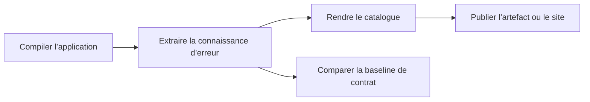

# Générer et publier le catalogue d’erreurs

🌍 **Langues :**  
🇬🇧 [English](./OperationalIntegration.en.md) | 🇫🇷 Français (ce fichier)

FirstClassErrors devient réellement utile pour l’exploitation lorsque le catalogue est généré depuis le code exact en cours de build, puis publié à un endroit accessible aux développeurs, au support et aux opérateurs.

Ce guide couvre la chaîne de livraison. Pour le logging structuré et les diagnostics de production, voir le [guide du logging structuré](LoggingIntegration.fr.md).

## Le flux de livraison



Un pipeline fiable doit :

1. compiler l’application ;
2. générer le catalogue depuis le code compilé ;
3. publier les fichiers générés ;
4. éventuellement comparer le contrat courant à une baseline commitée — le dernier snapshot accepté de vos codes d’erreur et clés de contexte (voir [Versionnage du catalogue](CatalogVersioning.fr.md)).

## Activer les projets

La génération au niveau solution est opt-in. Ajoutez le marqueur directement dans chaque `.csproj` qui définit des erreurs applicatives documentées :

```xml
<PropertyGroup>
  <GenerateErrorDocumentation>true</GenerateErrorDocumentation>
</PropertyGroup>
```

Le marqueur est lu dans le fichier projet lui-même. Une valeur héritée de `Directory.Build.props` n’est pas détectée.

Lorsqu’aucun projet n’a opté, le générateur émet un avertissement plutôt que de présenter silencieusement un catalogue vide comme un résultat valide. La commande se termine tout de même avec succès — le catalogue vide est un avertissement, pas un échec. Si une solution doit toujours produire un catalogue, imposez-le côté CI, par exemple en faisant échouer le job lorsque la sortie générée est vide ; le CLI ne transforme pas de lui-même l’absence d’opt-in en erreur (`--strict` interrompt sur les échecs d’extraction, ce qui est une situation différente).

Pour les déclarations ambiguës, la découverte de projets et le fonctionnement des workers, voir [Architecture du pipeline de documentation](ArchitectureOfTheDocumentationPipeline.fr.md).

## Générer le catalogue en local

Installez le CLI, compilez, puis générez depuis les binaires existants :

> **Pas encore sur nuget.org.** Le CLI `fce` (`FirstClassErrors.Cli`) n'est pas encore publié — les commandes d'installation de cette page (ici et dans l'exemple CI ci-dessous) fonctionneront une fois qu'il sera disponible.

```bash
dotnet tool install --global FirstClassErrors.Cli
dotnet build MyApp.sln -c Release
fce generate \
  --solution MyApp.sln \
  --configuration Release \
  --no-build \
  --format markdown \
  --output artifacts/errors.md \
  --service-name my-api
```

`--service-name` est requis pour Markdown et HTML car leurs exemples RFC 9457 utilisent des types de problème comme :

```text
urn:problem:my-api:payment-declined
```

La sortie JSON ne nécessite pas de nom de service.

## Workflow GitHub Actions minimal

Le workflow rend le catalogue en HTML avec `--layout split` (une page par erreur ; voir [Le renderer HTML](TheHtmlRenderer.fr.md)) :

```yaml
name: error-documentation

on:
  pull_request:
  push:
    branches: [main]

jobs:
  generate-error-catalog:
    runs-on: ubuntu-latest

    steps:
      - uses: actions/checkout@v4

      - uses: actions/setup-dotnet@v4
        with:
          dotnet-version: '10.0.x'

      - name: Install FirstClassErrors CLI
        run: dotnet tool install --global FirstClassErrors.Cli

      - name: Build
        run: dotnet build MyApp.sln -c Release

      - name: Generate catalog
        run: |
          fce generate \
            --solution MyApp.sln \
            --configuration Release \
            --no-build \
            --format html \
            --layout split \
            --output artifacts/error-catalog \
            --service-name my-api

      - name: Publish catalog artifact
        uses: actions/upload-artifact@v4
        with:
          name: error-catalog
          path: artifacts/error-catalog
```

Le build et la génération utilisent la même configuration. `--no-build` évite que le générateur reconstruise un autre ensemble de binaires.

Avec `--layout split`, le répertoire de sortie contient une page par erreur, plus un index partagé et des assets :

```text
artifacts/error-catalog/
├── index.html
├── errors/
│   ├── PAYMENT_DECLINED.html
│   └── CUSTOMER_NOT_FOUND.html
└── assets/
    └── search-index.json
```

C’est une première intégration vérifiable — elle publie un artefact de workflow temporaire, rien de plus. Sur une pull request, le job vérifie que la génération réussit toujours ; sur `main`, il publie le catalogue accepté comme cet artefact. La publication durable et versionnée (voir [Choisir une cible de publication](#choisir-une-cible-de-publication) et [Conserver des catalogues versionnés](#conserver-des-catalogues-versionnés)) relève d’un déclencheur de tag ou de release, où le nom de version est stable.

## Générer plusieurs langues

Exécutez une génération par locale :

```yaml
strategy:
  matrix:
    language: [en, fr]

steps:
  # checkout, setup, installation et build omis

  - name: Generate ${{ matrix.language }} catalog
    run: |
      fce generate \
        --solution MyApp.sln \
        --configuration Release \
        --no-build \
        --format html \
        --layout split \
        --language "${{ matrix.language }}" \
        --output "artifacts/error-catalog-${{ matrix.language }}" \
        --service-name my-api
```

Les noms de fichiers et les ancres restent stables d’une langue à l’autre, si bien que le même code d’erreur correspond au même nom de fichier dans chaque langue. Publiez chaque langue dans son propre répertoire, comme le fait la matrice ci-dessus, pour qu’elles ne s’écrasent jamais. Voir [Internationalisation](Internationalisation.fr.md) pour la localisation du contenu et des templates de renderer.

## Choisir une cible de publication

Le catalogue généré peut être :

- conservé comme artefact de pipeline ;
- attaché à une release ;
- déployé comme site statique ;
- copié dans un portail documentaire interne ;
- publié à côté de la documentation opérationnelle du service.

La plateforme importe moins que l’accessibilité : le catalogue correspondant à une version déployée doit être atteignable par les personnes qui investiguent cette version.

## Conserver des catalogues versionnés

Deux formes de versionnage complémentaires comptent ici, et il est facile de les confondre : conserver la **documentation** publiée de chaque release, et contrôler l’évolution du **contrat** d’erreurs lui-même face à une baseline. Cette section traite de la première ; [Protéger le contrat d’erreurs](#protéger-le-contrat-derreurs) plus bas traite de la seconde.

Un site « latest » est pratique au quotidien, mais n’explique plus correctement une ancienne release de production après l’évolution du contrat.

Pour les systèmes durables ou critiques pour le support, publiez au moins une forme immuable par release :

```text
/errors/latest/
/errors/releases/2.4.0/
/errors/releases/2.3.1/
```

Dans un workflow déclenché par tag ou release, dérivez le répertoire de sortie de la version pour que chaque release se retrouve dans son propre chemin immuable :

```yaml
--output "artifacts/error-catalog/${{ github.ref_name }}"
```

`github.ref_name` n’a de sens comme version que sur un déclencheur de tag ou de release ; sur un push de branche, c’est le nom de la branche.

Des événements de log qui enregistrent la version déployée à côté de l’erreur permettent alors au support de partir d’une occurrence loggée — son `InstanceId` plus cette version — et d’ouvrir le catalogue correspondant.

## Protéger le contrat d’erreurs

La génération répond à « que documente cette version ? ». Le versionnage répond à « cette version casse-t-elle un contrat déjà accepté ? ».

`fce catalog diff` compare le catalogue extrait du build courant à un fichier de baseline versionné dans le dépôt et signale les changements de contrat :

```bash
fce catalog diff --solution MyApp.sln --configuration Release --no-build
```

Conservez la baseline acceptée dans le dépôt et exécutez la comparaison dans les pull requests.

Voir :

- [Versionnage du catalogue](CatalogVersioning.fr.md) pour le modèle mental et le workflow quotidien ;
- [Intégration CI/CD du versionnage](CatalogVersioningCI.fr.md) pour les exemples complets GitHub Actions et GitLab.

## Politique d’échec

Traitez séparément les situations suivantes :

| Situation | Signification dans le pipeline |
| --- | --- |
| le build applicatif échoue | le produit ne peut pas être construit |
| l’extraction ou le rendu échoue | le catalogue n’est pas fiable |
| aucun projet n’a opté | la configuration est incomplète ou la solution ne contient volontairement aucun projet documenté |
| le contrat du catalogue casse | une revue humaine est nécessaire avant acceptation |
| la publication échoue | la documentation reste indisponible malgré une génération réussie |

Ne masquez pas les erreurs d’extraction ou de publication avec `continue-on-error` dans un pipeline qui promet une documentation opérationnelle.

## Checklist de revue

Avant d’approuver un pipeline de livraison du catalogue, vérifiez que :

- les projets activés déclarent le marqueur dans leur propre `.csproj` ;
- la génération utilise les mêmes binaires et la même configuration que le build applicatif ;
- `--service-name` est fourni pour Markdown ou HTML ;
- les fichiers générés sont publiés à un endroit accessible ;
- les sorties par langue ne s’écrasent pas ;
- chaque release supportée possède une URL ou un artefact documentaire immuable ;
- la comparaison de contrat reste distincte du rendu du catalogue ;
- les échecs de génération et de publication sont visibles.

---

<div align="center">
<a href="ArbitraryTestValues.fr.md">← Valeurs de test arbitraires</a> · <a href="README.fr.md#-étapes-suivantes">↑ Table des matières</a> · <a href="LoggingIntegration.fr.md">Intégrer FirstClassErrors au logging structuré →</a>
</div>

---