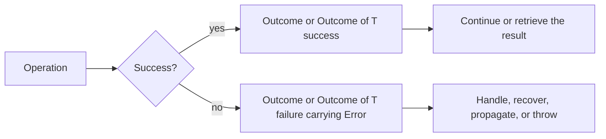

# Composing with Outcome

🌍 **Languages:**  
🇬🇧 English (this file) | 🇫🇷 [Français](./OutcomeGuide.fr.md)

`Outcome` and `Outcome<T>` carry a structured `Error` without throwing it. Use them when failure is expected and the caller should decide how to handle it.

This page is the focused guide to creating, inspecting, composing, recovering, and escalating outcomes. For help deciding when to use them, start with [Usage Patterns](UsagePatterns.en.md).

## 🧭 The model in one minute



An outcome never carries an exception. A failure carries an `Error`, preserving its code, messages, context, occurrence identity, and inner errors.

## `Outcome` or `Outcome<T>`?

| Type | Use it when |
| --- | --- |
| `Outcome` | success produces no value, such as reserving inventory or validating a command |
| `Outcome<T>` | success produces a value, such as parsing an amount or loading an order |

```csharp
Outcome reservation = Inventory.Reserve(sku);
Outcome<Order> lookup = Orders.Find(orderId);
```

## Creating outcomes

### Success without a value

```csharp
return Outcome.Success;
```

### Success with a value

```csharp
return Outcome<Amount>.Success(amount);
```

### Failure

```csharp
return Outcome<Amount>.Failure(
    InvalidMoneyTransferError.AmountNotPositive(amount));
```

`Failure(...)` requires an `Error`. Keep error creation in a named factory so the same situation remains consistent whether it is returned or thrown.

## Inspecting an outcome

Use `IsSuccess` and `IsFailure` when explicit branching is clearest.

```csharp
Outcome<Amount> result = CreateAmount(value, currencyCode);

if (result.IsFailure) {
    Log(result.Error!);
    return;
}

Amount amount = result.GetResultOrThrow();
Process(amount);
```

On failure, `Error` contains the structured failure. After success has been established, `GetResultOrThrow()` returns the result without throwing.

Prefer a pipeline when that makes the control flow clearer.

## `Then`: continue after a success

`Then(...)` runs the next step only when the current outcome succeeded; a failure short-circuits the chain and is propagated unchanged. What the step does depends on the function you pass — its return type decides.

A function that **returns a value** transforms the carried value (a step that cannot fail):

```csharp
Outcome<Money> total =
    CreateAmount(value, currencyCode)
        .Then(amount => amount.WithVat());
```

A function that **returns an `Outcome`** runs another step that may itself fail:

```csharp
Outcome<Receipt> result =
    CreateAmount(value, currencyCode)
        .Then(CheckLimits)
        .Then(Charge);
```

The second chain has three possible failure points, yet the caller receives a single `Outcome<Receipt>` and the first error remains the result. Either way the outcome stays flat: a step that returns an `Outcome` is never wrapped in another one.

## `Recover`: replace a failure deliberately

`Recover(...)` runs only after failure and receives the current `Error`.

```csharp
Outcome<ExchangeRate> rate =
    LoadLiveRate(currency)
        .Recover(error => LoadCachedRate(currency));
```

Recovery may produce a success or a new failure. If the fallback fails, its error becomes the outcome's error.

Use recovery for a real alternative strategy, compensation, or fallback. Do not use it merely to hide an error.

A value fallback can be returned as a successful outcome:

```csharp
Outcome<Amount> amount =
    CreateAmount(value, currencyCode)
        .Recover(error => Outcome<Amount>.Success(Amount.Zero));
```

## `Finally`: handle both terminal cases

`Finally(...)` selects one terminal action or value based on success or failure.

```csharp
string message = result.Finally(
    onSuccess: receipt => $"Charged {receipt.Id}",
    onFailure: error => $"Failed with {error.Code}");
```

It is useful at application boundaries where both cases must be translated into another representation, such as an API response, a CLI exit result, or a log entry.

```csharp
result.Finally(
    onSuccess: receipt => LogInformation(receipt),
    onFailure: error => LogError(error));
```

`Finally` is terminal: use it to consume or translate an outcome, not as a hidden intermediate step in a long chain.

## Leaving the outcome flow

Two methods convert a failure back into exception flow.

### `ThrowIfFailure()`

Use it for `Outcome` or when the successful value is not needed at that point.

```csharp
Outcome reservation = Inventory.Reserve(sku);
reservation.ThrowIfFailure();
```

It does nothing on success and throws `error.ToException()` on failure.

### `GetResultOrThrow()`

Use it with `Outcome<T>` when the boundary requires a value or an exception.

```csharp
Amount amount = CreateAmount(value, currencyCode).GetResultOrThrow();
```

The exception is created and thrown at this point. The stack trace therefore begins at the escalation point, not where the `Outcome` failure was created.

Keep this conversion at an intentional boundary. Calling it immediately after every operation removes the reason for using `Outcome<T>`.

## Asynchronous composition

The same operations are available for asynchronous steps. Pass the cancellation token through the chain.

```csharp
Outcome<Receipt> result =
    await LoadOrderAsync(orderId, cancellationToken)
        .Then(
            (order, ct) => ValidateOrderAsync(order, ct),
            cancellationToken)
        .Then(
            (order, ct) => ChargeAsync(order, ct),
            cancellationToken);
```

`OutcomeTaskExtensions` also lets a `Task<Outcome>` or `Task<Outcome<T>>` continue directly with `Then`, `Recover`, and `Finally`.

Prefer one visible cancellation token for the whole application flow. Cancellation remains cancellation; do not translate it into a domain error unless the application explicitly models that situation as one.

## Fluent chain or ordinary branching?

A fluent chain is useful when:

- the flow is a sequence of dependent steps;
- every step follows the same success/failure model;
- short-circuiting is the intended behavior;
- the chain reads from left to right without hiding business decisions.

Prefer explicit branching when:

- different errors require substantially different actions;
- several independent operations must all run;
- partial results must be collected;
- the chain becomes harder to read than a few `if` statements.

FirstClassErrors does not require railway-oriented code (chaining every step through a success/failure pipeline) everywhere. `Outcome` serves the model; the model does not serve the fluent syntax.

## Complete example

```csharp
public async Task<Outcome<Receipt>> CheckoutAsync(
    decimal value,
    string currencyCode,
    CancellationToken cancellationToken) {

    return await CreateAmount(value, currencyCode)
        .Then(CheckLimits)
        .Then(
            (amount, ct) => ChargeAsync(amount, ct),
            cancellationToken)
        .Recover(
            (error, ct) => AlternativeProviderAsync(error, ct),
            cancellationToken);
}
```

The flow keeps one structured error model from validation through payment. No exception is needed until a caller deliberately chooses to escalate.

## 📌 Review checklist

Before approving an `Outcome` flow, verify that:

- failure is expected and belongs in normal control flow;
- failures carry an `Error`, never an exception or string;
- factories remain the single source of error construction;
- each composition step uses `Then`, returning a value to map or an `Outcome` to chain a step that may fail;
- recovery is intentional and does not silently discard useful failures;
- exception conversion occurs only at a clear boundary;
- a fluent chain is genuinely clearer than explicit branching;
- cancellation tokens are propagated through asynchronous operations.

---

<div align="center">
<a href="UsagePatterns.en.md">← Usage Patterns</a> · <a href="../../../README.md#-next-steps">↑ Table of contents</a> · <a href="BestPractices.en.md">Best Practices →</a>
</div>

---