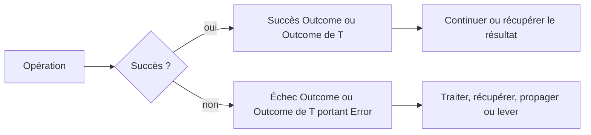

# Composer avec Outcome

🌍 **Langues :**  
🇬🇧 [English](./OutcomeGuide.en.md) | 🇫🇷 Français (ce fichier)

`Outcome` et `Outcome<T>` transportent une `Error` structurée sans la lever. Utilisez-les lorsque l’échec est attendu et que l’appelant doit décider comment le traiter.

Cette page est le guide dédié à la création, l’inspection, la composition, la récupération et l’escalade des outcomes. Pour choisir quand les utiliser, commencez par [Patterns d’utilisation](UsagePatterns.fr.md).

## 🧭 Le modèle en une minute



Un outcome ne transporte jamais une exception. Un échec porte une `Error` et conserve son code, ses messages, son contexte, son identité d’occurrence et ses erreurs internes.

## `Outcome` ou `Outcome<T>` ?

| Type | À utiliser lorsque |
| --- | --- |
| `Outcome` | le succès ne produit aucune valeur, par exemple réserver un stock ou valider une commande |
| `Outcome<T>` | le succès produit une valeur, par exemple parser un montant ou charger une commande |

```csharp
Outcome reservation = Inventory.Reserve(sku);
Outcome<Order> lookup = Orders.Find(orderId);
```

## Créer des outcomes

### Succès sans valeur

```csharp
return Outcome.Success;
```

### Succès avec une valeur

```csharp
return Outcome<Amount>.Success(amount);
```

### Échec

```csharp
return Outcome<Amount>.Failure(
    InvalidMoneyTransferError.AmountNotPositive(amount));
```

`Failure(...)` exige une `Error`. Gardez la création des erreurs dans une factory nommée afin qu’une même situation reste cohérente, qu’elle soit retournée ou levée.

## Inspecter un outcome

Utilisez `IsSuccess` et `IsFailure` lorsqu’un branchement explicite est le plus lisible.

```csharp
Outcome<Amount> result = CreateAmount(value, currencyCode);

if (result.IsFailure) {
    Log(result.Error!);
    return;
}

Amount amount = result.GetResultOrThrow();
Process(amount);
```

En cas d’échec, `Error` contient l’erreur structurée. Après avoir établi le succès, `GetResultOrThrow()` retourne le résultat sans lever.

Préférez un pipeline lorsque cela rend le contrôle de flux plus clair.

## `Then` : continuer après un succès

`Then(...)` exécute l’étape suivante uniquement lorsque l’outcome courant a réussi ; un échec court-circuite la chaîne et est propagé sans modification. Ce que fait l’étape dépend de la fonction que vous passez — c’est son type de retour qui décide.

Une fonction qui **renvoie une valeur** transforme la valeur portée (une étape qui ne peut pas échouer) :

```csharp
Outcome<Money> total =
    CreateAmount(value, currencyCode)
        .Then(amount => amount.WithVat());
```

Une fonction qui **renvoie un `Outcome`** exécute une autre étape susceptible d’échouer :

```csharp
Outcome<Receipt> result =
    CreateAmount(value, currencyCode)
        .Then(CheckLimits)
        .Then(Charge);
```

La seconde chaîne comporte trois points d’échec possibles, pourtant l’appelant reçoit un seul `Outcome<Receipt>` et la première erreur reste le résultat. Dans les deux cas l’outcome reste plat : une étape qui renvoie un `Outcome` n’est jamais enveloppée dans un autre.

## `Recover` : remplacer volontairement un échec

`Recover(...)` s’exécute uniquement après un échec et reçoit l’`Error` courante.

```csharp
Outcome<ExchangeRate> rate =
    LoadLiveRate(currency)
        .Recover(error => LoadCachedRate(currency));
```

La récupération peut produire un succès ou un nouvel échec. Si le fallback échoue, son erreur devient l’erreur de l’outcome.

Utilisez la récupération pour une véritable stratégie alternative, compensation ou valeur de repli. Ne l’utilisez pas simplement pour masquer une erreur.

Une valeur de repli peut être retournée sous forme de succès :

```csharp
Outcome<Amount> amount =
    CreateAmount(value, currencyCode)
        .Recover(error => Outcome<Amount>.Success(Amount.Zero));
```

## `Finally` : traiter les deux cas terminaux

`Finally(...)` sélectionne une action ou une valeur terminale selon le succès ou l’échec.

```csharp
string message = result.Finally(
    onSuccess: receipt => $"Paiement {receipt.Id} effectué",
    onFailure: error => $"Échec avec {error.Code}");
```

Il est utile aux frontières applicatives où les deux cas doivent être traduits vers une autre représentation : réponse API, résultat CLI ou entrée de log.

```csharp
result.Finally(
    onSuccess: receipt => LogInformation(receipt),
    onFailure: error => LogError(error));
```

`Finally` est terminal : utilisez-le pour consommer ou traduire un outcome, pas comme une étape intermédiaire cachée dans une longue chaîne.

## Entrer dans le flux Outcome depuis du code qui lève

`Try` est l'inverse de `ThrowIfFailure()` et `GetResultOrThrow()` : au lieu de sortir du flux Outcome en levant, elle y *entre* en exécutant une opération susceptible de lever et en capturant la levée comme un échec via un mapper obligatoire. C'est un **outil étroit et tranchant**, pas la façon par défaut d'atteindre le flux Outcome — la plupart du temps, l'un des cas ci-dessous s'applique et `Try` est le mauvais choix. Quatre analyzers épaulent ces frontières : [FCE019](analyzers/FCE019.fr.md), [FCE021](analyzers/FCE021.fr.md) et [FCE022](analyzers/FCE022.fr.md) sont activés par défaut ; [FCE020](analyzers/FCE020.fr.md) est opt-in.

### Quand `Try` est le mauvais outil

**Un `TryXxx` non-levant existe déjà.** La plupart des parsings et conversions de la BCL ont un équivalent `bool TryParse(..., out T)` / `TryCreate`. Utilisez-le et mappez le `false` : il n'y a aucune exception à attraper, donc `Try` n'ajoute que du coût et du bruit. [FCE021](analyzers/FCE021.fr.md) émet un warning là-dessus dès que la contrepartie existe pour votre framework cible (supprimez-le là où un `TryXxx` sosie n'est pas un vrai inverse).

```csharp
// À éviter : attraper ce que vous pouvez éviter de lever.
Outcome<int> port = Outcome.Try<int, FormatException>(() => int.Parse(raw), PortErrors.Malformed);

// À faire : le chemin non-levant est déjà là.
Outcome<int> port = int.TryParse(raw, out int value)
    ? Outcome<int>.Success(value)
    : Outcome<int>.Failure(PortErrors.Malformed(raw));
```

**L'échec est un résultat de protocole, pas (seulement) une levée.** Un appel HTTP ou une commande base de données signale l'échec via un code de statut, un numéro d'erreur du provider, un corps de réponse — des données que vous avez déjà en main. Les envelopper dans `Try` jette tout cela : un 404, un 402 et un timeout s'effondrent en une seule erreur, et le timeout s'échappe même sous la forme de l'`OperationCanceledException` que `Try` laisse passer. Ces cas méritent un adaptateur dédié qui inspecte le résultat, pas une levée attrapée.

**Vous dégainez `System.Exception`.** Cela avale les bugs — un déréférencement null, un état invalide — en erreurs anticipées, la seule chose qu'un `Outcome` est documenté pour ne pas représenter. Attrapez le seul type que l'opération est documentée pour lever.

### Quand `Try` convient

Ce qui reste est réel mais étroit : **un appel que vous ne possédez pas et auquel vous ne pouvez pas ajouter de `TryXxx`, qui n'en a aucun de disponible** pour votre framework cible, où un seul type d'exception dénote l'échec anticipé. Deux choses vous y amènent — un framework ancien (`MailAddress.TryCreate` est .NET 5+, `DateOnly.TryParse` est .NET 6+, donc sur le plancher netstandard2.0 / .NET Framework la primitive est levante-seulement), ou une lib tierce qui n'a jamais livré de `TryXxx`. Si c'était votre propre code, vous ajouteriez la forme non-levante au lieu d'attraper.

```csharp
public static Outcome<Certificate> Load(byte[] der) {
    return Outcome.Try<Certificate, CryptographicException>(
        () => new Certificate(der),
        exception => CertificateErrors.Unreadable(exception));
}
```

`JsonDocument.Parse` hors d'un flux HTTP (un fichier de config, un message de file), `XDocument.Parse`, et un `Parse`/`Decode` tiers qui ne fait que lever sont les autres cas honnêtes. (Préférez `JsonDocument.Parse` à `JsonSerializer.Deserialize<T>` ici : ce dernier retourne `null` pour le littéral JSON `null`, ce qui devient une `ArgumentNullException` depuis `Success` plutôt que la `JsonException` que vous attrapez.)

### Les règles que `Try` respecte toujours

- **Le mapper est obligatoire.** La bibliothèque ne convertit jamais une exception en erreur automatiquement : cela produirait des erreurs sans code stable (ce que [FCE005](analyzers/FCE005.fr.md) décourage), et le mapper est l'endroit où extraire uniquement ce qui est sûr plutôt que de déverser le message brut (FCE017/FCE018).
- **Seul le type nommé est attrapé** ; tout le reste se propage, car un `Outcome` modélise un échec anticipé, pas un crash inattendu.
- **`OperationCanceledException` se propage toujours**, même lorsque le type attrapé est `Exception` : une annulation n'est pas un échec. Lier `TException` à un type d'annulation produit donc un catch qui ne peut jamais s'exécuter — un catch mort silencieux que [FCE022](analyzers/FCE022.fr.md) signale.

Une opération à effet de bord renvoie un `Outcome` non générique, et les deux formes disposent d'une surcharge asynchrone qui propage un token d'annulation :

```csharp
Outcome<Config> config = await Outcome.Try<Config, JsonException>(
    (ct) => LoadConfigAsync(path, ct),
    exception => ConfigErrors.Malformed(path, exception),
    cancellationToken);
```

## Sortir du flux Outcome

Deux méthodes reconvertissent un échec en flux par exception.

### `ThrowIfFailure()`

Utilisez-la avec `Outcome`, ou lorsque la valeur réussie n’est pas nécessaire à cet endroit.

```csharp
Outcome reservation = Inventory.Reserve(sku);
reservation.ThrowIfFailure();
```

Elle ne fait rien en cas de succès et lève `error.ToException()` en cas d’échec.

### `GetResultOrThrow()`

Utilisez-la avec `Outcome<T>` lorsqu’une frontière exige une valeur ou une exception.

```csharp
Amount amount = CreateAmount(value, currencyCode).GetResultOrThrow();
```

L’exception est créée et levée à cet endroit. La stack trace commence donc au point d’escalade, pas là où l’échec `Outcome` a été créé.

Gardez cette conversion à une frontière intentionnelle. L’appeler immédiatement après chaque opération supprimerait l’intérêt d’utiliser `Outcome<T>`.

## Composition asynchrone

Les mêmes opérations existent pour les étapes asynchrones. Propagez le token d’annulation dans la chaîne.

```csharp
Outcome<Receipt> result =
    await LoadOrderAsync(orderId, cancellationToken)
        .Then(
            (order, ct) => ValidateOrderAsync(order, ct),
            cancellationToken)
        .Then(
            (order, ct) => ChargeAsync(order, ct),
            cancellationToken);
```

`OutcomeTaskExtensions` permet également à un `Task<Outcome>` ou `Task<Outcome<T>>` de continuer directement avec `Then`, `Recover` et `Finally`.

Préférez un token d’annulation visible pour tout le flux applicatif. Une annulation reste une annulation ; ne la traduisez pas en erreur métier sauf si l’application modélise explicitement cette situation.

## Chaîne fluide ou branchement classique ?

Une chaîne fluide est utile lorsque :

- le flux est une séquence d’étapes dépendantes ;
- chaque étape suit le même modèle succès/échec ;
- le court-circuit est le comportement voulu ;
- la chaîne se lit de gauche à droite sans masquer les décisions métier.

Préférez un branchement explicite lorsque :

- des erreurs différentes exigent des actions très différentes ;
- plusieurs opérations indépendantes doivent toutes s’exécuter ;
- des résultats partiels doivent être collectés ;
- la chaîne devient moins lisible que quelques `if`.

FirstClassErrors n’impose pas du railway-oriented programming (enchaîner chaque étape dans un pipeline succès/échec) partout. `Outcome` sert le modèle ; le modèle ne sert pas la syntaxe fluide.

## Exemple complet

```csharp
public async Task<Outcome<Receipt>> CheckoutAsync(
    decimal value,
    string currencyCode,
    CancellationToken cancellationToken) {

    return await CreateAmount(value, currencyCode)
        .Then(CheckLimits)
        .Then(
            (amount, ct) => ChargeAsync(amount, ct),
            cancellationToken)
        .Recover(
            (error, ct) => AlternativeProviderAsync(error, ct),
            cancellationToken);
}
```

Le flux conserve un seul modèle d’erreur structuré de la validation jusqu’au paiement. Aucune exception n’est nécessaire tant qu’un appelant ne choisit pas explicitement d’escalader.

## 📌 Checklist de revue

Avant de valider un flux `Outcome`, vérifiez que :

- l’échec est attendu et appartient au contrôle de flux normal ;
- les échecs portent une `Error`, jamais une exception ou une chaîne ;
- les factories restent la source unique de construction des erreurs ;
- chaque étape de composition utilise `Then`, en renvoyant une valeur pour transformer ou un `Outcome` pour chaîner une étape susceptible d’échouer ;
- la récupération est intentionnelle et ne supprime pas silencieusement des erreurs utiles ;
- le code qui lève est ramené dans le flux via `Try` avec un mapper obligatoire, uniquement là où l’exception est tout le signal d’échec ;
- la conversion en exception n’a lieu qu’à une frontière claire ;
- une chaîne fluide est réellement plus lisible qu’un branchement explicite ;
- les tokens d’annulation sont propagés dans les opérations asynchrones.

---

<div align="center">
<a href="UsagePatterns.fr.md">← Patterns d’utilisation</a> · <a href="README.fr.md#-étapes-suivantes">↑ Table des matières</a> · <a href="BestPractices.fr.md">Bonnes pratiques →</a>
</div>

---