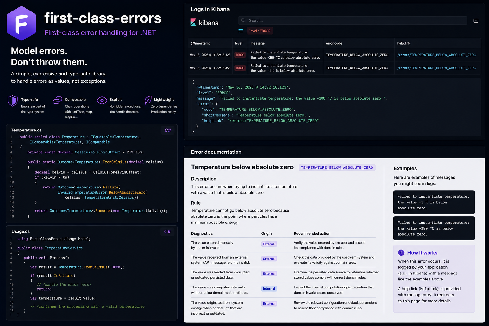

# FirstClassErrors

🌍 **Langues :**  
🇬🇧 [English](../../../README.md) | 🇫🇷 Français (ce fichier)

|  |  |
| :-- | :-- |
| **Build** | [](https://github.com/Reefact/first-class-errors/actions/workflows/ci.yml) |
| **Qualité** | [](https://sonarcloud.io/summary/new_code?id=reefact_first-class-errors) [](https://sonarcloud.io/summary/new_code?id=reefact_first-class-errors) |
| **Sécurité** | [](https://github.com/Reefact/first-class-errors/actions/workflows/codeql.yml) [](https://www.bestpractices.dev/projects/13567) [](https://securityscorecards.dev/viewer/?uri=github.com/Reefact/first-class-errors) |
| **Package** | [](https://www.nuget.org/packages/FirstClassErrors)  |
| **Projet** | [](../../../LICENSE) [](https://www.conventionalcommits.org) |

---

**Transformez vos erreurs en connaissance structurée et vivante sur votre système.**



## 🚨 Le problème

Une erreur de production est rarement utile lorsqu’elle se résume à un type et une chaîne de caractères :

```text
Opération invalide.
```

Les développeurs et le support doivent encore découvrir :

- quelle situation s’est réellement produite ;
- quelle règle a été violée ;
- quels faits appartiennent à cette occurrence ;
- ce qui a pu la provoquer ;
- par où commencer l’investigation.

Lorsque cette connaissance est répartie entre les logs, les tickets, les commentaires et la mémoire des personnes, elle dérive du code.

## 🧩 Un seul modèle pour toute la chaîne

FirstClassErrors fait de l’erreur un concept de première classe de votre domaine. Vous décrivez chaque situation d’erreur une seule fois, avec ses règles, à un seul endroit du code ; toute la bibliothèque s’appuie ensuite sur ce modèle.

**Modéliser l’erreur**
Une erreur devient un objet qui porte son propre sens — qu’il s’agisse d’une règle métier violée, d’un appel entrant rejeté ou d’une panne d’un service externe, passagère ou définitive.

**Gérer l’échec**
À vous de choisir comment elle voyage : levée comme une exception classique, ou renvoyée comme un résultat explicite que l’appelant inspecte sans try/catch.

**Documenter l’erreur**
Chaque erreur peut porter, dans le code, son explication, sa règle et ses causes probables. FirstClassErrors en génère un catalogue lisible, extrait de ce même code — il ne dérive donc jamais.

**Vérifier le modèle**
Des analyseurs Roslyn contrôlent ces règles dès la compilation : un code d’erreur dupliqué ou une documentation incohérente deviennent des erreurs de build, détectées avant la production.

**Lier les entrées externes**
Un formulaire ou une requête JSON doit devenir un objet métier valide. Là où le binding .NET classique redéclare ces règles séparément, dans un validateur ou des attributs, FirstClassErrors lie ces entrées directement à vos objets valeur, en réutilisant leurs propres règles de construction au lieu de les dupliquer.

## 💡 L’approche FirstClassErrors

Une factory donne une identité stable à la situation d’erreur, centralise sa construction et y attache une documentation structurée qui alimentera un catalogue généré, lisible par des humains :

```csharp
[ProvidesErrorsFor(nameof(Amount))]
public static class InvalidAmountOperationError {

    [DocumentedBy(nameof(CurrencyMismatchDocumentation))]
    internal static DomainError CurrencyMismatch(Amount left, Amount right) {
        return DomainError.Create(
                ErrorCode.Create("AMOUNT_CURRENCY_MISMATCH"),
                diagnosticMessage: $"Impossible d’additionner {left} et {right} car leurs devises diffèrent.")
            .WithPublicMessage(
                shortMessage: "Les montants utilisent des devises différentes.",
                detailedMessage: "Les deux montants doivent utiliser la même devise.");
    }

    private static ErrorDocumentation CurrencyMismatchDocumentation() {
        return DescribeError.WithTitle("Incohérence de devise")
                            .WithDescription("Cette erreur survient lorsqu’une opération combine des montants exprimés dans des devises différentes.")
                            .WithRule("Une opération monétaire doit utiliser une devise commune.")
                            .WithDiagnostic(
                                "Les montants ont atteint l’opération sans avoir été convertis dans une devise commune.",
                                ErrorOrigin.Internal,
                                "Vérifiez à quel endroit les montants auraient dû être convertis avant cette opération.")
                            .WithExamples(() => CurrencyMismatch(
                                new Amount(10, Currency.EUR),
                                new Amount(12, Currency.USD)));
    }
}
```

Le code métier reste centré sur l’intention :

```csharp
if (Currency != other.Currency) {
    throw InvalidAmountOperationError.CurrencyMismatch(this, other).ToException();
}
```

La factory retourne une `Error` (`DomainError` en est une des catégories), donc un échec attendu peut employer le même modèle sans lever d’exception :

```csharp
return Outcome<Amount>.Failure(
    InvalidAmountOperationError.CurrencyMismatch(left, right));
```

À partir de ces factories, FirstClassErrors peut générer un catalogue lisible par les développeurs, le support et l’exploitation.

## 📦 Installation

```bash
dotnet add package FirstClassErrors
```

Le package cible **.NET Standard 2.0**. Les analyseurs Roslyn sont inclus automatiquement ; aucun package d’analyse supplémentaire n’est nécessaire.

Pour lier les requêtes entrantes en commandes ou requêtes typées à la frontière de l’adaptateur primaire, ajoutez le binder de requêtes optionnel :

```bash
dotnet add package FirstClassErrors.RequestBinder
```

Pour générer la documentation, installez le CLI :

```bash
dotnet tool install --global FirstClassErrors.Cli
```

Suivez ensuite le guide [Premiers pas](GettingStarted.fr.md) pour créer et générer votre première erreur documentée.

## 🎯 Quand la bibliothèque est adaptée

FirstClassErrors est particulièrement utile dans du code applicatif ou métier durable lorsque :

- les erreurs représentent des règles, des contraintes ou des défaillances de frontière ;
- plusieurs équipes ou systèmes dépendent de codes d’erreur stables ;
- le support et l’exploitation investiguent des incidents de production ;
- la documentation doit rester alignée avec le comportement.

Pour un prototype, un petit utilitaire ou du code technique bas niveau, les exceptions standards peuvent suffire. Consultez [Quand ne pas utiliser FirstClassErrors](WhenNotToUseFirstClassErrors.fr.md).

## 🔍 Analyseurs et chaîne d’approvisionnement

Le package contient des règles Roslyn aux identifiants stables `FCExxx`. Elles détectent notamment les codes dupliqués ou mal formés, les liaisons de documentation invalides, l’absence d’exemples et certains mauvais usages de l’API. Consultez la [référence des analyseurs](analyzers/README.fr.md).

Les packages publiés contiennent une provenance de build signée et un SBOM SPDX embarqué. Les informations de vérification sont disponibles dans [SECURITY.fr.md](SECURITY.fr.md).

## 🐛 Retours et contributions

Vous avez trouvé un bug ou souhaitez proposer une fonctionnalité ? Ouvrez une issue sur le [gestionnaire d’issues GitHub](https://github.com/Reefact/first-class-errors/issues). Les contributions sont les bienvenues ; consultez [CONTRIBUTING.fr.md](CONTRIBUTING.fr.md).

Pour les vulnérabilités de sécurité, suivez le processus privé décrit dans [SECURITY.fr.md](SECURITY.fr.md).

## 📚 Documentation

### Découvrir

- [Premiers pas](GettingStarted.fr.md)
- [Principes de conception](DesignPrinciples.fr.md)
- [Quand ne pas utiliser FirstClassErrors](WhenNotToUseFirstClassErrors.fr.md)

### Comprendre le modèle

- [Concepts fondamentaux](CoreConcepts.fr.md)
- [Taxonomie et composition des erreurs](ErrorTaxonomy.fr.md)
- [Guide du contexte d’erreur](ErrorContext.fr.md)

### Écrire et utiliser des erreurs

- [Guide d’écriture des erreurs](WritingErrorsGuide.fr.md)
- [Cas d’usage](UsagePatterns.fr.md)
- [Lier les requêtes à la frontière (RequestBinder)](RequestBinder.fr.md)
- [Bonnes pratiques](BestPractices.fr.md)
- [Guide des tests](Testing.fr.md)
  - [Tests d’erreur déterministes](DeterministicTesting.fr.md)
  - [Valeurs de test arbitraires](ArbitraryTestValues.fr.md)

### Générer et exploiter le catalogue

- [Intégration CI/CD et exploitation](OperationalIntegration.fr.md)
- Versionnage du catalogue
  - [Vue d’ensemble et workflow](CatalogVersioning.fr.md)
  - [Référence des commandes](CatalogVersioningReference.fr.md)
  - [Intégration CI/CD](CatalogVersioningCI.fr.md)
- [Architecture du pipeline de documentation](ArchitectureOfTheDocumentationPipeline.fr.md)
- [Écrire son propre renderer](WritingACustomRenderer.fr.md)
- [Internationalisation](Internationalisation.fr.md)

### Évaluer et résoudre les problèmes

- [Comparaison avec les bibliothèques de gestion d’erreurs](ComparisonWithOtherLibraries.fr.md)
- [Règles d’analyse (FCExxx)](analyzers/README.fr.md)
- [FAQ](FAQ.fr.md)
