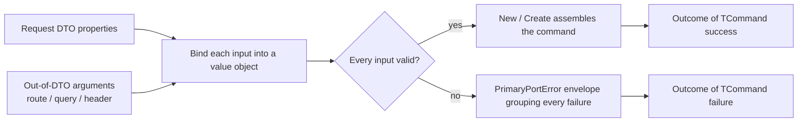

# Binding requests at the boundary

🌍 **Languages:**  
🇬🇧 English (this file) | 🇫🇷 [Français](./RequestBinder.fr.md)

`FirstClassErrors.RequestBinder` converts an incoming request — a DTO body,
out-of-DTO route/query/header arguments, or both — into a typed command or query
of value objects, at the primary-adapter boundary. It collects **every** invalid
input into one documented `PrimaryPortError` instead of stopping at the first, and
it never throws on the invalid-input path.

This page is the focused guide to declaring a binder, converting properties and
arguments, reading bound values, assembling the command, and handling the errors
it produces. If you are new to `Outcome` and error factories, read
[Getting Started](GettingStarted.en.md) and the [Outcome Guide](OutcomeGuide.en.md)
first — the binder builds directly on both.

## 🧭 The model in one minute



A binder is **source-agnostic**: it builds a command, and its inputs are attached
as **peers** — a DTO's properties on one side, individually named out-of-DTO
arguments on the other — into one envelope, with one set of paths. Each input is
read, converted through a value-object factory, and every failure is **recorded**
rather than raised. When the terminal runs, either every input bound — and the
command is assembled — or at least one failed, and the result is the failure of a
single envelope error carrying all of them.

## Install the package

```bash
dotnet add package FirstClassErrors.RequestBinder
```

It targets **.NET Standard 2.0** and ships on the same release train as
`FirstClassErrors`, at the same version — so the two always resolve together.

## The shape of a binding

Every binding has the same three parts: **start** by declaring the envelope,
**attach and convert** each input — a DTO's properties, out-of-DTO arguments, or
both — then **assemble** the command. The running example is a hotel-booking
endpoint whose DTO is the loose wire shape, and whose command is a value-object
aggregate.

```csharp
// The incoming DTO: everything nullable, everything a primitive.
public sealed record BookingRequest(
    string? GuestEmail,
    string? Reference,
    string? Currency,
    string? MaxNights,
    StayDto? Stay,
    IReadOnlyList<string?>? Tags,
    IReadOnlyList<GuestDto?>? Guests);

// The command: value objects, non-null where presence is required.
public sealed record PlaceBookingCommand(
    EmailAddress GuestEmail,
    string Reference,
    Currency Currency,
    int? MaxNights,
    Stay Stay,
    IReadOnlyList<Tag> Tags,
    IReadOnlyList<Guest> Guests);
```

```csharp
public Outcome<PlaceBookingCommand> Bind(BookingRequest request) {
    RequestBinder bind = Bind.Request(PlaceBookingError.Invalid);

    PropertySource<BookingRequest> body = bind.PropertiesOf(request);

    RequiredField<EmailAddress> email     = body.SimpleProperty(r => r.GuestEmail).AsRequired(EmailAddress.Parse);
    RequiredField<string>       reference = body.SimpleProperty(r => r.Reference).AsRequired();
    RequiredField<Currency>     currency  = body.SimpleProperty(r => r.Currency).AsOptional(Currency.Parse, "EUR");

    // Assemble the command from the bound fields (the full version is at the end of this guide):
    return bind.New(s => new PlaceBookingCommand(
        s.Get(email),
        s.Get(reference),
        s.Get(currency),
        /* MaxNights, Stay, Tags, Guests — bound the same way, shown below */));
}
```

- **`Bind.Request(PlaceBookingError.Invalid)`** starts a binder and declares the
  envelope up front — one factory from *your* catalog, under which every failure is
  grouped. The envelope comes **first**, not last: a binder can never exist without
  one, exactly as an error can never be left without a public message.
- **`bind.PropertiesOf(request)`** attaches the DTO as a source of inputs, returning
  a `PropertySource<BookingRequest>` on which each `SimpleProperty(...)` selects one
  property and converts it. The DTO is **one source among peers**; out-of-DTO values
  are attached separately with `bind.Argument(...)` (see *Out-of-DTO arguments*).
- Each converter returns a **field token**, not a value.
- **`bind.New(...)`** assembles the command, reading each token through the scope
  `s`. It returns `Outcome<PlaceBookingCommand>` — success when every input bound,
  the envelope failure otherwise. The command type is inferred from the assembler,
  so you never name it.

The envelope factory is an ordinary aggregate error from your catalog:

```csharp
[ProvidesErrorsFor("PlaceBooking")]
public static class PlaceBookingError {

    [DocumentedBy(nameof(InvalidDocumentation))]
    internal static PrimaryPortError Invalid(PrimaryPortInnerErrors violations) {
        return PrimaryPortError.Create(Code.Invalid, "The booking request is invalid.", violations)
                               .WithPublicMessage("We could not accept your booking request.");
    }

    // ... Code, documentation, nested envelopes (StayInvalid, GuestInvalid) omitted for brevity.
}
```

## Converting a scalar property

`body.SimpleProperty(r => r.X)` selects one property; the converter stage that
follows offers four ways to bind it. All of them take a value-object factory
(`Func<TArgument, Outcome<TProperty>>` — typically a method group such as
`EmailAddress.Parse`) and **fail by returning** `Outcome.Failure`, never by
throwing.

| Method | Absent argument | Present but invalid | Bound value |
| --- | --- | --- | --- |
| `AsRequired(convert)` | records `REQUEST_ARGUMENT_REQUIRED` | records `REQUEST_ARGUMENT_INVALID` | `RequiredField<T>` |
| `AsRequired()` | records `REQUEST_ARGUMENT_REQUIRED` | — (no conversion) | `RequiredField<TArgument>` (raw) |
| `AsOptional(convert, fallback)` | converts `fallback` instead | records `REQUEST_ARGUMENT_INVALID` | `RequiredField<T>` (always present) |
| `AsOptionalReference(convert)` | `null`, records nothing | records `REQUEST_ARGUMENT_INVALID` | `OptionalReferenceField<T>` |
| `AsOptionalValue(convert)` | `null`, records nothing | records `REQUEST_ARGUMENT_INVALID` | `OptionalValueField<T>` |

```csharp
// Required with conversion: EmailAddress.Parse turns the raw string into a value object.
RequiredField<EmailAddress> email = body.SimpleProperty(r => r.GuestEmail).AsRequired(EmailAddress.Parse);

// Required without conversion: presence is checked, the raw value is bound as-is.
RequiredField<string> reference = body.SimpleProperty(r => r.Reference).AsRequired();

// Optional with a fallback: absent uses "EUR"; a present-but-invalid value still records an error.
RequiredField<Currency> currency = body.SimpleProperty(r => r.Currency).AsOptional(Currency.Parse, "EUR");

// Optional value type: absent yields a real Nullable null — never default(int).
OptionalValueField<int> maxNights = body.SimpleProperty(r => r.MaxNights).AsOptionalValue(PositiveInt.Parse);

// AsOptionalReference is the reference-type sibling of AsOptionalValue (absent yields a null value
// object, records nothing). It is shown on the guest's optional email under "Lists", below.
```

**A value-type property binds over its *underlying* type.** When the DTO property
is itself a value type — an `int?`, `bool?`, or `decimal?` that a JSON number or
boolean deserializes into — the converter you pass runs over the **non-nullable
underlying** type: the binder unwraps the `Nullable` for you. A value-object
factory such as `Quantity.From(int)` therefore binds as a method group, exactly as
`EmailAddress.Parse(string)` does for a reference-type property:

```csharp
// DTO: public sealed record CartRequest(int? Quantity, IReadOnlyList<int?>? Lines);

// Quantity.From is `int -> Outcome<Quantity>`; the binder feeds it the unwrapped int.
RequiredField<Quantity>                qty   = body.SimpleProperty(r => r.Quantity).AsRequired(Quantity.From);

// A list of value types works the same way: each element is converted over its underlying
// int, and a null element records REQUEST_ARGUMENT_REQUIRED under its indexed path (Lines[2]).
RequiredField<IReadOnlyList<Quantity>> lines = body.ListOfSimpleProperties(r => r.Lines).AsRequired(Quantity.From);
```

The property must still be declared nullable (`int?`, not `int`) so the binder can
tell an absent argument from a real value; a non-nullable value-type property
throws instead, as *The bug channel* explains below.

**Optional means "may be absent", never "may be malformed".** A present argument
that fails to convert is always an error — even on an optional binding. Only a
*missing* optional argument is silent (falling back, yielding `null`, or an empty
list).

**A fallback is developer configuration, not client input.** If the `fallback`
you pass to `AsOptional` does not itself convert, that is a bug in your code, so
it throws `InvalidOperationException` rather than being reported as a client
error.

## Reading bound values: the binding scope

A field token exposes **no** public value. The only way to read one is
`s.Get(token)`, inside the assembler passed to `New` or `Create`:

```csharp
return bind.New(s => new PlaceBookingCommand(
    s.Get(email),       // EmailAddress   — required
    s.Get(reference),   // string         — required, raw
    s.Get(currency),    // Currency       — optional with fallback, always present
    s.Get(maxNights),   // int?           — optional value, null when absent
    ...));
```

This is safety **by construction**, not by convention. The scope `s` is a
`readonly ref struct`: it cannot be stored, captured, or returned, so it lives
only for the duration of the assembler. And the terminal creates it **only** on
its success branch — after verifying that not a single failure was recorded. So a
bound value can be read *only* where every binding is known to have succeeded:
reading one before the terminal, or outside its assembler, does not compile.

The token's type carries the nullability:

| Token | `s.Get(...)` returns |
| --- | --- |
| `RequiredField<T>` | `T` |
| `OptionalReferenceField<T>` | `T?` (`null` when the argument was absent) |
| `OptionalValueField<T>` | `T?` — a real `Nullable<T>`, `null` when absent, never `default(T)` |

## Assembling the command: `New` and `Create`

There are two terminals. Pick the one that matches the shape of your assembler —
the name mirrors what you write inside it. Both infer the command type from the
assembler, so you never name it.

| Terminal | Your assembler | Use when |
| --- | --- | --- |
| `New(s => new Command(...))` | returns the command | the constructor is total: every field was already validated one by one |
| `Create(s => Command.Create(...))` | returns `Outcome<Command>` | a validating factory enforces a **cross-field** rule that can still reject an all-valid combination |

`New` wraps the constructed command in a success outcome:

```csharp
return bind.New(s => new PlaceBookingCommand(s.Get(email), s.Get(reference), ...));
```

`Create` runs a factory that may still fail — a cross-field rule such as
"check-out must be after check-in" that no single field could check on its own —
and **flattens** its result, so you never get an `Outcome<Outcome<T>>`:

```csharp
return bind.Create(s => PlaceBookingCommand.Create(
    s.Get(checkIn), s.Get(checkOut), s.Get(guests)));
// PlaceBookingCommand.Create(...) returns Outcome<PlaceBookingCommand>.
```

The factory runs **only** on the zero-error branch — every field is already
bound — so a cross-field rule can assume its inputs are present and valid. Its
failure is returned **as-is**: the factory owns that error (it is a domain rule,
not an argument-binding failure), so it is not re-wrapped in the binder envelope.
A consumer of `Create` therefore sees either the binder's envelope (an input was
missing or malformed) or the factory's own error (all inputs were fine, but the
combination was rejected). The decision behind these two names is recorded in
[ADR-0007](../for-maintainers/adr/0007-name-the-binder-terminals-new-and-create.md).

## Collect-all, not fail-fast

The whole point of a binder is that a client fixing one field does not discover
the next only on resubmit. Every failing input is recorded and reported at once,
in declaration order:

```csharp
RequestBinder bind = Bind.Request(PlaceBookingError.Invalid);
PropertySource<BookingRequest> body = bind.PropertiesOf(new BookingRequest(
    GuestEmail: "not-an-email",   // invalid
    Reference: null,              // missing
    Currency: "EURO",             // invalid (not 3 letters)
    /* ... */));

body.SimpleProperty(r => r.GuestEmail).AsRequired(EmailAddress.Parse);
body.SimpleProperty(r => r.Reference).AsRequired();
body.SimpleProperty(r => r.Currency).AsOptional(Currency.Parse, "EUR");

Outcome<PlaceBookingCommand> outcome = bind.New(s => /* never reached */ null!);

// outcome.Error is PlaceBookingError.Invalid, with three inner errors:
//   REQUEST_ARGUMENT_INVALID   (GuestEmail)
//   REQUEST_ARGUMENT_REQUIRED  (Reference)
//   REQUEST_ARGUMENT_INVALID   (Currency)
```

A request whose every input is invalid raises **zero** exceptions: the binder
never throws on the invalid-input path.

## The two binder error codes

The binder manufactures exactly two errors of its own. Everything else in a
failure tree comes from *your* code — the conversion errors your value objects
return, and the envelope errors you declare.

| Code | Meaning | Inner error |
| --- | --- | --- |
| `REQUEST_ARGUMENT_REQUIRED` | a required input was absent from the request | — |
| `REQUEST_ARGUMENT_INVALID` | a present input failed to convert | the converter's own error |

Both carry the **full argument path** in their context (for example
`Guests[1].FirstName`), so the failing input is identifiable without parsing
messages. Read it through the public typed key `RequestBindingError.ArgumentPathKey`:

```csharp
Error required = outcome.Error!.InnerErrors.First();
required.Context.TryGet(RequestBindingError.ArgumentPathKey, out string? path);
// path == "Reference"
```

An out-of-DTO argument additionally carries its **provenance** (`"route"`,
`"query"`, …) under `RequestBindingError.ArgumentSourceKey`; a DTO property carries
no source, because its provenance — the request body — is implicit. See
*Out-of-DTO arguments*, below.

`REQUEST_ARGUMENT_REQUIRED` is **non-transient**: resubmitting the same request
cannot succeed. `REQUEST_ARGUMENT_INVALID` wraps the converter's `DomainError` or
`PrimaryPortError` as its inner error — read it to learn the precise rule the
value violated. Both codes are documented in the generated catalog like any
other error (see the [documentation pipeline](ArchitectureOfTheDocumentationPipeline.en.md)).

A converter must fail with a `DomainError` or a `PrimaryPortError` — the two
families a failure tree accepts. Failing with any other family is a converter
bug, reported by throwing, never recorded as a client error.

## Nested objects

A complex property is bound by a **nested binder**, declared with its own
envelope. The nested binding typically lives in a dedicated method, passed as a
method group; it receives the child binder **and** the nested DTO to attach to it:

```csharp
RequiredField<Stay> stay = body.ComplexProperty(r => r.Stay)
                               .FailWith(PlaceBookingError.StayInvalid)
                               .AsRequired(BindStay);

private static Outcome<Stay> BindStay(RequestBinder binder, StayDto dto) {
    PropertySource<StayDto> stay = binder.PropertiesOf(dto);

    RequiredField<BookingDate> checkIn  = stay.SimpleProperty(s => s.CheckIn).AsRequired(BookingDate.Parse);
    RequiredField<BookingDate> checkOut = stay.SimpleProperty(s => s.CheckOut).AsRequired(BookingDate.Parse);

    return binder.New(s => new Stay(s.Get(checkIn), s.Get(checkOut)));
}
```

The nested binder is a full `RequestBinder` — the nested value object is built
exactly like a top-level command. It inherits the parent's options and
**prefixes** its argument paths, so a failure inside `Stay` reports `Stay.CheckIn`,
not just `CheckIn`. A missing complex property records `REQUEST_ARGUMENT_REQUIRED`;
a nested binding that fails contributes its own envelope, whose inner errors
already carry the prefixed paths. Use `AsOptionalReference` instead of `AsRequired`
for a nullable nested object: absent yields `null` and records nothing — the same
`AsOptionalReference` name the scalar side uses for a nullable reference value.

## Lists

Two selectors bind list properties, each producing indexed paths so one bad
element never hides the others.

**A list of scalars** converts each element through a value-object factory:

```csharp
RequiredField<IReadOnlyList<Tag>> tags =
    body.ListOfSimpleProperties(r => r.Tags).AsOptional(Tag.Parse);
// A failing element records REQUEST_ARGUMENT_INVALID under Tags[2].
```

**A list of complex elements** binds each element with a nested binder, under a
per-element envelope:

```csharp
RequiredField<IReadOnlyList<Guest>> guests =
    body.ListOfComplexProperties(r => r.Guests)
        .FailWith(PlaceBookingError.GuestInvalid)
        .AsRequired(BindGuest);

private static Outcome<Guest> BindGuest(RequestBinder binder, GuestDto dto) {
    PropertySource<GuestDto> guest = binder.PropertiesOf(dto);

    RequiredField<string>                firstName = guest.SimpleProperty(g => g.FirstName).AsRequired();
    OptionalReferenceField<EmailAddress> email     = guest.SimpleProperty(g => g.Email).AsOptionalReference(EmailAddress.Parse);

    return binder.New(s => new Guest(s.Get(firstName), s.Get(email)));
}
// A failure in the second guest's email reports Guests[1].Email.
```

For both list selectors, `AsRequired` records `REQUEST_ARGUMENT_REQUIRED` only when
the list itself is **absent** (`null`): a list that is **present but empty** is a
valid required list — it binds to an empty list and records nothing, because a
required list constrains **presence, not size**. `AsOptional` treats an absent list
as an **empty** list (never `null`) and records nothing. A `null` *element* of a
present list is recorded as a missing argument at its index. When the domain needs
at least one element, enforce that cardinality in the value object or command the
bound list feeds.

## Out-of-DTO arguments

Not every input is a DTO property. A route identifier, a query parameter, a header
value, a claim — these are **out-of-DTO arguments**: individual values the host has
already extracted from the request. The binder attaches them as **peers** of the
DTO, into the same envelope and the same set of paths, so a route value and a body
property fail together, uniformly.

Name the argument, state where it comes from, then bind it with the **same**
converters a DTO property uses:

```csharp
RequestBinder bind = Bind.Request(ConfirmBookingError.Invalid);

// A body DTO and out-of-DTO arguments, attached as peers into one binder:
PropertySource<ConfirmRequest> body = bind.PropertiesOf(request);
RequiredField<PaymentRef>      payment = body.SimpleProperty(r => r.PaymentRef).AsRequired(PaymentRef.Parse);

RequiredField<BookingId> id     = bind.Argument("bookingId").FromRoute(routeBookingId).AsRequired(BookingId.From);
RequiredField<TenantId>  tenant = bind.Argument("tenant").FromHeader(tenantHeader).AsRequired(TenantId.From);

Outcome<ConfirmBookingCommand> command =
    bind.New(s => new ConfirmBookingCommand(s.Get(id), s.Get(tenant), s.Get(payment)));
```

- **`bind.Argument(name)`** names an out-of-DTO argument. The `name` is used
  verbatim as the argument's error path (`bookingId`) — there is no DTO property to
  derive it from, so you state it.
- **`.From(source, value)`** supplies its provenance and value. `source` is a free
  label (`"route"`, `"query"`, `"header"`, …) recorded in the failure's context; a
  `null` value means the argument was **absent**. The provenance-shortcut helpers
  `FromRoute`, `FromQuery`, `FromHeader`, `FromBody`, `FromForm` are exactly
  `From("route", …)` and so on.
- The returned converter is the **same** one a DTO property yields: `AsRequired`,
  `AsRequired()`, `AsOptional`, `AsOptionalReference`, `AsOptionalValue`, with the
  same absent/invalid semantics and the same two structural codes.

Because the helpers only **tag** an already-extracted value, they carry no
dependency on any web framework and work the same for an HTTP controller, a
message consumer, or a CLI. Extracting the value from the incoming request itself
is the host's job, not the library's.

**Provenance is captured, for diagnostics.** An argument's failure carries both its
path *and* its source, so you can tell a bad route segment from a bad header without
parsing anything:

```csharp
Error inner = command.Error!.InnerErrors.First();
inner.Context.TryGet(RequestBindingError.ArgumentPathKey,   out string? path);   // "bookingId"
inner.Context.TryGet(RequestBindingError.ArgumentSourceKey, out string? source); // "route"
```

The source appears **only** on out-of-DTO arguments. A DTO property records its
path but no source, because its provenance — the request body — is implicit and the
same for every property; adding it would be noise. This asymmetry is deliberate: an
argument is a value whose origin you had to state, so the origin is worth keeping.

**A list argument** is the out-of-DTO counterpart of `ListOfSimpleProperties` — a
repeated query parameter or header, under one name and an indexed path:

```csharp
RequiredField<IReadOnlyList<Tag>> tags =
    bind.ArgumentList("tag").FromQuery(queryTags).AsOptional(Tag.Parse);
// A failing element records REQUEST_ARGUMENT_INVALID under tag[2], source "query".
```

There is **no** out-of-DTO counterpart of a *complex* property: a complex property
is a path into a DTO, and an out-of-DTO argument, by definition, has no DTO to path
into. Build a complex value from arguments by binding each argument as a peer and
assembling them in the terminal, exactly as the example above builds
`ConfirmBookingCommand`.

## Argument names and the wire format

By default, a DTO property's path uses the **C# property name** (`GuestEmail`). If
your serializer renames keys (snake_case, `JsonPropertyName`, a naming policy),
plug an `IArgumentNameProvider` so the paths reported in errors match the keys the
client actually sent:

```csharp
public sealed class SnakeCaseNames : IArgumentNameProvider {
    public string GetArgumentNameFrom(PropertyInfo property) =>
        ToSnakeCase(property.Name);   // GuestEmail -> guest_email
}

RequestBinder bind = Bind.WithOptions(new RequestBinderOptions(new SnakeCaseNames()))
                         .Request(PlaceBookingError.Invalid);
```

The name provider applies to **DTO properties**, whose name is derived by
reflection; an out-of-DTO argument's path is the name you passed to
`bind.Argument(...)`, used verbatim, since you already gave it the wire name.

Options are chosen **once**, on `Bind.WithOptions`, before the binder even exists —
so a binder's naming policy can never change mid-binding. They are fixed for the life
of a binding, and **nested binders inherit** the options in effect when they are
created — so `Stay.check_in` is renamed consistently, top to bottom. The entry point
`Bind.WithOptions(...)` returns carries no per-request state, so you can build it once
(for example at application startup) and reuse it for every request. The library
deliberately ships only the default (C# property names): which serializer names the
wire keys is the host's knowledge, not the library's.

## Structural errors: codes and messages

The binder raises two coded errors of its own — `REQUEST_ARGUMENT_REQUIRED` when a
required input is missing, and `REQUEST_ARGUMENT_INVALID` when one is present but
fails to convert. These are the only errors the binder manufactures; every other code
in a failure tree is yours (the converters' errors, and the envelope).

Each is a `BinderErrorDefinition` — a **code and its public messages, kept together** —
so you override them as one coherent unit, never a code stranded from its message. Start
from the exposed default and change the code, the messages, or both; whatever you leave
untouched keeps the shipped value:

```csharp
var options = new RequestBinderOptions(
    new SnakeCaseNames(),
    // align the code with your catalog's convention, keep the default messages:
    argumentRequired: RequestBindingError.DefaultArgumentRequired.WithCode(ErrorCode.Create("ACME_ARGUMENT_REQUIRED")),
    // a code and its message, defined together in one place:
    argumentInvalid: new BinderErrorDefinition(
        ErrorCode.Create("ACME_ARGUMENT_INVALID"),
        path => new BindingMessage("An argument is invalid.", $"The argument '{path}' is invalid.")));

RequestBinder bind = Bind.WithOptions(options).Request(PlaceBookingError.Invalid);
```

The message builder runs **when the error is raised**, not when the options are built —
so it can read the ambient culture (`CultureInfo.CurrentUICulture`) and return a message
localized per request. A host serving several languages localizes the binder's structural
messages through its own resource accessor, exactly as it localizes any other error:

```csharp
argumentRequired: RequestBindingError.DefaultArgumentRequired.WithMessage(
    path => new BindingMessage(
        BinderStrings.ArgumentRequired_Short,                       // .resx, resolved on CurrentUICulture
        string.Format(BinderStrings.ArgumentRequired_Detailed, path)))
```

Only the two **public** messages are localizable; the diagnostic message stays in the
library's internal language (English) by convention, so logs for one structural failure
never fork by request language. See [Internationalization](Internationalization.en.md).

The configured definitions flow through **every** structural failure — scalars, list
elements, out-of-DTO arguments, and the inner failures of nested binders, which inherit
them.

To **branch** on a binder failure — mapping it to an HTTP status, say — compare the
error's code symbolically, never against a string literal: use the code you configured,
or, when you keep the defaults, the ones the binder exposes.

```csharp
if (error.Code == RequestBindingError.DefaultArgumentRequiredCode) { return 422; }
```

### Documenting your overridden errors in your own catalog

When you override the codes or messages and you generate an error catalog with
`fce generate`, document the errors where you now own them — in **your** catalog, reusing
the binder's own prose. The public seams `DescribeArgumentRequired` /
`DescribeArgumentInvalid` return the binder's generic description with a live example built
from your definition; `SampleArgumentRequired` / `SampleArgumentInvalid` return the example
error itself, for the `[DocumentedBy]` factory:

```csharp
[ProvidesErrorsFor("MyApi")]
public static class MyApiBinderErrors {

    // The definition you inject into RequestBinderOptions — the single source of truth.
    public static readonly BinderErrorDefinition ArgumentRequired =
        RequestBindingError.DefaultArgumentRequired.WithCode(ErrorCode.Create("ACME_ARGUMENT_REQUIRED"));

    [DocumentedBy(nameof(ArgumentRequiredDoc))]
    internal static PrimaryPortError ArgumentRequiredError() => RequestBindingError.SampleArgumentRequired(ArgumentRequired);
    private  static ErrorDocumentation ArgumentRequiredDoc()  => RequestBindingError.DescribeArgumentRequired(ArgumentRequired);

    // ArgumentInvalid follows the same shape, with DescribeArgumentInvalid / SampleArgumentInvalid.
}
```

The generator discovers this like any other catalog: the prose is the binder's, the code
and messages are yours, and the example is built the way the binder builds it at binding
time — so the documented entry matches what you actually emit. The same pattern folds the
**default** codes into your catalog too — point the definition at
`RequestBindingError.DefaultArgumentRequired` / `DefaultArgumentInvalid`.

## Configuring the default for the whole application

`Bind.Request(envelope)` binds with `RequestBinderOptions.Default`. That default is
configurable **once, at application startup** — so a whole host (ASP.NET, a CLI, a
worker) shares one naming policy and one set of structural-error definitions without
threading options through every call, and without a DI container:

```csharp
// Program.cs, before the first bind:
RequestBinderOptions.Default = new RequestBinderOptions(
    new SnakeCaseNames(),
    argumentRequired: RequestBindingError.DefaultArgumentRequired.WithCode(ErrorCode.Create("ACME_ARGUMENT_REQUIRED")),
    argumentInvalid:  RequestBindingError.DefaultArgumentInvalid.WithCode(ErrorCode.Create("ACME_ARGUMENT_INVALID")));

// anywhere after that — no options threaded through:
RequestBinder bind = Bind.Request(PlaceBookingError.Invalid);
```

The default is **frozen on first use**: the first bind reads it, and any later
assignment throws — so it is set at composition time and can never drift once requests
are flowing (the same discipline as `JsonSerializerOptions`). A per-call
`Bind.WithOptions(...)` still overrides it for a single binding.

## The bug channel: what throws vs what is collected

The binder draws a hard line between a **client error** (recorded, surfaced once
as the envelope failure) and a **programming error** (thrown, so a genuine bug
reaches your exception boundary undisguised). Nothing on the invalid-input path
throws; these do:

- a converter that throws instead of returning `Outcome.Failure` (a converter bug);
- a selector that is not a direct property access, e.g. `r => r.Email.Trim()`;
- an `AsOptional` fallback that does not convert (bad developer configuration);
- reading a token through the scope of a *different* binder;
- **a non-nullable value-type DTO property**, e.g. `int` instead of `int?`.

The last one is worth dwelling on. A non-nullable value type can never be
`null`, so a *missing* argument (deserialized to `default(T)` — `0`, `false`) is
indistinguishable from a legitimately-sent default. The information does not
exist at runtime, so the binder rejects the mis-declaration loudly rather than
silently losing absence:

```csharp
public sealed record BookingRequest(int MaxNights /* ... */);   // ✗ int
//                                   ^ throws ArgumentException: declare it int?

public sealed record BookingRequest(int? MaxNights /* ... */);  // ✓ int?
```

Declare every bound value-type property nullable, so an absent argument arrives
as `null` and the binder can tell it apart from a real value. The same holds for a
value-type **argument**: pass an `int?` / `Guid?` to `From`, so absence is a real
`null` rather than a defaulted value.

## Complete example

A full endpoint: nested `Stay`, a list of `Guests`, an optional `MaxNights`, and
a cross-field rule enforced through `Create`.

```csharp
public Outcome<PlaceBookingCommand> BindBooking(BookingRequest request) {
    RequestBinder bind = Bind.Request(PlaceBookingError.Invalid);
    PropertySource<BookingRequest> body = bind.PropertiesOf(request);

    RequiredField<EmailAddress>         email     = body.SimpleProperty(r => r.GuestEmail).AsRequired(EmailAddress.Parse);
    RequiredField<string>               reference = body.SimpleProperty(r => r.Reference).AsRequired();
    RequiredField<Currency>             currency  = body.SimpleProperty(r => r.Currency).AsOptional(Currency.Parse, "EUR");
    OptionalValueField<int>             maxNights = body.SimpleProperty(r => r.MaxNights).AsOptionalValue(PositiveInt.Parse);
    RequiredField<Stay>                 stay      = body.ComplexProperty(r => r.Stay).FailWith(PlaceBookingError.StayInvalid).AsRequired(BindStay);
    RequiredField<IReadOnlyList<Tag>>   tags      = body.ListOfSimpleProperties(r => r.Tags).AsOptional(Tag.Parse);
    RequiredField<IReadOnlyList<Guest>> guests    = body.ListOfComplexProperties(r => r.Guests).FailWith(PlaceBookingError.GuestInvalid).AsRequired(BindGuest);

    // Create: PlaceBookingCommand.Create enforces "check-out after check-in" and may still reject.
    return bind.Create(s => PlaceBookingCommand.Create(
        s.Get(email),
        s.Get(reference),
        s.Get(currency),
        s.Get(maxNights),
        s.Get(stay),
        s.Get(tags),
        s.Get(guests)));
}
```

One structured error model runs from the wire to the command: a malformed input
surfaces as the binder's envelope with indexed paths; a rejected all-valid
combination surfaces as the command factory's own error. No exception is raised
unless the code itself is wrong.

## Testing a binding

The binder returns an `Outcome`, so the [testing helpers](Testing.en.md) apply
directly. Assert on codes and argument paths rather than on messages:

```csharp
Outcome<PlaceBookingCommand> outcome = BindBooking(InvalidRequest());

Check.That(outcome.IsFailure).IsTrue();
Check.That(outcome.Error!.Code.ToString()).IsEqualTo("PLACE_BOOKING_INVALID");
Check.That(outcome.Error!.InnerErrors.Select(e => e.Code.ToString()))
     .ContainsExactly("REQUEST_ARGUMENT_INVALID", "REQUEST_ARGUMENT_REQUIRED");
```

Assert the *whole* set of collected failures, in order — that is what proves the
collect-all behavior, not just that binding failed. For an out-of-DTO argument,
assert its provenance too, through `RequestBindingError.ArgumentSourceKey`.

## Runnable examples

The patterns in this guide are realized as compiled, tested, and
snapshot-documented code in the
[`FirstClassErrors.RequestBinder.Usage`](../../../FirstClassErrors.RequestBinder.Usage)
sample: a full hotel-booking boundary bound end-to-end (`BookingBinder`), a
showcase of every remaining overload and option — required/optional lists, custom
argument names, custom structural codes (`BinderShowcase`) — a framework-agnostic
call site (`BookingEndpoint`), and companion unit tests that assert the
collect-all order, codes, and argument paths. Its documented errors appear in
their own generated, snapshot-tested catalog, so the binder path is exercised in
living documentation.

## 📌 Review checklist

Before approving a binding, verify that:

- every DTO property is nullable, including value types (`int?`, not `int`);
- each input is bound with the variant matching its contract — required,
  optional-with-fallback, or optional;
- out-of-DTO arguments state their source, and a value-type argument is passed as a
  nullable (`int?`, `Guid?`) so absence stays distinguishable;
- converters fail by **returning** `Outcome.Failure`, never by throwing;
- the terminal matches the assembler: `New` for a total constructor, `Create` for
  a validating factory returning `Outcome`;
- every complex property and list declares its own envelope with `FailWith`;
- an `IArgumentNameProvider` is configured when the wire keys differ from the C#
  property names;
- tests assert the full, ordered set of collected errors and their argument paths
  (and provenance, for arguments).

---

<div align="center">
<a href="UsagePatterns.en.md">← Usage Patterns</a> · <a href="../../../README.md#-documentation">↑ Table of contents</a> · <a href="Testing.en.md">Testing →</a>
</div>

---
