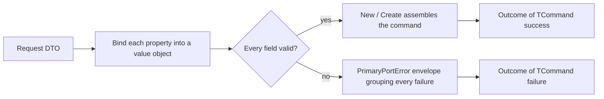

# Binding requests at the boundary

🌍 **Languages:**  
🇬🇧 English (this file) | 🇫🇷 [Français](./RequestBinder.fr.md)

`FirstClassErrors.RequestBinder` converts an incoming request DTO — the loose,
nullable shape a controller, message consumer, CLI, or gRPC handler receives —
into a typed command or query of value objects, at the primary-adapter boundary.
It collects **every** invalid field into one documented `PrimaryPortError`
instead of stopping at the first, and it never throws on the invalid-input path.

This page is the focused guide to declaring a binder, converting properties,
reading bound values, assembling the command, and handling the errors it
produces. If you are new to `Outcome` and error factories, read
[Getting Started](GettingStarted.en.md) and the [Outcome Guide](OutcomeGuide.en.md)
first — the binder builds directly on both.

## 🧭 The model in one minute



A binder reads each property, converts it through a value-object factory, and
**records** every failure rather than raising it. When the terminal runs, either
every field bound — and the command is assembled — or at least one failed, and
the result is the failure of a single envelope error carrying all of them.

## Install the package

```bash
dotnet add package FirstClassErrors.RequestBinder
```

It targets **.NET Standard 2.0** and ships on the same release train as
`FirstClassErrors`, at the same version — so the two always resolve together.

## The shape of a binding

Every binding has the same three parts: **start** from the request and declare
the envelope, **select and convert** each property, then **assemble** the
command. The running example is a hotel-booking endpoint whose DTO is the loose
wire shape, and whose command is a value-object aggregate.

```csharp
// The incoming DTO: everything nullable, everything a primitive.
public sealed record BookingRequest(
    string? GuestEmail,
    string? Reference,
    string? Currency,
    string? MaxNights,
    StayDto? Stay,
    IReadOnlyList<string?>? Tags,
    IReadOnlyList<GuestDto?>? Guests);

// The command: value objects, non-null where presence is required.
public sealed record PlaceBookingCommand(
    EmailAddress GuestEmail,
    string Reference,
    Currency Currency,
    int? MaxNights,
    Stay Stay,
    IReadOnlyList<Tag> Tags,
    IReadOnlyList<Guest> Guests);
```

```csharp
public Outcome<PlaceBookingCommand> Bind(BookingRequest request) {
    var bind = Bind.PropertiesOf(request)
                   .FailWith(PlaceBookingError.Invalid);

    RequiredField<EmailAddress> email     = bind.SimpleProperty(r => r.GuestEmail).AsRequired(EmailAddress.Parse);
    RequiredField<string>       reference = bind.SimpleProperty(r => r.Reference).AsRequired();
    RequiredField<Currency>     currency  = bind.SimpleProperty(r => r.Currency).AsOptional(Currency.Parse, "EUR");

    // Assemble the command from the bound fields (the full version is at the end of this guide):
    return bind.New(s => new PlaceBookingCommand(
        s.Get(email),
        s.Get(reference),
        s.Get(currency),
        /* MaxNights, Stay, Tags, Guests — bound the same way, shown below */));
}
```

- **`Bind.PropertiesOf(request)`** starts a binder over the DTO.
- **`.FailWith(PlaceBookingError.Invalid)`** is mandatory: it declares the single
  envelope error — one factory from *your* catalog — under which every failure is
  grouped. A binder can never be left without an envelope, exactly as an error can
  never be left without a public message.
- Each `SimpleProperty(...)` selects one property and converts it, returning a
  **field token**, not a value.
- **`bind.New(...)`** assembles the command, reading each token through the scope
  `s`. It returns `Outcome<PlaceBookingCommand>` — success when every field bound,
  the envelope failure otherwise.

The envelope factory is an ordinary aggregate error from your catalog:

```csharp
[ProvidesErrorsFor("PlaceBooking")]
public static class PlaceBookingError {

    [DocumentedBy(nameof(InvalidDocumentation))]
    internal static PrimaryPortError Invalid(PrimaryPortInnerErrors violations) {
        return PrimaryPortError.Create(Code.Invalid, "The booking request is invalid.", violations)
                               .WithPublicMessage("We could not accept your booking request.");
    }

    // ... Code, documentation, nested envelopes (StayInvalid, GuestInvalid) omitted for brevity.
}
```

## Converting a scalar property

`SimpleProperty(r => r.X)` selects one property; the converter stage that follows
offers four ways to bind it. All of them take a value-object factory
(`Func<TArgument, Outcome<TProperty>>` — typically a method group such as
`EmailAddress.Parse`) and **fail by returning** `Outcome.Failure`, never by
throwing.

| Method | Absent argument | Present but invalid | Bound value |
| --- | --- | --- | --- |
| `AsRequired(convert)` | records `REQUEST_ARGUMENT_REQUIRED` | records `REQUEST_ARGUMENT_INVALID` | `RequiredField<T>` |
| `AsRequired()` | records `REQUEST_ARGUMENT_REQUIRED` | — (no conversion) | `RequiredField<TArgument>` (raw) |
| `AsOptional(convert, fallback)` | converts `fallback` instead | records `REQUEST_ARGUMENT_INVALID` | `RequiredField<T>` (always present) |
| `AsOptionalReference(convert)` | `null`, records nothing | records `REQUEST_ARGUMENT_INVALID` | `OptionalReferenceField<T>` |
| `AsOptionalValue(convert)` | `null`, records nothing | records `REQUEST_ARGUMENT_INVALID` | `OptionalValueField<T>` |

```csharp
// Required with conversion: EmailAddress.Parse turns the raw string into a value object.
RequiredField<EmailAddress> email = bind.SimpleProperty(r => r.GuestEmail).AsRequired(EmailAddress.Parse);

// Required without conversion: presence is checked, the raw value is bound as-is.
RequiredField<string> reference = bind.SimpleProperty(r => r.Reference).AsRequired();

// Optional with a fallback: absent uses "EUR"; a present-but-invalid value still records an error.
RequiredField<Currency> currency = bind.SimpleProperty(r => r.Currency).AsOptional(Currency.Parse, "EUR");

// Optional value type: absent yields a real Nullable null — never default(int).
OptionalValueField<int> maxNights = bind.SimpleProperty(r => r.MaxNights).AsOptionalValue(PositiveInt.Parse);

// AsOptionalReference is the reference-type sibling of AsOptionalValue (absent yields a null value
// object, records nothing). It is shown on the guest's optional email under "Lists", below.
```

**A value-type property binds over its *underlying* type.** When the DTO property
is itself a value type — an `int?`, `bool?`, or `decimal?` that a JSON number or
boolean deserializes into — the converter you pass runs over the **non-nullable
underlying** type: the binder unwraps the `Nullable` for you. A value-object
factory such as `Quantity.From(int)` therefore binds as a method group, exactly as
`EmailAddress.Parse(string)` does for a reference-type property:

```csharp
// DTO: public sealed record CartRequest(int? Quantity, IReadOnlyList<int?>? Lines);

// Quantity.From is `int -> Outcome<Quantity>`; the binder feeds it the unwrapped int.
RequiredField<Quantity>                qty   = bind.SimpleProperty(r => r.Quantity).AsRequired(Quantity.From);

// A list of value types works the same way: each element is converted over its underlying
// int, and a null element records REQUEST_ARGUMENT_REQUIRED under its indexed path (Lines[2]).
RequiredField<IReadOnlyList<Quantity>> lines = bind.ListOfSimpleProperties(r => r.Lines).AsRequired(Quantity.From);
```

The property must still be declared nullable (`int?`, not `int`) so the binder can
tell an absent argument from a real value; a non-nullable value-type property
throws instead, as *The bug channel* explains below.

**Optional means "may be absent", never "may be malformed".** A present argument
that fails to convert is always an error — even on an optional binding. Only a
*missing* optional argument is silent (falling back, yielding `null`, or an empty
list).

**A fallback is developer configuration, not client input.** If the `fallback`
you pass to `AsOptional` does not itself convert, that is a bug in your code, so
it throws `InvalidOperationException` rather than being reported as a client
error.

## Reading bound values: the binding scope

A field token exposes **no** public value. The only way to read one is
`s.Get(token)`, inside the assembler passed to `New` or `Create`:

```csharp
return bind.New(s => new PlaceBookingCommand(
    s.Get(email),       // EmailAddress   — required
    s.Get(reference),   // string         — required, raw
    s.Get(currency),    // Currency       — optional with fallback, always present
    s.Get(maxNights),   // int?           — optional value, null when absent
    ...));
```

This is safety **by construction**, not by convention. The scope `s` is a
`readonly ref struct`: it cannot be stored, captured, or returned, so it lives
only for the duration of the assembler. And the terminal creates it **only** on
its success branch — after verifying that not a single failure was recorded. So a
bound value can be read *only* where every binding is known to have succeeded:
reading one before the terminal, or outside its assembler, does not compile.

The token's type carries the nullability:

| Token | `s.Get(...)` returns |
| --- | --- |
| `RequiredField<T>` | `T` |
| `OptionalReferenceField<T>` | `T?` (`null` when the argument was absent) |
| `OptionalValueField<T>` | `T?` — a real `Nullable<T>`, `null` when absent, never `default(T)` |

## Assembling the command: `New` and `Create`

There are two terminals. Pick the one that matches the shape of your assembler —
the name mirrors what you write inside it.

| Terminal | Your assembler | Use when |
| --- | --- | --- |
| `New(s => new Command(...))` | returns the command | the constructor is total: every field was already validated one by one |
| `Create(s => Command.Create(...))` | returns `Outcome<Command>` | a validating factory enforces a **cross-field** rule that can still reject an all-valid combination |

`New` wraps the constructed command in a success outcome:

```csharp
return bind.New(s => new PlaceBookingCommand(s.Get(email), s.Get(reference), ...));
```

`Create` runs a factory that may still fail — a cross-field rule such as
"check-out must be after check-in" that no single field could check on its own —
and **flattens** its result, so you never get an `Outcome<Outcome<T>>`:

```csharp
return bind.Create(s => PlaceBookingCommand.Create(
    s.Get(checkIn), s.Get(checkOut), s.Get(guests)));
// PlaceBookingCommand.Create(...) returns Outcome<PlaceBookingCommand>.
```

The factory runs **only** on the zero-error branch — every field is already
bound — so a cross-field rule can assume its inputs are present and valid. Its
failure is returned **as-is**: the factory owns that error (it is a domain rule,
not an argument-binding failure), so it is not re-wrapped in the binder envelope.
A consumer of `Create` therefore sees either the binder's envelope (a field was
missing or malformed) or the factory's own error (all fields were fine, but the
combination was rejected). The decision behind these two names is recorded in
[ADR-0007](../for-maintainers/adr/0007-name-the-binder-terminals-new-and-create.md).

## Collect-all, not fail-fast

The whole point of a binder is that a client fixing one field does not discover
the next only on resubmit. Every failing property is recorded and reported at
once, in declaration order:

```csharp
var bind = Bind.PropertiesOf(new BookingRequest(
                   GuestEmail: "not-an-email",   // invalid
                   Reference: null,              // missing
                   Currency: "EURO",             // invalid (not 3 letters)
                   /* ... */))
               .FailWith(PlaceBookingError.Invalid);

bind.SimpleProperty(r => r.GuestEmail).AsRequired(EmailAddress.Parse);
bind.SimpleProperty(r => r.Reference).AsRequired();
bind.SimpleProperty(r => r.Currency).AsOptional(Currency.Parse, "EUR");

Outcome<PlaceBookingCommand> outcome = bind.New(s => /* never reached */ null!);

// outcome.Error is PlaceBookingError.Invalid, with three inner errors:
//   REQUEST_ARGUMENT_INVALID   (GuestEmail)
//   REQUEST_ARGUMENT_REQUIRED  (Reference)
//   REQUEST_ARGUMENT_INVALID   (Currency)
```

A request whose every field is invalid raises **zero** exceptions: the binder
never throws on the invalid-input path.

## The two binder error codes

The binder manufactures exactly two errors of its own. Everything else in a
failure tree comes from *your* code — the conversion errors your value objects
return, and the envelope errors you declare with `FailWith`.

| Code | Meaning | Inner error |
| --- | --- | --- |
| `REQUEST_ARGUMENT_REQUIRED` | a required argument was absent from the request | — |
| `REQUEST_ARGUMENT_INVALID` | a present argument failed to convert | the converter's own error |

Both carry the **full argument path** in their context under the key
`RequestArgument` (for example `Guests[1].FirstName`), so the failing field is
identifiable without parsing messages:

```csharp
Error required = outcome.Error!.InnerErrors.First();
required.Context.ToNameDictionary().TryGetValue("RequestArgument", out object? path);
// path == "Reference"
```

`REQUEST_ARGUMENT_REQUIRED` is **non-transient**: resubmitting the same request
cannot succeed. `REQUEST_ARGUMENT_INVALID` wraps the converter's `DomainError` or
`PrimaryPortError` as its inner error — read it to learn the precise rule the
value violated. Both codes are documented in the generated catalog like any
other error (see the [documentation pipeline](ArchitectureOfTheDocumentationPipeline.en.md)).

A converter must fail with a `DomainError` or a `PrimaryPortError` — the two
families a failure tree accepts. Failing with any other family is a converter
bug, reported by throwing, never recorded as a client error.

## Nested objects

A complex property is bound by a **nested binder**, declared with its own
envelope. The nested binding typically lives in a dedicated method, passed as a
method group:

```csharp
RequiredField<Stay> stay = bind.ComplexProperty(r => r.Stay)
                               .FailWith(PlaceBookingError.StayInvalid)
                               .AsRequired(BindStay);

private static Outcome<Stay> BindStay(RequestBinder<StayDto> stay) {
    RequiredField<BookingDate> checkIn  = stay.SimpleProperty(s => s.CheckIn).AsRequired(BookingDate.Parse);
    RequiredField<BookingDate> checkOut = stay.SimpleProperty(s => s.CheckOut).AsRequired(BookingDate.Parse);

    return stay.New(s => new Stay(s.Get(checkIn), s.Get(checkOut)));
}
```

The nested binder inherits the parent's options and **prefixes** its argument
paths, so a failure inside `Stay` reports `Stay.CheckIn`, not just `CheckIn`. A
missing complex property records `REQUEST_ARGUMENT_REQUIRED`; a nested binding
that fails contributes its own envelope, whose inner errors already carry the
prefixed paths. Use `AsOptional` instead of `AsRequired` for a nullable nested
object: absent yields `null` and records nothing.

## Lists

Two selectors bind list properties, each producing indexed paths so one bad
element never hides the others.

**A list of scalars** converts each element through a value-object factory:

```csharp
RequiredField<IReadOnlyList<Tag>> tags =
    bind.ListOfSimpleProperties(r => r.Tags).AsOptional(Tag.Parse);
// A failing element records REQUEST_ARGUMENT_INVALID under Tags[2].
```

**A list of complex elements** binds each element with a nested binder, under a
per-element envelope:

```csharp
RequiredField<IReadOnlyList<Guest>> guests =
    bind.ListOfComplexProperties(r => r.Guests)
        .FailWith(PlaceBookingError.GuestInvalid)
        .AsRequired(BindGuest);

private static Outcome<Guest> BindGuest(RequestBinder<GuestDto> guest) {
    RequiredField<string>                firstName = guest.SimpleProperty(g => g.FirstName).AsRequired();
    OptionalReferenceField<EmailAddress> email     = guest.SimpleProperty(g => g.Email).AsOptionalReference(EmailAddress.Parse);

    return guest.New(s => new Guest(s.Get(firstName), s.Get(email)));
}
// A failure in the second guest's email reports Guests[1].Email.
```

For both list selectors, `AsRequired` records `REQUEST_ARGUMENT_REQUIRED` when the
list is absent, while `AsOptional` treats an absent list as an **empty** list
(never `null`) and records nothing. A `null` *element* of a present list is
recorded as a missing argument at its index.

## Argument names and the wire format

By default, the argument path uses the **C# property name** (`GuestEmail`). If
your serializer renames keys (snake_case, `JsonPropertyName`, a naming policy),
plug an `IArgumentNameProvider` so the paths reported in errors match the keys the
client actually sent:

```csharp
public sealed class SnakeCaseNames : IArgumentNameProvider {
    public string GetArgumentNameFrom(PropertyInfo property) =>
        ToSnakeCase(property.Name);   // GuestEmail -> guest_email
}

var bind = Bind.PropertiesOf(request)
               .FailWith(PlaceBookingError.Invalid)
               .WithOptions(new RequestBinderOptions(new SnakeCaseNames()));
```

Call `WithOptions` **before** binding any property. Options are per-binder, never
global mutable state, and **nested binders inherit** the options in effect when
they are created — so `Stay.check_in` is renamed consistently, top to bottom.
The library deliberately ships only the default (C# property names): which
serializer names the wire keys is the host's knowledge, not the library's.

## The bug channel: what throws vs what is collected

The binder draws a hard line between a **client error** (recorded, surfaced once
as the envelope failure) and a **programming error** (thrown, so a genuine bug
reaches your exception boundary undisguised). Nothing on the invalid-input path
throws; these do:

- a converter that throws instead of returning `Outcome.Failure` (a converter bug);
- a selector that is not a direct property access, e.g. `r => r.Email.Trim()`;
- an `AsOptional` fallback that does not convert (bad developer configuration);
- reading a token through the scope of a *different* binder;
- **a non-nullable value-type DTO property**, e.g. `int` instead of `int?`.

The last one is worth dwelling on. A non-nullable value type can never be
`null`, so a *missing* argument (deserialized to `default(T)` — `0`, `false`) is
indistinguishable from a legitimately-sent default. The information does not
exist at runtime, so the binder rejects the mis-declaration loudly rather than
silently losing absence:

```csharp
public sealed record BookingRequest(int MaxNights /* ... */);   // ✗ int
//                                   ^ throws ArgumentException: declare it int?

public sealed record BookingRequest(int? MaxNights /* ... */);  // ✓ int?
```

Declare every bound value-type property nullable, so an absent argument arrives
as `null` and the binder can tell it apart from a real value.

## Complete example

A full endpoint: nested `Stay`, a list of `Guests`, an optional `MaxNights`, and
a cross-field rule enforced through `Create`.

```csharp
public Outcome<PlaceBookingCommand> BindBooking(BookingRequest request) {
    var bind = Bind.PropertiesOf(request)
                   .FailWith(PlaceBookingError.Invalid);

    RequiredField<EmailAddress>       email     = bind.SimpleProperty(r => r.GuestEmail).AsRequired(EmailAddress.Parse);
    RequiredField<string>             reference = bind.SimpleProperty(r => r.Reference).AsRequired();
    RequiredField<Currency>           currency  = bind.SimpleProperty(r => r.Currency).AsOptional(Currency.Parse, "EUR");
    OptionalValueField<int>           maxNights = bind.SimpleProperty(r => r.MaxNights).AsOptionalValue(PositiveInt.Parse);
    RequiredField<Stay>               stay      = bind.ComplexProperty(r => r.Stay).FailWith(PlaceBookingError.StayInvalid).AsRequired(BindStay);
    RequiredField<IReadOnlyList<Tag>> tags      = bind.ListOfSimpleProperties(r => r.Tags).AsOptional(Tag.Parse);
    RequiredField<IReadOnlyList<Guest>> guests  = bind.ListOfComplexProperties(r => r.Guests).FailWith(PlaceBookingError.GuestInvalid).AsRequired(BindGuest);

    // Create: PlaceBookingCommand.Create enforces "check-out after check-in" and may still reject.
    return bind.Create(s => PlaceBookingCommand.Create(
        s.Get(email),
        s.Get(reference),
        s.Get(currency),
        s.Get(maxNights),
        s.Get(stay),
        s.Get(tags),
        s.Get(guests)));
}
```

One structured error model runs from the wire to the command: a malformed field
surfaces as the binder's envelope with indexed paths; a rejected all-valid
combination surfaces as the command factory's own error. No exception is raised
unless the code itself is wrong.

## Testing a binding

The binder returns an `Outcome`, so the [testing helpers](Testing.en.md) apply
directly. Assert on codes and argument paths rather than on messages:

```csharp
Outcome<PlaceBookingCommand> outcome = BindBooking(InvalidRequest());

Check.That(outcome.IsFailure).IsTrue();
Check.That(outcome.Error!.Code.ToString()).IsEqualTo("PLACE_BOOKING_INVALID");
Check.That(outcome.Error!.InnerErrors.Select(e => e.Code.ToString()))
     .ContainsExactly("REQUEST_ARGUMENT_INVALID", "REQUEST_ARGUMENT_REQUIRED");
```

Assert the *whole* set of collected failures, in order — that is what proves the
collect-all behavior, not just that binding failed.

## 📌 Review checklist

Before approving a binding, verify that:

- every DTO property is nullable, including value types (`int?`, not `int`);
- each property is bound with the variant matching its contract — required,
  optional-with-fallback, or optional;
- converters fail by **returning** `Outcome.Failure`, never by throwing;
- the terminal matches the assembler: `New` for a total constructor, `Create` for
  a validating factory returning `Outcome`;
- every complex property and list declares its own envelope with `FailWith`;
- an `IArgumentNameProvider` is configured when the wire keys differ from the C#
  property names;
- tests assert the full, ordered set of collected errors and their argument paths.

---

<div align="center">
<a href="UsagePatterns.en.md">← Usage Patterns</a> · <a href="../../../README.md#-documentation">↑ Table of contents</a> · <a href="Testing.en.md">Testing →</a>
</div>

---
