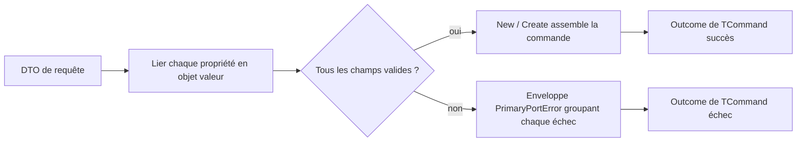

# Lier les requêtes à la frontière

🌍 **Langues :**  
🇬🇧 [English](./RequestBinder.en.md) | 🇫🇷 Français (ce fichier)

`FirstClassErrors.RequestBinder` convertit un DTO de requête entrant — la forme
lâche et nullable que reçoit un contrôleur, un consommateur de messages, une CLI
ou un handler gRPC — en une commande ou une requête typée, faite d’objets valeur,
à la frontière de l’adaptateur primaire. Il collecte **tous** les champs invalides
dans un seul `PrimaryPortError` documenté au lieu de s’arrêter au premier, et il ne
lève jamais d’exception sur le chemin des entrées invalides.

Cette page est le guide dédié : déclarer un binder, convertir les propriétés, lire
les valeurs liées, assembler la commande, et traiter les erreurs produites. Si
`Outcome` et les fabriques d’erreurs sont nouveaux pour vous, lisez d’abord
[Bien démarrer](GettingStarted.fr.md) et le [Guide d’Outcome](OutcomeGuide.fr.md) —
le binder s’appuie directement sur les deux.

## 🧭 Le modèle en une minute



Un binder lit chaque propriété, la convertit via une fabrique d’objet valeur, et
**enregistre** chaque échec au lieu de le lever. Quand le terminal s’exécute, soit
tous les champs se sont liés — et la commande est assemblée —, soit au moins un a
échoué, et le résultat est l’échec d’une enveloppe unique qui les porte tous.

## Installer le paquet

```bash
dotnet add package FirstClassErrors.RequestBinder
```

Il cible **.NET Standard 2.0** et voyage sur le même train de release que
`FirstClassErrors`, à la même version — les deux se résolvent donc toujours
ensemble.

## La forme d’une liaison

Toute liaison a les trois mêmes parties : **démarrer** depuis la requête et
déclarer l’enveloppe, **sélectionner et convertir** chaque propriété, puis
**assembler** la commande. L’exemple fil rouge est un endpoint de réservation
d’hôtel dont le DTO est la forme lâche du fil, et dont la commande est un agrégat
d’objets valeur.

```csharp
// Le DTO entrant : tout est nullable, tout est primitif.
public sealed record BookingRequest(
    string? GuestEmail,
    string? Reference,
    string? Currency,
    string? MaxNights,
    StayDto? Stay,
    IReadOnlyList<string?>? Tags,
    IReadOnlyList<GuestDto?>? Guests);

// La commande : des objets valeur, non-null là où la présence est requise.
public sealed record PlaceBookingCommand(
    EmailAddress GuestEmail,
    string Reference,
    Currency Currency,
    int? MaxNights,
    Stay Stay,
    IReadOnlyList<Tag> Tags,
    IReadOnlyList<Guest> Guests);
```

```csharp
public Outcome<PlaceBookingCommand> Bind(BookingRequest request) {
    var bind = Bind.PropertiesOf(request)
                   .FailWith(PlaceBookingError.Invalid);

    RequiredField<EmailAddress> email     = bind.SimpleProperty(r => r.GuestEmail).AsRequired(EmailAddress.Parse);
    RequiredField<string>       reference = bind.SimpleProperty(r => r.Reference).AsRequired();
    RequiredField<Currency>     currency  = bind.SimpleProperty(r => r.Currency).AsOptional(Currency.Parse, "EUR");

    // Assembler la commande à partir des champs liés (la version complète est en fin de guide) :
    return bind.New(s => new PlaceBookingCommand(
        s.Get(email),
        s.Get(reference),
        s.Get(currency),
        /* MaxNights, Stay, Tags, Guests — liés de la même façon, montrés plus bas */));
}
```

- **`Bind.PropertiesOf(request)`** démarre un binder sur le DTO.
- **`.FailWith(PlaceBookingError.Invalid)`** est obligatoire : il déclare l’unique
  erreur enveloppe — une fabrique de *votre* catalogue — sous laquelle chaque échec
  est groupé. Un binder ne peut jamais rester sans enveloppe, exactement comme une
  erreur ne peut jamais rester sans message public.
- Chaque `SimpleProperty(...)` sélectionne une propriété et la convertit, en
  renvoyant un **jeton de champ**, pas une valeur.
- **`bind.New(...)`** assemble la commande, en lisant chaque jeton via la portée
  `s`. Il renvoie `Outcome<PlaceBookingCommand>` — un succès quand tous les champs
  se sont liés, l’échec de l’enveloppe sinon.

La fabrique d’enveloppe est une erreur d’agrégat ordinaire de votre catalogue :

```csharp
[ProvidesErrorsFor("PlaceBooking")]
public static class PlaceBookingError {

    [DocumentedBy(nameof(InvalidDocumentation))]
    internal static PrimaryPortError Invalid(PrimaryPortInnerErrors violations) {
        return PrimaryPortError.Create(Code.Invalid, "The booking request is invalid.", violations)
                               .WithPublicMessage("We could not accept your booking request.");
    }

    // ... Code, documentation, enveloppes imbriquées (StayInvalid, GuestInvalid) omis pour la concision.
}
```

## Convertir une propriété scalaire

`SimpleProperty(r => r.X)` sélectionne une propriété ; l’étape de conversion qui
suit offre quatre façons de la lier. Toutes prennent une fabrique d’objet valeur
(`Func<TArgument, Outcome<TProperty>>` — typiquement un groupe de méthodes comme
`EmailAddress.Parse`) et **échouent en renvoyant** `Outcome.Failure`, jamais en
levant une exception.

| Méthode | Argument absent | Présent mais invalide | Valeur liée |
| --- | --- | --- | --- |
| `AsRequired(convert)` | enregistre `REQUEST_ARGUMENT_REQUIRED` | enregistre `REQUEST_ARGUMENT_INVALID` | `RequiredField<T>` |
| `AsRequired()` | enregistre `REQUEST_ARGUMENT_REQUIRED` | — (pas de conversion) | `RequiredField<TArgument>` (brut) |
| `AsOptional(convert, fallback)` | convertit `fallback` à la place | enregistre `REQUEST_ARGUMENT_INVALID` | `RequiredField<T>` (toujours présent) |
| `AsOptionalReference(convert)` | `null`, n’enregistre rien | enregistre `REQUEST_ARGUMENT_INVALID` | `OptionalReferenceField<T>` |
| `AsOptionalValue(convert)` | `null`, n’enregistre rien | enregistre `REQUEST_ARGUMENT_INVALID` | `OptionalValueField<T>` |

```csharp
// Requis avec conversion : EmailAddress.Parse transforme la chaîne brute en objet valeur.
RequiredField<EmailAddress> email = bind.SimpleProperty(r => r.GuestEmail).AsRequired(EmailAddress.Parse);

// Requis sans conversion : la présence est vérifiée, la valeur brute est liée telle quelle.
RequiredField<string> reference = bind.SimpleProperty(r => r.Reference).AsRequired();

// Optionnel avec repli : l'absence utilise « EUR » ; une valeur présente mais invalide enregistre quand même une erreur.
RequiredField<Currency> currency = bind.SimpleProperty(r => r.Currency).AsOptional(Currency.Parse, "EUR");

// Type valeur optionnel : l'absence donne un vrai Nullable null — jamais default(int).
OptionalValueField<int> maxNights = bind.SimpleProperty(r => r.MaxNights).AsOptionalValue(PositiveInt.Parse);

// AsOptionalReference est le pendant « type référence » d'AsOptionalValue (l'absence donne un objet
// valeur null, n'enregistre rien). Il est montré sur l'email optionnel de l'invité dans « Listes », plus bas.
```

**Une propriété de type valeur se lie sur son type *sous-jacent*.** Lorsque la
propriété du DTO est elle-même un type valeur — un `int?`, `bool?` ou `decimal?`
dans lequel un nombre ou un booléen JSON est désérialisé — le convertisseur que
vous passez opère sur le type **sous-jacent non-nullable** : le binder déballe le
`Nullable` pour vous. Une fabrique d'objet valeur comme `Quantity.From(int)` se lie
donc comme un groupe de méthodes, exactement comme `EmailAddress.Parse(string)`
pour une propriété de type référence :

```csharp
// DTO : public sealed record CartRequest(int? Quantity, IReadOnlyList<int?>? Lines);

// Quantity.From est `int -> Outcome<Quantity>` ; le binder lui passe l'int déballé.
RequiredField<Quantity>                qty   = bind.SimpleProperty(r => r.Quantity).AsRequired(Quantity.From);

// Une liste de types valeur fonctionne de même : chaque élément est converti sur son int
// sous-jacent, et un élément null enregistre REQUEST_ARGUMENT_REQUIRED sous son chemin indexé (Lines[2]).
RequiredField<IReadOnlyList<Quantity>> lines = bind.ListOfSimpleProperties(r => r.Lines).AsRequired(Quantity.From);
```

La propriété doit toujours être déclarée nullable (`int?`, pas `int`) pour que le
binder distingue un argument absent d'une vraie valeur ; une propriété de type
valeur non-nullable lève à la place, comme l'explique *Le canal des bugs* plus bas.

**Optionnel signifie « peut être absent », jamais « peut être malformé ».** Un
argument présent qui échoue à se convertir est toujours une erreur — même sur une
liaison optionnelle. Seul un argument optionnel *manquant* est silencieux (repli,
`null`, ou liste vide).

**Un repli est une configuration développeur, pas une entrée client.** Si le
`fallback` passé à `AsOptional` ne se convertit pas lui-même, c’est un bug de
votre code : il lève donc `InvalidOperationException` au lieu d’être rapporté comme
une erreur client.

## Lire les valeurs liées : la portée de liaison

Un jeton de champ n’expose **aucune** valeur publique. La seule façon d’en lire un
est `s.Get(token)`, à l’intérieur de l’assembleur passé à `New` ou `Create` :

```csharp
return bind.New(s => new PlaceBookingCommand(
    s.Get(email),       // EmailAddress   — requis
    s.Get(reference),   // string         — requis, brut
    s.Get(currency),    // Currency       — optionnel avec repli, toujours présent
    s.Get(maxNights),   // int?           — valeur optionnelle, null si absent
    ...));
```

C’est une sûreté **par construction**, pas par convention. La portée `s` est un
`readonly ref struct` : elle ne peut être ni stockée, ni capturée, ni retournée,
donc elle ne vit que le temps de l’assembleur. Et le terminal ne la crée **que**
sur sa branche de succès — après avoir vérifié qu’aucun échec n’a été enregistré.
Une valeur liée ne peut donc être lue *que* là où chaque liaison est connue pour
avoir réussi : lire une valeur avant le terminal, ou hors de son assembleur, **ne
compile pas**.

Le type du jeton porte la nullabilité :

| Jeton | `s.Get(...)` renvoie |
| --- | --- |
| `RequiredField<T>` | `T` |
| `OptionalReferenceField<T>` | `T?` (`null` si l’argument était absent) |
| `OptionalValueField<T>` | `T?` — un vrai `Nullable<T>`, `null` si absent, jamais `default(T)` |

## Assembler la commande : `New` et `Create`

Il y a deux terminaux. Choisissez celui qui correspond à la forme de votre
assembleur — le nom recopie ce que vous écrivez à l’intérieur.

| Terminal | Votre assembleur | À utiliser quand |
| --- | --- | --- |
| `New(s => new Command(...))` | renvoie la commande | le constructeur est total : chaque champ a déjà été validé un par un |
| `Create(s => Command.Create(...))` | renvoie `Outcome<Command>` | une fabrique validante applique une règle **inter-champs** qui peut encore rejeter une combinaison pourtant valide |

`New` emballe la commande construite dans un outcome de succès :

```csharp
return bind.New(s => new PlaceBookingCommand(s.Get(email), s.Get(reference), ...));
```

`Create` exécute une fabrique qui peut encore échouer — une règle inter-champs
telle que « la sortie doit être après l’entrée » qu’aucun champ seul ne pourrait
vérifier — et **aplatit** son résultat, pour que vous n’obteniez jamais un
`Outcome<Outcome<T>>` :

```csharp
return bind.Create(s => PlaceBookingCommand.Create(
    s.Get(checkIn), s.Get(checkOut), s.Get(guests)));
// PlaceBookingCommand.Create(...) renvoie Outcome<PlaceBookingCommand>.
```

La fabrique ne s’exécute **que** sur la branche zéro-erreur — chaque champ est
déjà lié — donc une règle inter-champs peut supposer ses entrées présentes et
valides. Son échec est renvoyé **tel quel** : la fabrique possède cette erreur
(c’est une règle métier, pas un échec de liaison d’argument), elle n’est donc pas
ré-emballée dans l’enveloppe du binder. Un consommateur de `Create` voit donc soit
l’enveloppe du binder (un champ manquant ou malformé), soit l’erreur propre de la
fabrique (tous les champs allaient bien, mais la combinaison a été rejetée). La
décision derrière ces deux noms est consignée dans
[ADR-0007](../for-maintainers/adr/0007-name-the-binder-terminals-new-and-create.md).

## Tout collecter, pas au premier échec

Tout l’intérêt d’un binder est qu’un client qui corrige un champ ne découvre pas
le suivant seulement à la resoumission. Chaque propriété en échec est enregistrée
et rapportée d’un coup, dans l’ordre de déclaration :

```csharp
var bind = Bind.PropertiesOf(new BookingRequest(
                   GuestEmail: "not-an-email",   // invalide
                   Reference: null,              // manquant
                   Currency: "EURO",             // invalide (pas 3 lettres)
                   /* ... */))
               .FailWith(PlaceBookingError.Invalid);

bind.SimpleProperty(r => r.GuestEmail).AsRequired(EmailAddress.Parse);
bind.SimpleProperty(r => r.Reference).AsRequired();
bind.SimpleProperty(r => r.Currency).AsOptional(Currency.Parse, "EUR");

Outcome<PlaceBookingCommand> outcome = bind.New(s => /* jamais atteint */ null!);

// outcome.Error est PlaceBookingError.Invalid, avec trois erreurs internes :
//   REQUEST_ARGUMENT_INVALID   (GuestEmail)
//   REQUEST_ARGUMENT_REQUIRED  (Reference)
//   REQUEST_ARGUMENT_INVALID   (Currency)
```

Une requête dont chaque champ est invalide ne lève **aucune** exception : le binder
ne lève jamais sur le chemin des entrées invalides.

## Les deux codes d’erreur du binder

Le binder fabrique exactement deux erreurs qui lui sont propres. Tout le reste
d’un arbre d’échec vient de *votre* code — les erreurs de conversion que renvoient
vos objets valeur, et les erreurs enveloppes que vous déclarez avec `FailWith`.

| Code | Signification | Erreur interne |
| --- | --- | --- |
| `REQUEST_ARGUMENT_REQUIRED` | un argument requis était absent de la requête | — |
| `REQUEST_ARGUMENT_INVALID` | un argument présent a échoué à se convertir | l’erreur propre du convertisseur |

Les deux portent le **chemin d’argument complet** dans leur contexte sous la clé
`RequestArgument` (par exemple `Guests[1].FirstName`), pour que le champ fautif
soit identifiable sans parser les messages :

```csharp
Error required = outcome.Error!.InnerErrors.First();
required.Context.ToNameDictionary().TryGetValue("RequestArgument", out object? path);
// path == "Reference"
```

`REQUEST_ARGUMENT_REQUIRED` est **non transitoire** : resoumettre la même requête
ne peut pas réussir. `REQUEST_ARGUMENT_INVALID` emballe comme erreur interne le
`DomainError` ou le `PrimaryPortError` du convertisseur — lisez-le pour connaître
la règle précise que la valeur a violée. Les deux codes sont documentés dans le
catalogue généré comme toute autre erreur (voir le
[pipeline de documentation](ArchitectureOfTheDocumentationPipeline.fr.md)).

Un convertisseur doit échouer avec un `DomainError` ou un `PrimaryPortError` — les
deux familles qu’un arbre d’échec accepte. Échouer avec une autre famille est un
bug du convertisseur, rapporté en levant, jamais enregistré comme erreur client.

## Objets imbriqués

Une propriété complexe est liée par un **binder imbriqué**, déclaré avec sa propre
enveloppe. La liaison imbriquée vit typiquement dans une méthode dédiée, passée en
groupe de méthodes :

```csharp
RequiredField<Stay> stay = bind.ComplexProperty(r => r.Stay)
                               .FailWith(PlaceBookingError.StayInvalid)
                               .AsRequired(BindStay);

private static Outcome<Stay> BindStay(RequestBinder<StayDto> stay) {
    RequiredField<BookingDate> checkIn  = stay.SimpleProperty(s => s.CheckIn).AsRequired(BookingDate.Parse);
    RequiredField<BookingDate> checkOut = stay.SimpleProperty(s => s.CheckOut).AsRequired(BookingDate.Parse);

    return stay.New(s => new Stay(s.Get(checkIn), s.Get(checkOut)));
}
```

Le binder imbriqué hérite des options du parent et **préfixe** ses chemins
d’argument : un échec dans `Stay` rapporte `Stay.CheckIn`, pas seulement
`CheckIn`. Une propriété complexe manquante enregistre `REQUEST_ARGUMENT_REQUIRED` ;
une liaison imbriquée qui échoue contribue sa propre enveloppe, dont les erreurs
internes portent déjà les chemins préfixés. Utilisez `AsOptionalReference` plutôt
qu’`AsRequired` pour un objet imbriqué nullable : l’absence donne `null` et
n’enregistre rien — le même nom `AsOptionalReference` que le côté scalaire utilise
pour une valeur de référence nullable.

## Listes

Deux sélecteurs lient les propriétés de type liste, chacun produisant des chemins
indexés pour qu’un mauvais élément n’en cache jamais un autre.

**Une liste de scalaires** convertit chaque élément via une fabrique d’objet
valeur :

```csharp
RequiredField<IReadOnlyList<Tag>> tags =
    bind.ListOfSimpleProperties(r => r.Tags).AsOptional(Tag.Parse);
// Un élément en échec enregistre REQUEST_ARGUMENT_INVALID sous Tags[2].
```

**Une liste d’éléments complexes** lie chaque élément avec un binder imbriqué, sous
une enveloppe par élément :

```csharp
RequiredField<IReadOnlyList<Guest>> guests =
    bind.ListOfComplexProperties(r => r.Guests)
        .FailWith(PlaceBookingError.GuestInvalid)
        .AsRequired(BindGuest);

private static Outcome<Guest> BindGuest(RequestBinder<GuestDto> guest) {
    RequiredField<string>                firstName = guest.SimpleProperty(g => g.FirstName).AsRequired();
    OptionalReferenceField<EmailAddress> email     = guest.SimpleProperty(g => g.Email).AsOptionalReference(EmailAddress.Parse);

    return guest.New(s => new Guest(s.Get(firstName), s.Get(email)));
}
// Un échec sur l'email du deuxième invité rapporte Guests[1].Email.
```

Pour les deux sélecteurs de liste, `AsRequired` enregistre
`REQUEST_ARGUMENT_REQUIRED` uniquement quand la liste elle-même est **absente**
(`null`) : une liste **présente mais vide** est une liste requise valide — elle se
lie à une liste vide et n’enregistre rien, car une liste requise contraint la
**présence, pas la taille**. `AsOptional` traite une liste absente comme une liste
**vide** (jamais `null`) et n’enregistre rien. Un *élément* `null` d’une liste
présente est enregistré comme un argument manquant à son index. Quand le domaine
exige au moins un élément, imposez cette cardinalité dans l’objet valeur ou la
commande que la liste liée alimente.

## Noms d’arguments et format du fil

Par défaut, le chemin d’argument utilise le **nom de propriété C#**
(`GuestEmail`). Si votre sérialiseur renomme les clés (snake_case,
`JsonPropertyName`, une politique de nommage), branchez un `IArgumentNameProvider`
pour que les chemins rapportés dans les erreurs correspondent aux clés réellement
envoyées par le client :

```csharp
public sealed class SnakeCaseNames : IArgumentNameProvider {
    public string GetArgumentNameFrom(PropertyInfo property) =>
        ToSnakeCase(property.Name);   // GuestEmail -> guest_email
}

var bind = Bind.WithOptions(new RequestBinderOptions(new SnakeCaseNames()))
               .PropertiesOf(request)
               .FailWith(PlaceBookingError.Invalid);
```

Les options sont choisies **une seule fois**, sur `Bind.WithOptions`, avant même que
le binder n’existe — la politique de nommage d’un binder ne peut donc jamais changer
en cours de liaison. Elles sont fixées pour toute la durée d’une liaison, et **les
binders imbriqués héritent** des options en vigueur à leur création — donc
`Stay.check_in` est renommé de manière cohérente, de haut en bas. Le point d’entrée
renvoyé par `Bind.WithOptions(...)` ne porte aucun état par requête : vous pouvez le
construire une fois (par exemple au démarrage de l’application) et le réutiliser pour
chaque requête. La bibliothèque ne fournit délibérément que le défaut (noms de
propriété C#) : quel sérialiseur nomme les clés du fil relève de la connaissance de
l’hôte, pas de la bibliothèque.

## Erreurs structurelles : codes et messages

Le binder lève deux erreurs codées qui lui sont propres — `REQUEST_ARGUMENT_REQUIRED`
quand un argument requis est absent, et `REQUEST_ARGUMENT_INVALID` quand il est présent
mais échoue à se convertir. Ce sont les seules erreurs que le binder fabrique ; tout autre
code d’un arbre d’échec est le vôtre (les erreurs des convertisseurs, et l’enveloppe).

Chacune est un `BinderErrorDefinition` — un **code et ses messages publics, tenus
ensemble** — que vous surchargez comme une unité cohérente, jamais un code séparé de son
message. Partez du défaut exposé et changez le code, les messages, ou les deux ; ce que
vous laissez intact garde la valeur livrée :

```csharp
var options = new RequestBinderOptions(
    new SnakeCaseNames(),
    // aligner le code sur la convention de votre catalogue, garder les messages par défaut :
    argumentRequired: RequestBindingError.DefaultArgumentRequired.WithCode(ErrorCode.Create("ACME_ARGUMENT_REQUIRED")),
    // un code et son message, définis ensemble au même endroit :
    argumentInvalid: new BinderErrorDefinition(
        ErrorCode.Create("ACME_ARGUMENT_INVALID"),
        path => new BindingMessage("An argument is invalid.", $"The argument '{path}' is invalid.")));

var bind = Bind.WithOptions(options).PropertiesOf(request).FailWith(PlaceBookingError.Invalid);
```

Le constructeur de message s’exécute **au moment où l’erreur est levée**, pas à la
construction des options — il peut donc lire la culture ambiante
(`CultureInfo.CurrentUICulture`) et renvoyer un message localisé par requête. Un hôte qui
sert plusieurs langues localise les messages structurels du binder via son propre
accesseur de ressources, exactement comme il localise toute autre erreur :

```csharp
argumentRequired: RequestBindingError.DefaultArgumentRequired.WithMessage(
    path => new BindingMessage(
        BinderStrings.ArgumentRequired_Short,                       // .resx, résolu sur CurrentUICulture
        string.Format(BinderStrings.ArgumentRequired_Detailed, path)))
```

Seuls les deux messages **publics** sont localisables ; le message de diagnostic reste
dans la langue interne de la bibliothèque (l’anglais) par convention, pour que les logs
d’un même échec structurel ne se scindent jamais selon la langue de la requête. Voir
[Internationalisation](Internationalisation.fr.md).

Les définitions configurées se propagent à **chaque** échec structurel — scalaires,
éléments de liste, et les échecs internes des binders imbriqués, qui en héritent.

Pour **brancher** sur un échec du binder — le mapper vers un statut HTTP, par exemple —
comparez le code de l’erreur symboliquement, jamais à une chaîne littérale : utilisez le
code que vous avez configuré, ou, quand vous gardez les défauts, ceux que le binder
expose.

```csharp
if (error.Code == RequestBindingError.DefaultArgumentRequiredCode) { return 422; }
```

## Configurer le défaut pour toute l’application

`Bind.PropertiesOf(request)` lie avec `RequestBinderOptions.Default`. Ce défaut est
configurable **une seule fois, au démarrage de l’application** — un hôte entier
(ASP.NET, une CLI, un worker) partage ainsi une politique de nommage et un jeu de
définitions d’erreurs structurelles sans faire transiter d’options par chaque appel, et
sans conteneur DI :

```csharp
// Program.cs, avant la première liaison :
RequestBinderOptions.Default = new RequestBinderOptions(
    new SnakeCaseNames(),
    argumentRequired: RequestBindingError.DefaultArgumentRequired.WithCode(ErrorCode.Create("ACME_ARGUMENT_REQUIRED")),
    argumentInvalid:  RequestBindingError.DefaultArgumentInvalid.WithCode(ErrorCode.Create("ACME_ARGUMENT_INVALID")));

// n’importe où ensuite — aucune option à faire transiter :
var bind = Bind.PropertiesOf(request).FailWith(PlaceBookingError.Invalid);
```

Le défaut est **gelé à la première utilisation** : la première liaison le lit, et toute
affectation ultérieure lève — il est donc défini au moment de la composition et ne peut
jamais dériver une fois les requêtes en vol (la même discipline que
`JsonSerializerOptions`). Un `Bind.WithOptions(...)` par appel le surcharge quand même
pour une liaison donnée.

## Le canal des bugs : ce qui lève vs ce qui est collecté

Le binder trace une frontière nette entre une **erreur client** (enregistrée,
surfacée une seule fois comme l’échec de l’enveloppe) et une **erreur de
programmation** (levée, pour qu’un vrai bug atteigne votre frontière d’exceptions
sans déguisement). Rien sur le chemin des entrées invalides ne lève ; ceci, si :

- un convertisseur lève au lieu de renvoyer `Outcome.Failure` (bug de convertisseur) ;
- un sélecteur qui n’est pas un accès direct à une propriété, p. ex. `r => r.Email.Trim()` ;
- un repli `AsOptional` qui ne se convertit pas (mauvaise configuration développeur) ;
- la lecture d’un jeton via la portée d’un *autre* binder ;
- **une propriété DTO de type valeur non-nullable**, p. ex. `int` au lieu de `int?`.

Le dernier cas mérite qu’on s’y arrête. Un type valeur non-nullable ne peut jamais
être `null`, donc un argument *manquant* (désérialisé en `default(T)` — `0`,
`false`) est indistinguable d’un défaut légitimement envoyé. L’information n’existe
pas à l’exécution : le binder rejette donc la mauvaise déclaration bruyamment
plutôt que de perdre silencieusement l’absence :

```csharp
public sealed record BookingRequest(int MaxNights /* ... */);   // ✗ int
//                                   ^ lève ArgumentException : déclarez-le int?

public sealed record BookingRequest(int? MaxNights /* ... */);  // ✓ int?
```

Déclarez nullable chaque propriété de type valeur liée, pour qu’un argument absent
arrive comme `null` et que le binder puisse le distinguer d’une vraie valeur.

## Exemple complet

Un endpoint complet : un `Stay` imbriqué, une liste de `Guests`, un `MaxNights`
optionnel, et une règle inter-champs appliquée via `Create`.

```csharp
public Outcome<PlaceBookingCommand> BindBooking(BookingRequest request) {
    var bind = Bind.PropertiesOf(request)
                   .FailWith(PlaceBookingError.Invalid);

    RequiredField<EmailAddress>       email     = bind.SimpleProperty(r => r.GuestEmail).AsRequired(EmailAddress.Parse);
    RequiredField<string>             reference = bind.SimpleProperty(r => r.Reference).AsRequired();
    RequiredField<Currency>           currency  = bind.SimpleProperty(r => r.Currency).AsOptional(Currency.Parse, "EUR");
    OptionalValueField<int>           maxNights = bind.SimpleProperty(r => r.MaxNights).AsOptionalValue(PositiveInt.Parse);
    RequiredField<Stay>               stay      = bind.ComplexProperty(r => r.Stay).FailWith(PlaceBookingError.StayInvalid).AsRequired(BindStay);
    RequiredField<IReadOnlyList<Tag>> tags      = bind.ListOfSimpleProperties(r => r.Tags).AsOptional(Tag.Parse);
    RequiredField<IReadOnlyList<Guest>> guests  = bind.ListOfComplexProperties(r => r.Guests).FailWith(PlaceBookingError.GuestInvalid).AsRequired(BindGuest);

    // Create : PlaceBookingCommand.Create applique « sortie après entrée » et peut encore rejeter.
    return bind.Create(s => PlaceBookingCommand.Create(
        s.Get(email),
        s.Get(reference),
        s.Get(currency),
        s.Get(maxNights),
        s.Get(stay),
        s.Get(tags),
        s.Get(guests)));
}
```

Un seul modèle d’erreur structuré court du fil jusqu’à la commande : un champ
malformé surface comme l’enveloppe du binder avec ses chemins indexés ; une
combinaison pourtant valide mais rejetée surface comme l’erreur propre de la
fabrique de commande. Aucune exception n’est levée, sauf si le code lui-même est
faux.

## Tester une liaison

Le binder renvoie un `Outcome`, donc les [aides de test](Testing.fr.md)
s’appliquent directement. Assertez sur les codes et les chemins d’argument plutôt
que sur les messages :

```csharp
Outcome<PlaceBookingCommand> outcome = BindBooking(InvalidRequest());

Check.That(outcome.IsFailure).IsTrue();
Check.That(outcome.Error!.Code.ToString()).IsEqualTo("PLACE_BOOKING_INVALID");
Check.That(outcome.Error!.InnerErrors.Select(e => e.Code.ToString()))
     .ContainsExactly("REQUEST_ARGUMENT_INVALID", "REQUEST_ARGUMENT_REQUIRED");
```

Assertez l’ensemble *complet* des échecs collectés, dans l’ordre — c’est ce qui
prouve le comportement de collecte exhaustive, pas seulement que la liaison a
échoué.

## Exemples exécutables

Les patterns de ce guide sont réalisés en code compilé, testé et documenté par
snapshot dans l’échantillon
[`FirstClassErrors.RequestBinder.Usage`](../../../FirstClassErrors.RequestBinder.Usage) :
une frontière de réservation d’hôtel liée de bout en bout (`BookingBinder`), une
vitrine de toutes les surcharges et options restantes — listes requises/optionnelles,
noms d’arguments personnalisés, codes structurels personnalisés (`BinderShowcase`) —
un site d’appel indépendant de tout framework (`BookingEndpoint`), et des tests
unitaires compagnons qui assertent l’ordre du collect-all, les codes et les chemins
d’argument. Ses erreurs documentées apparaissent dans leur propre catalogue généré
et testé par snapshot, de sorte que le chemin du binder est exercé dans de la
documentation vivante.

## 📌 Checklist de revue

Avant d’approuver une liaison, vérifiez que :

- chaque propriété du DTO est nullable, y compris les types valeur (`int?`, pas `int`) ;
- chaque propriété est liée avec la variante correspondant à son contrat — requise,
  optionnelle-avec-repli, ou optionnelle ;
- les convertisseurs échouent en **renvoyant** `Outcome.Failure`, jamais en levant ;
- le terminal correspond à l’assembleur : `New` pour un constructeur total,
  `Create` pour une fabrique validante renvoyant `Outcome` ;
- chaque propriété complexe et chaque liste déclare sa propre enveloppe avec `FailWith` ;
- un `IArgumentNameProvider` est configuré quand les clés du fil diffèrent des noms
  de propriété C# ;
- les tests assertent l’ensemble complet et ordonné des erreurs collectées et leurs
  chemins d’argument.

---

<div align="center">
<a href="UsagePatterns.fr.md">← Patterns d’utilisation</a> · <a href="README.fr.md#-documentation">↑ Table des matières</a> · <a href="Testing.fr.md">Tests →</a>
</div>

---
